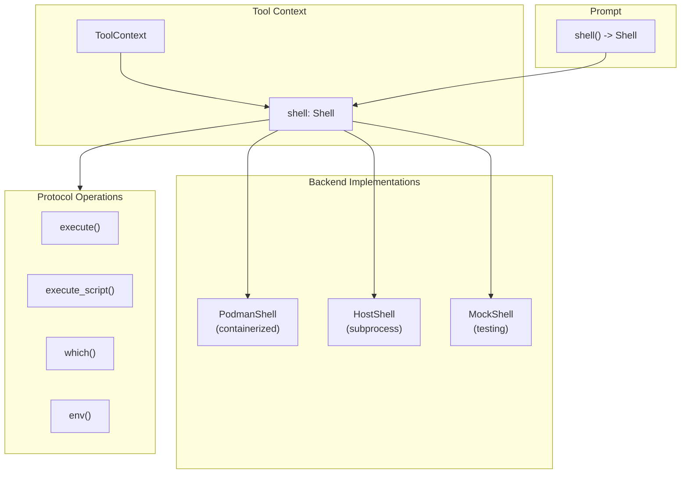

# Shell Protocol Specification

## Purpose

This specification defines a unified `Shell` protocol that tools access through
`ToolContext`. The protocol abstracts over shell execution backends (Podman
containers, host subprocess, mock shells) so tool handlers can execute commands
without coupling to a specific execution environment.

## Guiding Principles

- **Single access pattern**: Tools use one protocol regardless of backend.
- **Context-scoped**: The shell instance lives on `ToolContext` and `Prompt`,
  not global state.
- **Immutable results**: Execution results are frozen dataclasses; state changes
  go through the protocol.
- **Backend-managed isolation**: Backends manage their own sandboxing; no session
  slice coupling for execution state.
- **Backend-agnostic tools**: Tool handlers call `context.shell.*` and remain
  portable across execution environments.
- **Fail-safe defaults**: Timeouts, output limits, and restricted environments
  are the default.



## Protocol Definition

### Result Types

```python
from dataclasses import dataclass
from typing import Literal

@dataclass(slots=True, frozen=True)
class ExecutionResult:
    """Result from a shell command execution."""

    exit_code: int
    """Process exit code. 0 typically indicates success."""

    stdout: str
    """Standard output (may be truncated)."""

    stderr: str
    """Standard error (may be truncated)."""

    command: tuple[str, ...]
    """The command that was executed."""

    cwd: str
    """Working directory where command ran."""

    duration_seconds: float
    """Wall-clock execution time."""

    truncated: bool
    """True if stdout or stderr was truncated due to limits."""

    timed_out: bool
    """True if command was killed due to timeout."""

    signal: int | None
    """Signal number if process was killed by signal, else None."""

    @property
    def success(self) -> bool:
        """True if command completed with exit code 0."""
        return self.exit_code == 0 and not self.timed_out


@dataclass(slots=True, frozen=True)
class WhichResult:
    """Result from command lookup."""

    command: str
    """The command that was searched for."""

    path: str | None
    """Absolute path to executable, or None if not found."""

    @property
    def found(self) -> bool:
        """True if command was found."""
        return self.path is not None


@dataclass(slots=True, frozen=True)
class EnvironmentSnapshot:
    """Immutable snapshot of shell environment."""

    variables: tuple[tuple[str, str], ...]
    """Environment variables as (name, value) pairs."""

    cwd: str
    """Current working directory."""

    shell: str
    """Shell executable path (e.g., /bin/bash)."""

    def get(self, name: str, default: str | None = None) -> str | None:
        """Get environment variable value."""
        for key, value in self.variables:
            if key == name:
                return value
        return default

    def to_dict(self) -> dict[str, str]:
        """Convert to mutable dictionary."""
        return dict(self.variables)
```

### Shell Protocol

```python
from typing import Protocol, Mapping
from collections.abc import Sequence

class Shell(Protocol):
    """Unified shell protocol for command execution.

    All commands are executed with restricted defaults:
    - Timeout enforced (default 30 seconds)
    - Output truncated at limits (default 32 KiB)
    - Network access may be disabled (backend-dependent)
    - Dangerous commands may be blocked (backend-dependent)
    """

    # --- Execution Operations ---

    def execute(
        self,
        command: str | Sequence[str],
        *,
        cwd: str | None = None,
        env: Mapping[str, str] | None = None,
        env_mode: Literal["replace", "extend"] = "extend",
        stdin: str | None = None,
        timeout_seconds: float = 30.0,
        capture_output: bool = True,
    ) -> ExecutionResult:
        """Execute a shell command.

        Args:
            command: Command to execute. If a string, executed via shell.
                If a sequence, executed directly without shell interpolation.
            cwd: Working directory. None uses backend default.
            env: Environment variables to set.
            env_mode: How to apply env variables.
                - "replace": Use only provided env vars (plus PATH).
                - "extend": Merge with existing environment.
            stdin: Input to pipe to command's stdin.
            timeout_seconds: Maximum execution time. Range: 0.1-600.0.
            capture_output: If True, capture stdout/stderr. If False, discard.

        Raises:
            ValueError: Invalid command, timeout, or cwd.
            PermissionError: Command blocked by security policy.
            RuntimeError: Backend unavailable or execution failure.
        """
        ...

    def execute_script(
        self,
        script: str,
        *,
        interpreter: str = "/bin/bash",
        cwd: str | None = None,
        env: Mapping[str, str] | None = None,
        env_mode: Literal["replace", "extend"] = "extend",
        timeout_seconds: float = 30.0,
        capture_output: bool = True,
    ) -> ExecutionResult:
        """Execute a multi-line shell script.

        The script is written to a temporary file and executed via the
        specified interpreter. This is preferred over execute() for
        multi-line scripts as it avoids shell escaping issues.

        Args:
            script: Shell script content.
            interpreter: Script interpreter (e.g., /bin/bash, /usr/bin/python3).
            cwd: Working directory.
            env: Environment variables.
            env_mode: How to apply env variables.
            timeout_seconds: Maximum execution time.
            capture_output: If True, capture stdout/stderr.

        Raises:
            ValueError: Invalid script or interpreter.
            PermissionError: Interpreter or commands blocked by policy.
            RuntimeError: Backend unavailable.
        """
        ...

    # --- Inspection Operations ---

    def which(self, command: str) -> WhichResult:
        """Find executable path for a command.

        Args:
            command: Command name to search for.

        Returns:
            WhichResult with path if found.
        """
        ...

    def env(self) -> EnvironmentSnapshot:
        """Get current environment snapshot.

        Returns:
            Immutable snapshot of environment variables, cwd, and shell.
        """
        ...

    # --- Metadata ---

    @property
    def backend_name(self) -> str:
        """Human-readable backend identifier (e.g., 'podman', 'host')."""
        ...

    @property
    def sandboxed(self) -> bool:
        """True if execution is isolated from host system."""
        ...

    @property
    def network_enabled(self) -> bool:
        """True if network access is available."""
        ...

    @property
    def default_timeout(self) -> float:
        """Default timeout in seconds for execute() calls."""
        ...
```

## ToolContext Integration

### Updated ToolContext

```python
@dataclass(slots=True, frozen=True)
class ToolContext:
    """Immutable container exposing prompt execution state to handlers."""

    prompt: PromptProtocol[Any]
    rendered_prompt: RenderedPromptProtocol[Any] | None
    adapter: ProviderAdapterProtocol[Any]
    session: SessionProtocol
    deadline: Deadline | None = None
    budget_tracker: BudgetTracker | None = None
    filesystem: Filesystem | None = None
    shell: Shell | None = None  # New field

    @property
    def resources(self) -> ScopedResourceContext:
        """Access resources from the prompt's resource context."""
        return self.prompt.resources
```

### Handler Usage

```python
def run_tests_handler(
    params: RunTestsParams,
    *,
    context: ToolContext,
) -> ToolResult[RunTestsResult]:
    if context.shell is None:
        return ToolResult.error("No shell available in this context.")

    # Beat before potentially slow execution
    context.beat()

    try:
        result = context.shell.execute(
            ["pytest", params.test_path, "-v"],
            cwd=params.working_dir,
            timeout_seconds=120.0,
        )
    except PermissionError as e:
        return ToolResult.error(f"Command blocked: {e}")

    if result.timed_out:
        return ToolResult.error(
            f"Tests timed out after {result.duration_seconds:.1f}s"
        )

    return ToolResult.ok(
        RunTestsResult(
            passed=result.success,
            output=result.stdout,
            errors=result.stderr,
        ),
        message=f"Tests {'passed' if result.success else 'failed'}",
    )
```

## Section Ownership

The `Shell` instance is owned by the workspace section that provides shell
tools. Sections implementing `ShellSection` expose their shell via the `shell`
property.

### ShellSection Protocol

```python
class ShellSection(Protocol):
    """Section that provides shell access."""

    @property
    def shell(self) -> Shell:
        """Return the shell managed by this section."""
        ...
```

### Combined Workspace Section

Many workspace sections provide both filesystem and shell access:

```python
class WorkspaceSection(Protocol):
    """Section that provides workspace access."""

    @property
    def filesystem(self) -> Filesystem:
        """Return the filesystem managed by this section."""
        ...

    @property
    def shell(self) -> Shell:
        """Return the shell managed by this section."""
        ...
```

## Backend Implementations

### PodmanShell

Containerized execution with strong isolation guarantees.

```python
@dataclass(slots=True)
class PodmanShell:
    """Shell implementation using Podman containers."""

    _container_id: str
    _workspace_root: str = "/workspace"
    _default_timeout: float = 30.0
    _max_output_bytes: int = 32768  # 32 KiB
    _network_enabled: bool = False

    @property
    def backend_name(self) -> str:
        return "podman"

    @property
    def sandboxed(self) -> bool:
        return True

    @property
    def network_enabled(self) -> bool:
        return self._network_enabled

    @property
    def default_timeout(self) -> float:
        return self._default_timeout

    def execute(
        self,
        command: str | Sequence[str],
        *,
        cwd: str | None = None,
        env: Mapping[str, str] | None = None,
        env_mode: Literal["replace", "extend"] = "extend",
        stdin: str | None = None,
        timeout_seconds: float = 30.0,
        capture_output: bool = True,
    ) -> ExecutionResult:
        self._validate_timeout(timeout_seconds)
        cwd = cwd or self._workspace_root

        # Build podman exec command
        exec_cmd = ["podman", "exec"]

        # Working directory
        exec_cmd.extend(["-w", cwd])

        # Environment variables
        for key, value in (env or {}).items():
            exec_cmd.extend(["-e", f"{key}={value}"])

        # Container and command
        exec_cmd.append(self._container_id)

        if isinstance(command, str):
            exec_cmd.extend(["/bin/sh", "-c", command])
        else:
            exec_cmd.extend(command)

        # Execute with timeout
        start = time.monotonic()
        try:
            proc = subprocess.run(
                exec_cmd,
                input=stdin,
                capture_output=capture_output,
                text=True,
                timeout=timeout_seconds,
            )
            duration = time.monotonic() - start

            stdout = self._truncate(proc.stdout or "")
            stderr = self._truncate(proc.stderr or "")

            return ExecutionResult(
                exit_code=proc.returncode,
                stdout=stdout,
                stderr=stderr,
                command=tuple(command) if isinstance(command, Sequence) else (command,),
                cwd=cwd,
                duration_seconds=duration,
                truncated=len(proc.stdout or "") > self._max_output_bytes,
                timed_out=False,
                signal=None,
            )

        except subprocess.TimeoutExpired:
            duration = time.monotonic() - start
            return ExecutionResult(
                exit_code=-1,
                stdout="",
                stderr=f"Command timed out after {timeout_seconds}s",
                command=tuple(command) if isinstance(command, Sequence) else (command,),
                cwd=cwd,
                duration_seconds=duration,
                truncated=False,
                timed_out=True,
                signal=9,  # SIGKILL
            )
```

### HostShell

Subprocess-based execution on the host system. Less isolated but faster.

```python
@dataclass(slots=True)
class HostShell:
    """Shell implementation using host subprocess.

    WARNING: This backend executes commands directly on the host system.
    Use with caution and only with trusted inputs. Prefer PodmanShell for
    untrusted workloads.
    """

    _root: str
    _allowed_commands: frozenset[str] | None = None
    _blocked_commands: frozenset[str] = field(
        default_factory=lambda: frozenset({
            "rm -rf /",
            "mkfs",
            "dd if=/dev/zero",
            ":(){:|:&};:",
        })
    )
    _default_timeout: float = 30.0
    _max_output_bytes: int = 32768

    @property
    def backend_name(self) -> str:
        return "host"

    @property
    def sandboxed(self) -> bool:
        return False

    @property
    def network_enabled(self) -> bool:
        return True

    @property
    def default_timeout(self) -> float:
        return self._default_timeout

    def _validate_command(self, command: str | Sequence[str]) -> None:
        """Check command against security policies."""
        cmd_str = command if isinstance(command, str) else " ".join(command)

        # Check blocked patterns
        for blocked in self._blocked_commands:
            if blocked in cmd_str:
                raise PermissionError(f"Command contains blocked pattern: {blocked}")

        # Check allowlist if configured
        if self._allowed_commands is not None:
            base_cmd = cmd_str.split()[0] if cmd_str else ""
            if base_cmd not in self._allowed_commands:
                raise PermissionError(f"Command not in allowlist: {base_cmd}")

    def _resolve_cwd(self, cwd: str | None) -> Path:
        """Resolve working directory within root."""
        root_path = Path(self._root).resolve()
        if cwd is None:
            return root_path

        candidate = (root_path / cwd).resolve()
        try:
            _ = candidate.relative_to(root_path)
        except ValueError:
            raise ValueError(f"Working directory escapes root: {cwd}") from None
        return candidate

    def execute(
        self,
        command: str | Sequence[str],
        *,
        cwd: str | None = None,
        env: Mapping[str, str] | None = None,
        env_mode: Literal["replace", "extend"] = "extend",
        stdin: str | None = None,
        timeout_seconds: float = 30.0,
        capture_output: bool = True,
    ) -> ExecutionResult:
        self._validate_command(command)
        resolved_cwd = self._resolve_cwd(cwd)

        # Build environment
        if env_mode == "replace":
            exec_env = {"PATH": os.environ.get("PATH", "/usr/bin:/bin")}
            exec_env.update(env or {})
        else:
            exec_env = dict(os.environ)
            exec_env.update(env or {})

        # Execute
        start = time.monotonic()
        try:
            if isinstance(command, str):
                proc = subprocess.run(
                    command,
                    shell=True,
                    cwd=resolved_cwd,
                    env=exec_env,
                    input=stdin,
                    capture_output=capture_output,
                    text=True,
                    timeout=timeout_seconds,
                )
            else:
                proc = subprocess.run(
                    list(command),
                    cwd=resolved_cwd,
                    env=exec_env,
                    input=stdin,
                    capture_output=capture_output,
                    text=True,
                    timeout=timeout_seconds,
                )
            duration = time.monotonic() - start

            return ExecutionResult(
                exit_code=proc.returncode,
                stdout=self._truncate(proc.stdout or ""),
                stderr=self._truncate(proc.stderr or ""),
                command=tuple(command) if isinstance(command, Sequence) else (command,),
                cwd=str(resolved_cwd),
                duration_seconds=duration,
                truncated=len(proc.stdout or "") > self._max_output_bytes,
                timed_out=False,
                signal=None,
            )

        except subprocess.TimeoutExpired:
            duration = time.monotonic() - start
            return ExecutionResult(
                exit_code=-1,
                stdout="",
                stderr=f"Command timed out after {timeout_seconds}s",
                command=tuple(command) if isinstance(command, Sequence) else (command,),
                cwd=str(resolved_cwd),
                duration_seconds=duration,
                truncated=False,
                timed_out=True,
                signal=9,
            )
```

### MockShell

Test double for unit testing without real execution.

```python
@dataclass(slots=True)
class MockShell:
    """Test double for shell operations."""

    _responses: dict[str, ExecutionResult] = field(default_factory=dict)
    _default_result: ExecutionResult | None = None
    execute_calls: list[tuple[str | Sequence[str], dict[str, Any]]] = field(
        default_factory=list
    )

    @property
    def backend_name(self) -> str:
        return "mock"

    @property
    def sandboxed(self) -> bool:
        return True

    @property
    def network_enabled(self) -> bool:
        return False

    @property
    def default_timeout(self) -> float:
        return 30.0

    def add_response(self, command_pattern: str, result: ExecutionResult) -> None:
        """Register a canned response for a command pattern."""
        self._responses[command_pattern] = result

    def execute(
        self,
        command: str | Sequence[str],
        **kwargs: Any,
    ) -> ExecutionResult:
        cmd_str = command if isinstance(command, str) else " ".join(command)
        self.execute_calls.append((command, kwargs))

        # Check for registered response
        for pattern, result in self._responses.items():
            if pattern in cmd_str:
                return result

        # Return default or success
        if self._default_result is not None:
            return self._default_result

        return ExecutionResult(
            exit_code=0,
            stdout="",
            stderr="",
            command=(cmd_str,),
            cwd="/",
            duration_seconds=0.0,
            truncated=False,
            timed_out=False,
            signal=None,
        )
```

## Security Considerations

### Command Validation

Backends should validate commands before execution:

```python
class CommandValidator:
    """Validates commands against security policies."""

    def __init__(
        self,
        *,
        blocked_patterns: Sequence[str] = (),
        allowed_commands: Sequence[str] | None = None,
        max_command_length: int = 4096,
    ):
        self._blocked = frozenset(blocked_patterns)
        self._allowed = frozenset(allowed_commands) if allowed_commands else None
        self._max_length = max_command_length

    def validate(self, command: str | Sequence[str]) -> None:
        """Validate command against policies.

        Raises:
            ValueError: Command exceeds length limit.
            PermissionError: Command blocked by policy.
        """
        cmd_str = command if isinstance(command, str) else " ".join(command)

        if len(cmd_str) > self._max_length:
            raise ValueError(
                f"Command exceeds maximum length ({len(cmd_str)} > {self._max_length})"
            )

        for pattern in self._blocked:
            if pattern in cmd_str:
                raise PermissionError(f"Command contains blocked pattern: {pattern}")

        if self._allowed is not None:
            base_cmd = cmd_str.split()[0] if cmd_str else ""
            if base_cmd not in self._allowed:
                raise PermissionError(f"Command not in allowlist: {base_cmd}")
```

### Default Blocked Patterns

Recommended patterns to block by default:

| Pattern | Reason |
| --------------------- | --------------------------------- |
| `rm -rf /` | Recursive root deletion |
| `rm -rf /*` | Recursive root deletion variant |
| `mkfs` | Filesystem formatting |
| `dd if=/dev/zero` | Disk overwrite |
| `:(){ :|:& };:` | Fork bomb |
| `> /dev/sda` | Direct disk write |
| `chmod -R 777 /` | Recursive permission change |
| `curl \| sh` | Remote code execution |
| `wget \| sh` | Remote code execution |

### Sandboxed vs Host Execution

| Aspect | PodmanShell | HostShell |
| ------------------- | --------------------- | ---------------------- |
| Filesystem isolation | Container overlay | Working directory only |
| Network isolation | Configurable (default off) | Full access |
| Resource limits | cgroups enforced | None |
| Process isolation | Namespace separation | None |
| Startup overhead | ~100ms | ~10ms |
| Use case | Untrusted workloads | Trusted automation |

## Prompt Integration

### Prompt.shell() Method

The `Prompt` class exposes a `shell()` method that locates the workspace section
and returns its shell. This provides convenient access without navigating the
section tree.

```python
class Prompt(Generic[OutputT]):
    def shell(self) -> Shell | None:
        """Return the shell from the workspace section, if present.

        Searches the template's section tree for a section implementing
        ShellSection and returns its shell property.

        Returns None if no shell section exists in the template.
        """
        section = self._find_shell_section()
        if section is None:
            return None
        return section.shell

    def _find_shell_section(self) -> ShellSection | None:
        """Locate the shell section in the template tree."""
        for section in self.template.sections:
            if isinstance(section, ShellSection):
                return section
            # Recursively search children
            found = self._search_children_for_shell(section)
            if found is not None:
                return found
        return None
```

### Adapter Propagation

Adapters construct `ToolContext` with the shell from the prompt:

```python
def _build_tool_context(
    self,
    prompt: Prompt[OutputT],
    rendered: RenderedPrompt[OutputT],
    session: SessionProtocol,
) -> ToolContext:
    return ToolContext(
        prompt=prompt,
        rendered_prompt=rendered,
        adapter=self,
        session=session,
        deadline=rendered.deadline,
        filesystem=prompt.filesystem(),
        shell=prompt.shell(),  # Propagate from workspace section
    )
```

## Limits

Backends enforce their own limits. Recommended defaults:

| Limit | Value | Notes |
| --------------------- | ---------- | --------------------------- |
| Default timeout | 30 seconds | Per execution |
| Max timeout | 600 seconds | 10 minutes |
| Max output size | 32 KiB | stdout + stderr combined |
| Max command length | 4,096 chars | Combined args |
| Max stdin size | 64 KiB | Input pipe limit |
| Max env vars | 256 | Per execution |

## Error Handling

### Exception Mapping

All backends map internal errors to standard Python exceptions:

| Backend Error | Python Exception |
| --------------------- | -------------------- |
| Command blocked | `PermissionError` |
| Invalid command | `ValueError` |
| Working dir invalid | `ValueError` |
| Backend unavailable | `RuntimeError` |
| Timeout exceeded | N/A (in result) |

Note: Timeouts are **not** raised as exceptions. They are indicated in the
`ExecutionResult.timed_out` field. This allows handlers to inspect partial
output and decide how to proceed.

### Tool Handler Pattern

```python
def my_handler(params: Params, *, context: ToolContext) -> ToolResult[Result]:
    shell = context.shell
    if shell is None:
        return ToolResult.error("No shell available")

    try:
        result = shell.execute(params.command, timeout_seconds=60.0)
    except PermissionError as e:
        return ToolResult.error(f"Command blocked: {e}")
    except ValueError as e:
        return ToolResult.error(f"Invalid command: {e}")

    if result.timed_out:
        return ToolResult.error(
            f"Command timed out after {result.duration_seconds:.1f}s.\n"
            f"Partial output:\n{result.stdout}"
        )

    if not result.success:
        return ToolResult.error(
            f"Command failed (exit {result.exit_code}):\n{result.stderr}"
        )

    return ToolResult.ok(Result(output=result.stdout), message="Command succeeded")
```

## Testing

### Protocol Compliance

Backend implementations must pass the `ShellProtocolTests` suite:

```python
class ShellProtocolTests:
    """Abstract test suite for Shell implementations."""

    @abstractmethod
    def create_shell(self) -> Shell:
        """Factory method for the shell under test."""
        ...

    def test_execute_echo(self):
        shell = self.create_shell()
        result = shell.execute(["echo", "hello"])
        assert result.exit_code == 0
        assert "hello" in result.stdout

    def test_execute_nonexistent_command(self):
        shell = self.create_shell()
        result = shell.execute(["nonexistent_command_12345"])
        assert result.exit_code != 0

    def test_timeout_enforced(self):
        shell = self.create_shell()
        result = shell.execute(["sleep", "10"], timeout_seconds=0.5)
        assert result.timed_out
        assert result.duration_seconds < 2.0

    def test_environment_variables(self):
        shell = self.create_shell()
        result = shell.execute(
            ["sh", "-c", "echo $MY_VAR"],
            env={"MY_VAR": "test_value"},
        )
        assert "test_value" in result.stdout

    def test_working_directory(self):
        shell = self.create_shell()
        result = shell.execute(["pwd"], cwd="/tmp")
        assert "/tmp" in result.stdout

    # ... comprehensive test coverage
```

### Mock Shell Usage

```python
def test_build_tool_uses_shell():
    mock = MockShell()
    mock.add_response(
        "make build",
        ExecutionResult(
            exit_code=0,
            stdout="Build succeeded",
            stderr="",
            command=("make", "build"),
            cwd="/workspace",
            duration_seconds=5.2,
            truncated=False,
            timed_out=False,
            signal=None,
        ),
    )

    context = ToolContext(..., shell=mock)
    result = build_handler(BuildParams(), context=context)

    assert result.success
    assert len(mock.execute_calls) == 1
    assert "make" in mock.execute_calls[0][0]
```

## Integration with Filesystem

Shell and Filesystem are complementary abstractions that often work together:

```python
# Write a script, then execute it
fs = context.filesystem
shell = context.shell

if fs is None or shell is None:
    return ToolResult.error("Workspace not available")

# Create script file
fs.write("build.sh", """#!/bin/bash
set -e
make clean
make build
make test
""")

# Execute it
result = shell.execute(["bash", "build.sh"], timeout_seconds=300.0)
```

### PodmanSandboxSection Integration

`PodmanSandboxSection` provides both filesystem and shell access with shared
container state:

```python
class PodmanSandboxSection(MarkdownSection[_PodmanSectionParams]):
    """Prompt section providing containerized workspace tools."""

    def __init__(
        self,
        *,
        session: Session,
        config: PodmanSandboxConfig | None = None,
    ) -> None:
        # ... setup overlay and container ...

        # Filesystem accesses overlay directory
        self._filesystem = HostFilesystem(_root=str(self._overlay_path))

        # Shell executes in container with overlay mounted
        self._shell = PodmanShell(
            _container_id=self._container_id,
            _workspace_root="/workspace",
        )

    @property
    def filesystem(self) -> Filesystem:
        return self._filesystem

    @property
    def shell(self) -> Shell:
        return self._shell
```

## Usage Example

```python
from weakincentives.prompt import Prompt, PromptTemplate, MarkdownSection
from weakincentives.contrib.tools import PodmanSandboxSection

# Build prompt with shell access
sandbox_section = PodmanSandboxSection(session=session)

template = PromptTemplate(
    ns="agents/builder",
    key="run-commands",
    sections=[
        MarkdownSection(
            title="Instructions",
            key="instructions",
            template="Build and test the project.",
        ),
        sandbox_section,
    ],
)

prompt = Prompt(template)

# Access shell via prompt
shell = prompt.shell()
assert shell is sandbox_section.shell

# Inspect environment
env = shell.env()
print(f"Working in: {env.cwd}")
print(f"PATH: {env.get('PATH')}")

# Check for required tools
if not shell.which("make").found:
    raise RuntimeError("make not available")

# Run build
result = shell.execute(["make", "build"], timeout_seconds=120.0)
if not result.success:
    raise RuntimeError(f"Build failed: {result.stderr}")

# During evaluation, tools receive the same shell via context
# context.shell.execute(...) works in tool handlers
```

## Limitations

- **Synchronous only**: All execution is blocking; no async API.
- **No streaming**: Output is buffered; no incremental streaming support.
- **No PTY support**: Interactive commands (vim, less, etc.) are not supported.
- **No background jobs**: Commands must complete within timeout; no `&` support.
- **Text output only**: Binary output is decoded as UTF-8 with replacement chars.
- **Single-threaded**: Backends are not thread-safe; use one per session.
- **No signal control**: Beyond timeout, no SIGINT/SIGTERM control exposed.
- **Platform-dependent**: Some backends (Podman) require Linux or compatible.
