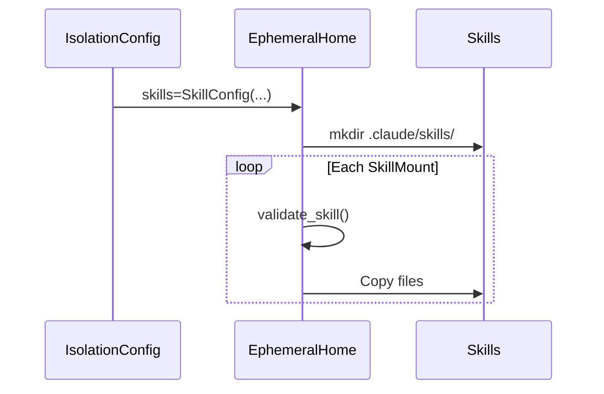

# Skills Specification

[Agent Skills](https://agentskills.io) implementation for extending agent capabilities
with specialized knowledge and workflows.

**Source:** `src/weakincentives/skills/`

## What are Skills?

A skill is a directory with `SKILL.md` containing YAML frontmatter and instructions.

```
my-skill/
├── SKILL.md          # Required: instructions + metadata
├── scripts/          # Optional: executable code
└── references/       # Optional: documentation
```

Progressive disclosure: agents load name/description at startup, full instructions
on activation.

## SKILL.md Format

```markdown
---
name: code-review
description: Perform code reviews checking security, error handling, tests.
---

# Code Review

When reviewing code...
```

### Required Fields

| Field | Constraints |
|-------|-------------|
| `name` | 1-64 chars, `[a-z0-9-]`, no `--`, no leading/trailing `-` |
| `description` | 1-1024 chars |

### Optional Fields

| Field | Purpose |
|-------|---------|
| `license` | License reference |
| `compatibility` | Environment requirements |
| `metadata` | Arbitrary key-value pairs |

## WINK Types

**Definition:** `skills/_types.py`

```python
Skill(name, source, content)
SkillMount(source, name=None, enabled=True)
SkillConfig(skills=(), validate_on_mount=True)
```

## Mounting Flow



## Validation

| Error | Condition |
|-------|-----------|
| `SkillNotFoundError` | Path does not exist |
| `SkillValidationError` | Missing SKILL.md, bad frontmatter, name mismatch |
| `SkillMountError` | Invalid name, duplicate, I/O error, >10 MiB |

## Usage

```python
from weakincentives.skills import SkillConfig, SkillMount
from weakincentives.adapters.claude_agent_sdk import IsolationConfig

config = IsolationConfig(
    skills=SkillConfig(skills=(
        SkillMount(Path("./skills/code-review")),
        SkillMount(Path("./skills/testing")),
    ))
)
```

Auto-discover:

```python
skill_mounts = tuple(
    SkillMount(source=d)
    for d in Path("./skills").iterdir()
    if d.is_dir() and (d / "SKILL.md").exists()
)
```

## Limitations

- No runtime updates (recreate adapter for changes)
- No skill dependencies
- No templating (use prompt composition)
- 10 MiB per skill limit
