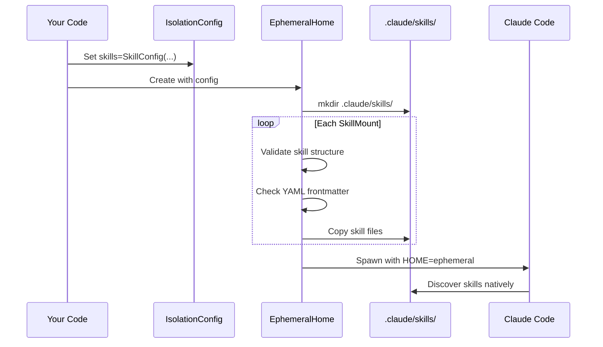

# Skills

> Agent Skills are a lightweight, open format for extending AI agent capabilities with specialized knowledge and workflows.

This document describes the [Agent Skills specification](https://agentskills.io) and how WINK implements skills for Claude Code.

## Table of Contents

- [What are Skills?](#what-are-skills)
- [Agent Skills Specification](#agent-skills-specification)
- [WINK Implementation](#wink-implementation)
- [Usage Examples](#usage-examples)
- [Module Reference](#module-reference)

## What are Skills?

At its core, a skill is a directory containing a `SKILL.md` file. This file includes metadata (`name` and `description`, at minimum) and instructions that tell an agent how to perform a specific task. Skills can also bundle scripts, templates, and reference materials.

```
my-skill/
├── SKILL.md          # Required: instructions + metadata
├── scripts/          # Optional: executable code
├── references/       # Optional: documentation
└── assets/           # Optional: templates, resources
```

### Progressive Disclosure

Skills use **progressive disclosure** to manage context efficiently:

1. **Discovery**: At startup, agents load only the name and description of each available skill, just enough to know when it might be relevant.

1. **Activation**: When a task matches a skill's description, the agent reads the full `SKILL.md` instructions into context.

1. **Execution**: The agent follows the instructions, optionally loading referenced files or executing bundled code as needed.

This approach keeps agents fast while giving them access to more context on demand.

## Agent Skills Specification

Skills follow the open [Agent Skills specification](https://agentskills.io), originally developed by Anthropic and released as an open standard.

### SKILL.md Format

Every skill starts with a `SKILL.md` file containing **YAML frontmatter** and **Markdown instructions**:

```markdown
---
name: pdf-processing
description: Extract text and tables from PDF files, fill forms, merge documents.
---

# PDF Processing

## When to use this skill
Use this skill when the user needs to work with PDF files...

## How to extract text
1. Use pdfplumber for text extraction...
```

### Required Frontmatter Fields

All skills must include these fields in the YAML frontmatter:

| Field | Constraints | Description |
|-------|-------------|-------------|
| `name` | 1-64 chars, lowercase letters/numbers/hyphens only, no consecutive hyphens, cannot start/end with hyphen | Skill identifier, must match directory name |
| `description` | 1-1024 chars, non-empty | What the skill does and when to use it |

#### Name Field Validation

The `name` field must:

- Be 1-64 characters long
- Contain only lowercase letters (`a-z`), numbers (`0-9`), and hyphens (`-`)
- Not start or end with a hyphen
- Not contain consecutive hyphens (`--`)
- Match the parent directory name (for directory skills)

**Valid examples:**

```yaml
name: pdf-processing
name: data-analysis
name: code-review
name: skill2
```

**Invalid examples:**

```yaml
name: PDF-Processing  # uppercase not allowed
name: -pdf            # cannot start with hyphen
name: pdf--process    # consecutive hyphens not allowed
name: skill_v2        # underscores not allowed
```

#### Description Field

The `description` field should:

- Be 1-1024 characters
- Describe both what the skill does and when to use it
- Include specific keywords that help agents identify relevant tasks

**Good example:**

```yaml
description: Extracts text and tables from PDF files, fills PDF forms, and merges multiple PDFs. Use when working with PDF documents or when the user mentions PDFs, forms, or document extraction.
```

**Poor example:**

```yaml
description: Helps with PDFs.
```

### Optional Frontmatter Fields

| Field | Constraints | Description |
|-------|-------------|-------------|
| `license` | String | License name or reference to bundled license file |
| `compatibility` | Max 500 chars | Environment requirements (product, packages, network access) |
| `metadata` | Dict with string keys/values | Arbitrary key-value metadata |
| `allowed-tools` | String | Space-delimited list of pre-approved tools (experimental) |

**Example with all optional fields:**

```yaml
---
name: pdf-processing
description: Extract text and tables from PDF files, fill forms, merge documents.
license: Apache-2.0
compatibility: Requires pdfplumber and PyPDF2 packages
metadata:
  author: example-org
  version: "1.0"
allowed-tools: Bash(python:*) Read Write
---
```

### Body Content

The Markdown body after the frontmatter contains the skill instructions. There are no format restrictions. Write whatever helps agents perform the task effectively.

**Recommended sections:**

- Step-by-step instructions
- Examples of inputs and outputs
- Common edge cases
- References to external resources

**Keep it concise:** The full `SKILL.md` is loaded when the skill activates. Keep the main file under 500 lines and move detailed reference material to separate files.

### Optional Directory Structure

Skills can include additional directories:

```
my-skill/
├── SKILL.md          # Required
├── scripts/          # Executable code agents can run
├── references/       # Additional documentation loaded on demand
└── assets/           # Templates, images, data files
```

When referencing other files in your skill, use relative paths from the skill root:

```markdown
See [the reference guide](references/REFERENCE.md) for details.

Run the extraction script:

    python scripts/extract.py input.pdf
```

## WINK Implementation

WINK provides provider-agnostic skill primitives in the core library (`weakincentives.skills`) and adapter-specific mounting in the Claude Agent SDK adapter.

### Architecture

**Core Library (`weakincentives.skills`):**

- **Types**: `Skill`, `SkillMount`, `SkillConfig`
- **Validation**: `validate_skill()`, `validate_skill_name()`, `resolve_skill_name()`
- **Errors**: `SkillError`, `SkillValidationError`, `SkillNotFoundError`, `SkillMountError`
- **Constants**: `MAX_SKILL_FILE_BYTES` (1 MiB), `MAX_SKILL_TOTAL_BYTES` (10 MiB)

**Adapter Implementation (`weakincentives.adapters.claude_agent_sdk`):**

- **`IsolationConfig.skills`**: Integration point for skill configuration
- **`EphemeralHome._mount_skills()`**: Copies skills into `.claude/skills/`
- **`_copy_skill()`**: Handles file system operations

### Skill Mounting Flow

When you create a Claude Agent SDK adapter with skills configured:



### Validation at Mount Time

When `SkillConfig.validate_on_mount` is `True` (default), WINK validates each skill before copying:

**For directory skills:**

- Must contain `SKILL.md` at the root
- `SKILL.md` must have valid YAML frontmatter
- Frontmatter `name` must match directory name
- All field constraints are enforced

**For file skills:**

- Must have `.md` extension
- File size must be ≤ 1 MiB
- Must have valid YAML frontmatter
- Frontmatter `name` can be anything (doesn't need to match filename)

**Validation errors:**

| Error | Condition |
|-------|-----------|
| `SkillNotFoundError` | Source path does not exist |
| `SkillValidationError` | Missing SKILL.md in directory |
| `SkillValidationError` | File is not markdown (.md) |
| `SkillValidationError` | File exceeds 1 MiB size limit |
| `SkillValidationError` | Missing YAML frontmatter |
| `SkillValidationError` | Invalid YAML syntax |
| `SkillValidationError` | Missing required field (name or description) |
| `SkillValidationError` | Field type mismatch or constraint violation |
| `SkillValidationError` | Name doesn't match directory name |
| `SkillMountError` | Invalid skill name format |
| `SkillMountError` | Duplicate skill names in config |
| `SkillMountError` | I/O error during copy |
| `SkillMountError` | Total size exceeds 10 MiB per skill |

### Data Model

#### Skill

```python
from weakincentives.skills import Skill

@FrozenDataclass()
class Skill:
    """Represents a skill definition.

    Attributes:
        name: The skill's identifier. Used for discovery and deduplication.
        source: Path to the skill file or directory on the host filesystem.
        content: The content of the SKILL.md file (if loaded).
    """

    name: str
    source: Path
    content: str | None = None
```

#### SkillMount

```python
from weakincentives.skills import SkillMount

@FrozenDataclass()
class SkillMount:
    """Configuration for mounting a skill into an agent environment.

    Attributes:
        source: Path to a skill file (SKILL.md) or skill directory.
            Relative paths are resolved against the current working directory.
        name: Optional skill name override. If None, derived from the source
            path (directory name or filename without extension).
        enabled: Whether the skill is active. Disabled skills are not copied.
            Defaults to True.
    """

    source: Path
    name: str | None = None
    enabled: bool = True
```

#### SkillConfig

```python
from weakincentives.skills import SkillConfig

@FrozenDataclass()
class SkillConfig:
    """Collection of skills to install in an agent environment.

    Attributes:
        skills: Tuple of skill mounts to copy into the workspace.
        validate_on_mount: If True, validate skill structure and frontmatter
            before copying. Validation checks YAML frontmatter, required fields,
            field constraints, and name matching. Defaults to True.
    """

    skills: tuple[SkillMount, ...] = ()
    validate_on_mount: bool = True
```

#### Integration with IsolationConfig

```python
from weakincentives.adapters.claude_agent_sdk import IsolationConfig

@FrozenDataclass()
class IsolationConfig:
    """Configuration for hermetic SDK isolation.

    Attributes:
        skills: Skills to mount in the hermetic environment. Skills are
            copied to {ephemeral_home}/.claude/skills/ before spawning
            Claude Code. All frontmatter is validated according to the
            Agent Skills specification.
    """

    network_policy: NetworkPolicy | None = None
    sandbox: SandboxConfig | None = None
    env: Mapping[str, str] | None = None
    api_key: str | None = None
    include_host_env: bool = False
    skills: SkillConfig | None = None
```

### Name Resolution

The skill name determines its destination directory:

```python
from weakincentives.skills import resolve_skill_name

def resolve_skill_name(mount: SkillMount) -> str:
    """Resolve the effective skill name from a mount.

    Resolution order:
    1. Explicit name from mount.name if provided
    2. Directory name if source is a directory
    3. File stem (without .md extension) if source is a file
    """
```

### Destination Layout

Skills are copied to `{ephemeral_home}/.claude/skills/{skill_name}/`:

| Source Type | Destination |
|-------------|-------------|
| Directory | `{skills_dir}/{name}/` (recursive copy) |
| File | `{skills_dir}/{name}/SKILL.md` (wrapped in directory) |

**Example:**

```python
# Source: ./skills/code-review/ (directory with SKILL.md)
# Destination: ~/.claude/skills/code-review/

# Source: ./my-skill.md (single file)
# Destination: ~/.claude/skills/my-skill/SKILL.md
```

### Copy Options

```python
def _copy_skill(
    source: Path,
    dest_dir: Path,
    *,
    follow_symlinks: bool = False,
    max_total_bytes: int = 10 * 1024 * 1024,  # 10 MiB per skill
) -> int:
    """Copy a skill to the destination directory.

    Returns:
        Total bytes copied.

    Raises:
        SkillMountError: If copy fails or exceeds byte limit.
    """
```

## Usage Examples

### Basic Skill Mounting

```python
from pathlib import Path
from weakincentives.skills import SkillConfig, SkillMount
from weakincentives.adapters.claude_agent_sdk import (
    ClaudeAgentSDKAdapter,
    ClaudeAgentSDKClientConfig,
    IsolationConfig,
    NetworkPolicy,
)

adapter = ClaudeAgentSDKAdapter(
    client_config=ClaudeAgentSDKClientConfig(
        permission_mode="bypassPermissions",
        isolation=IsolationConfig(
            network_policy=NetworkPolicy.no_network(),
            skills=SkillConfig(
                skills=(
                    SkillMount(Path("./skills/code-review")),
                    SkillMount(Path("./skills/testing")),
                )
            ),
        ),
    ),
)
```

### Auto-Discover Skills from Directory

```python
from pathlib import Path
from weakincentives.skills import SkillConfig, SkillMount

DEMO_SKILLS_ROOT = Path("./demo-skills")

# Auto-discover all skills from demo-skills/
skill_mounts = tuple(
    SkillMount(source=skill_dir)
    for skill_dir in DEMO_SKILLS_ROOT.iterdir()
    if skill_dir.is_dir() and (skill_dir / "SKILL.md").exists()
)

skills = SkillConfig(skills=skill_mounts)
```

### Custom Skill Names

```python
from weakincentives.skills import SkillConfig, SkillMount

skills = SkillConfig(
    skills=(
        # Use custom name instead of directory name
        SkillMount(
            source=Path("./internal/review-v2"),
            name="code-review",
        ),
        # Single-file skill with explicit name
        SkillMount(
            source=Path("./prompts/test-helper.md"),
            name="testing",
        ),
    )
)
```

### Conditional Skills

```python
from weakincentives.skills import SkillConfig, SkillMount

def get_skills(include_experimental: bool) -> SkillConfig:
    """Build skill config based on feature flags."""
    mounts = [
        SkillMount(Path("./skills/core")),
        SkillMount(
            source=Path("./skills/experimental"),
            enabled=include_experimental,
        ),
    ]
    return SkillConfig(skills=tuple(mounts))
```

### Disable Validation for Development

```python
from weakincentives.skills import SkillConfig, SkillMount

# Skip frontmatter validation during rapid iteration
skills = SkillConfig(
    skills=(SkillMount(Path("./wip-skill")),),
    validate_on_mount=False,
)
```

### Complete Example: Code Reviewer with Skills

```python
from pathlib import Path
from weakincentives.skills import SkillConfig, SkillMount
from weakincentives.adapters.claude_agent_sdk import (
    ClaudeAgentSDKAdapter,
    ClaudeAgentSDKClientConfig,
    IsolationConfig,
    NetworkPolicy,
    SandboxConfig,
)

PROJECT_ROOT = Path(__file__).parent
DEMO_SKILLS_ROOT = PROJECT_ROOT / "demo-skills"

# Auto-discover skills
skill_mounts = tuple(
    SkillMount(source=skill_dir)
    for skill_dir in DEMO_SKILLS_ROOT.iterdir()
    if skill_dir.is_dir() and (skill_dir / "SKILL.md").exists()
)

# Configure adapter with skills
adapter = ClaudeAgentSDKAdapter(
    client_config=ClaudeAgentSDKClientConfig(
        permission_mode="bypassPermissions",
        isolation=IsolationConfig(
            network_policy=NetworkPolicy(
                allowed_domains=["github.com", "api.github.com"]
            ),
            sandbox=SandboxConfig(
                enabled=True,
                readable_paths=("/workspace",),
                bash_auto_allow=True,
            ),
            skills=SkillConfig(skills=skill_mounts),
        ),
    ),
)

# Skills are automatically mounted to {ephemeral_home}/.claude/skills/
# Claude Code discovers them natively
```

### Example Skills

See `demo-skills/` for complete examples:

**`demo-skills/code-review/SKILL.md`:**

```markdown
---
name: code-review
description: Perform thorough code reviews checking for security vulnerabilities, error handling, test coverage, performance issues, and proper logging.
---

# Code Review Skill

You are a thorough code reviewer. When reviewing code:

## Review Checklist

- [ ] Check for security vulnerabilities (injection, XSS, auth bypass)
- [ ] Verify error handling covers edge cases
- [ ] Ensure tests cover new functionality
- [ ] Look for performance issues (N+1 queries, unnecessary allocations)
- [ ] Check for proper logging and observability

## Output Format

Structure your review as:

1. **Summary**: One-paragraph overview
1. **Issues**: Concrete problems found (severity: high/medium/low)
1. **Suggestions**: Improvements that aren't blocking
1. **Questions**: Clarifications needed from the author
```

**`demo-skills/python-style/SKILL.md`:**

```markdown
---
name: python-style
description: Apply Python best practices when reviewing or writing code, including PEP 8, type annotations, docstrings, and common anti-patterns to avoid.
---

# Python Style Skill

Apply Python best practices when reviewing or writing code.

## Style Guidelines

- Follow PEP 8 for formatting
- Use type annotations for all public functions (PEP 484)
- Write docstrings for public APIs (PEP 257)
- Prefer f-strings over .format() or % formatting

## Common Issues to Flag

- Missing type annotations on public functions
- Mutable default arguments (def foo(items=[]))
- Bare except clauses (except: instead of except Exception:)
- Using assert for validation (stripped in optimized mode)
```

## Module Reference

### Core Library (`weakincentives.skills`)

```python
from weakincentives.skills import (
    # Types
    Skill,
    SkillMount,
    SkillConfig,

    # Errors (inherit from SkillError)
    SkillError,
    SkillValidationError,
    SkillNotFoundError,
    SkillMountError,

    # Validation functions
    resolve_skill_name,
    validate_skill,
    validate_skill_name,

    # Constants
    MAX_SKILL_FILE_BYTES,   # 1 MiB
    MAX_SKILL_TOTAL_BYTES,  # 10 MiB
)
```

#### Functions

**`resolve_skill_name(mount: SkillMount) -> str`**

Resolve the effective skill name from a mount. Returns name in this order:

1. `mount.name` if provided
1. Directory name if source is a directory
1. File stem (without `.md`) if source is a file

**`validate_skill(source: Path) -> None`**

Validate skill structure and frontmatter before mounting. Checks:

- Directory skills have `SKILL.md` at root
- File skills have `.md` extension and are under 1 MiB
- YAML frontmatter is present and valid
- Required fields (`name`, `description`) are present
- Optional fields meet type and length constraints
- For directory skills, `name` matches directory name

Raises `SkillValidationError` if validation fails.

**`validate_skill_name(name: str) -> None`**

Validate that a skill name follows Agent Skills specification:

- 1-64 characters
- Lowercase letters, numbers, and hyphens only
- No consecutive hyphens
- Cannot start or end with hyphen

Raises `SkillMountError` if validation fails.

### Adapter (`weakincentives.adapters.claude_agent_sdk`)

```python
from weakincentives.adapters.claude_agent_sdk import (
    IsolationConfig,      # Has skills field
    EphemeralHome,        # Mounts skills during creation
)
```

**`IsolationConfig.skills`**: Field accepting `SkillConfig` for skill configuration

**`EphemeralHome.skills_dir`**: Property returning `Path` to skills directory within ephemeral home

## Security Considerations

- **Path traversal**: Skill names are sanitized to prevent directory traversal. Names containing `/`, `\`, or `..` raise `SkillMountError`.
- **Symlink following**: Disabled by default. Enable with caution as symlinks can escape intended boundaries.
- **Executable files**: Skill directories may contain scripts. The sandbox config controls whether these can execute.
- **Size limits**: Individual skills capped at 10 MiB to prevent workspace bloat.

## Limitations

- **No runtime skill updates**: Skills are copied at `EphemeralHome` creation. Changes to source skills require recreating the adapter.
- **No skill dependencies**: Skills cannot declare dependencies on other skills. Compose manually via `SkillConfig`.
- **No skill templating**: Skills are copied verbatim. Use prompt composition for dynamic content.

## Related Specifications

- [CLAUDE_AGENT_SDK.md](CLAUDE_AGENT_SDK.md): Parent adapter specification
- [WORKSPACE.md](WORKSPACE.md): Workspace and mount patterns
- [PROMPTS.md](PROMPTS.md): Prompt composition (alternative to skills)

## External Resources

- [Agent Skills Specification](https://agentskills.io): Official specification
- [Agent Skills on GitHub](https://github.com/anthropics/skills): Example skills
- [Skills Reference Library](https://github.com/agentskills/agentskills): Validation tools
