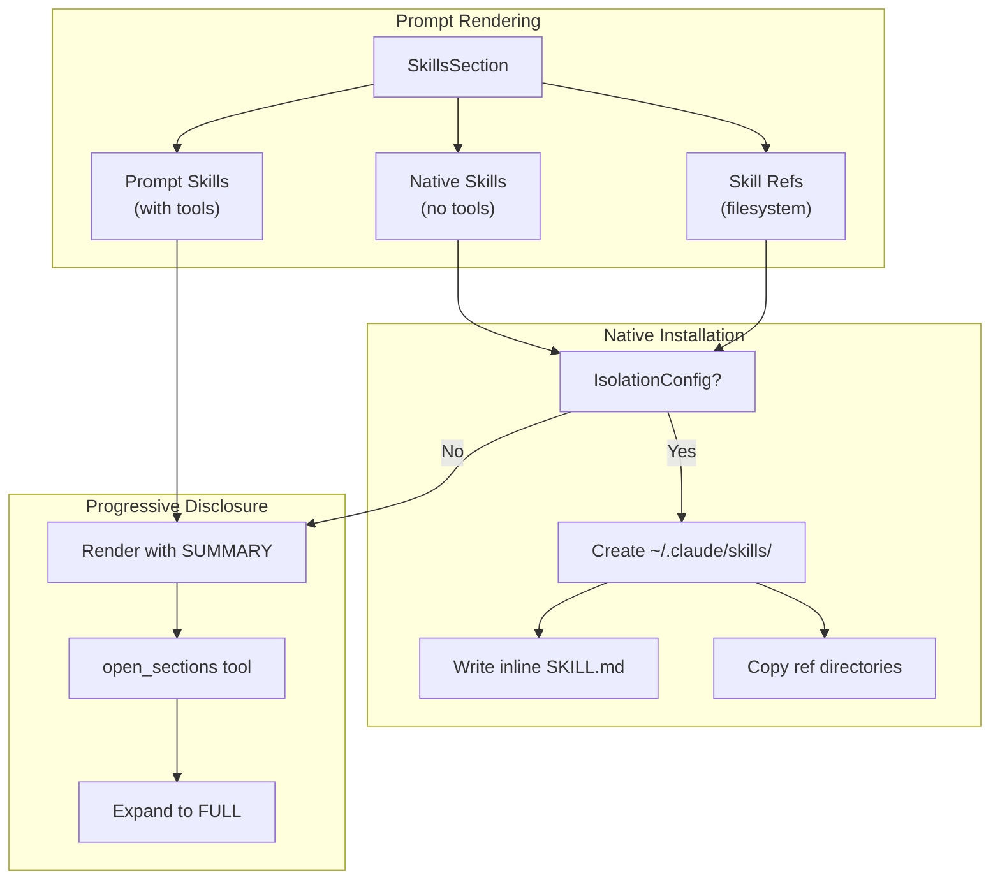

# Skills Specification

> **Claude Agent SDK**: `claude-agent-sdk>=0.1.15`

## Purpose

Skills package domain-specific expertise—workflows, context, and best
practices—into reusable units that extend Claude's capabilities. This
specification defines:

- `Skill` - A section type wrapping procedural knowledge with optional tools
- `SkillRef` - A reference to an existing skill directory on the filesystem
- `SkillsSection` - A container that manages skill installation and disclosure

Skills without custom tools are automatically installed as native Claude skills
in the isolated home directory. Skills with custom tools remain in the prompt
and participate in progressive disclosure. Filesystem-based skills referenced
via `SkillRef` are copied to the hermetic environment during setup.

## Guiding Principles

- **Native Integration**: Skills without tools become first-class Claude skills,
  benefiting from Claude's progressive loading (metadata → body → resources).
- **Tool Retention**: Skills with custom tools stay in the prompt where tool
  handlers can be invoked via MCP bridging.
- **Summary by Default**: All skills render with `SUMMARY` visibility initially,
  reducing token usage until the model requests expansion.
- **Hermetic Setup**: Native skill installation requires isolation to write to
  the ephemeral `~/.claude/skills/` directory.

## Core Components

### Skill

`Skill` is a section type that packages procedural knowledge with optional
tooling. It mirrors `MarkdownSection` but defaults to `SUMMARY` visibility and
carries metadata for native installation.

```python
from dataclasses import dataclass
from weakincentives.prompt import SectionVisibility

@dataclass(slots=True, frozen=True)
class SkillParams:
    """Default params for skills (can be specialized)."""
    pass


class Skill[ParamsT: SupportsDataclass = SkillParams](Section[ParamsT]):
    """Section type for domain-specific expertise."""

    def __init__(
        self,
        *,
        name: str,                      # 1-64 chars, lowercase/hyphens/numbers
        description: str,               # 1-1024 chars, plain text
        title: str,                     # Display heading
        template: str,                  # Body content (string.Template syntax)
        key: str,                       # Section identifier
        default_params: ParamsT | None = None,
        children: Sequence[Section] | None = None,
        enabled: Callable[[ParamsT], bool] | None = None,
        tools: Sequence[Tool] | None = None,
        accepts_overrides: bool = True,
        summary: str | None = None,     # Summary template (auto-generated if None)
        visibility: VisibilitySelector = SectionVisibility.SUMMARY,  # Default SUMMARY
    ) -> None: ...

    @property
    def has_tools(self) -> bool:
        """True if this skill has custom tool handlers."""
        return len(self.tools) > 0

    def to_skill_md(self, params: ParamsT) -> str:
        """Render as SKILL.md content with YAML frontmatter."""
        ...
```

**Field Constraints:**

- `name`: Maximum 64 characters, pattern `^[a-z0-9][a-z0-9-]{0,63}$`
- `description`: Maximum 1024 characters, non-empty, no XML tags
- `title`: Required, non-empty
- `template`: Required, uses `string.Template` syntax for substitution

**Default Summary Generation:**

When `summary` is `None`, the skill auto-generates a summary from the
description:

```
[Skill: {name}] {description}
```

### SkillRef

`SkillRef` references an existing skill directory on the filesystem. During
hermetic setup, the entire skill directory is copied to the ephemeral home,
preserving any bundled resources (scripts, reference docs, templates).

```python
from pathlib import Path

@dataclass(slots=True, frozen=True)
class SkillRef:
    """Reference to an existing skill directory on the filesystem."""

    path: Path | str            # Absolute path or relative to base_path
    base_path: Path | None = None  # Base for relative paths (defaults to cwd)
    enabled: Callable[[], bool] | None = None  # Conditional inclusion

    @property
    def resolved_path(self) -> Path:
        """Resolve to absolute path."""
        p = Path(self.path)
        if p.is_absolute():
            return p
        base = self.base_path or Path.cwd()
        return (base / p).resolve()

    @property
    def skill_md_path(self) -> Path:
        """Path to SKILL.md within the skill directory."""
        return self.resolved_path / "SKILL.md"

    @property
    def name(self) -> str:
        """Extract skill name from SKILL.md frontmatter."""
        ...

    @property
    def description(self) -> str:
        """Extract skill description from SKILL.md frontmatter."""
        ...

    def is_enabled(self) -> bool:
        """Check if this skill reference is enabled."""
        return self.enabled() if self.enabled else True

    def validate(self) -> None:
        """Validate the skill directory exists and contains valid SKILL.md."""
        ...
```

**Path Resolution:**

- Absolute paths are used as-is
- Relative paths resolve against `base_path` (defaults to current working
  directory)
- Common pattern: `base_path=Path(__file__).parent` for paths relative to the
  module

**Validation:**

- `resolved_path` must exist and be a directory
- `SKILL.md` must exist within the directory
- `SKILL.md` must contain valid YAML frontmatter with `name` and `description`
- Validation runs at construction time; invalid refs raise `SkillRefError`

**Supported Directory Structure:**

```
my-skill/
├── SKILL.md              # Required: frontmatter + body
├── scripts/              # Optional: executable scripts
│   └── analyze.sh
├── templates/            # Optional: reference templates
│   └── report.md
└── data/                 # Optional: reference data
    └── patterns.json
```

The entire directory tree is copied during installation, preserving the
structure Claude expects for resource access.

### SkillsSection

`SkillsSection` is a container that holds multiple `Skill` and `SkillRef`
instances, orchestrating their installation or disclosure.

```python
# Type alias for skill sources
SkillSource = Skill | SkillRef


class SkillsSection(Section[SkillsSectionParams]):
    """Container for skill management and installation."""

    def __init__(
        self,
        *,
        title: str = "Skills",
        key: str = "skills",
        skills: Sequence[SkillSource] = (),
        skill_refs: Sequence[SkillRef] = (),  # Convenience for refs-only
        enabled: Callable[[SkillsSectionParams], bool] | None = None,
        accepts_overrides: bool = True,
    ) -> None: ...

    @property
    def all_skills(self) -> tuple[SkillSource, ...]:
        """All skill sources (inline + refs)."""
        return tuple(self.skills) + tuple(self.skill_refs)

    @property
    def inline_skills(self) -> tuple[Skill, ...]:
        """Code-defined skills."""
        return tuple(s for s in self.skills if isinstance(s, Skill))

    @property
    def referenced_skills(self) -> tuple[SkillRef, ...]:
        """Filesystem-referenced skills."""
        refs_in_skills = tuple(s for s in self.skills if isinstance(s, SkillRef))
        return refs_in_skills + tuple(self.skill_refs)

    @property
    def native_skills(self) -> tuple[Skill, ...]:
        """Inline skills without custom tools (installed natively)."""
        return tuple(s for s in self.inline_skills if not s.has_tools)

    @property
    def prompt_skills(self) -> tuple[Skill, ...]:
        """Inline skills with custom tools (kept in prompt)."""
        return tuple(s for s in self.inline_skills if s.has_tools)

    def install_skills(
        self,
        *,
        skills_dir: Path,
        params_lookup: Mapping[type, SupportsDataclass],
    ) -> tuple[Path, ...]:
        """Install all native skills and copy all skill refs to skills_dir."""
        ...
```

**Skill Sources:**

- `skills` accepts mixed `Skill` and `SkillRef` instances
- `skill_refs` is a convenience parameter for ref-only configurations
- Both are combined via `all_skills` for unified processing

## Skill File Format

Native skills are written as SKILL.md files with YAML frontmatter:

```yaml
---
name: code-review
description: Provides code review workflows and best practices for Python projects.
---

# Code Review Workflow

Follow these steps when reviewing code:

1. Check for security vulnerabilities
2. Verify test coverage
3. Review naming conventions
4. Assess performance implications

## Security Checklist

- [ ] No hardcoded secrets
- [ ] Input validation present
- [ ] SQL injection prevented
...
```

The `to_skill_md()` method generates this format by:

1. Rendering the skill template with bound parameters
2. Prepending YAML frontmatter with `name` and `description`

## Installation Lifecycle



### Installation Steps (Claude Agent SDK)

When `ClaudeAgentSDKAdapter` evaluates a prompt containing `SkillsSection`:

1. **Detect Skills**: Locate `SkillsSection` in rendered sections
2. **Partition**: Split into `native_skills`, `prompt_skills`, and
   `referenced_skills`
3. **Check Isolation**: Verify `IsolationConfig` is set (hermetic requirement)
4. **Create Directory**: Ensure `{ephemeral_home}/.claude/skills/` exists
5. **Install Native Skills** (inline, no tools):
   - For each skill without tools, call `skill.to_skill_md(params)`
   - Write to `{skills_dir}/{skill.name}/SKILL.md`
6. **Copy Referenced Skills** (filesystem):
   - For each `SkillRef`, validate the source directory
   - Copy entire directory tree to `{skills_dir}/{ref.name}/`
   - Preserve file permissions for executable scripts
7. **Exclude from Prompt**: Native and referenced skills are not rendered into
   prompt text
8. **Render Prompt Skills**: Skills with tools render with their default
   `SUMMARY` visibility

### Without Isolation (Non-Hermetic)

When `IsolationConfig` is not set:

- All skills render into the prompt with `SUMMARY` visibility
- Native skill installation is skipped (no filesystem access)
- Warning logged: "Skills installation requires hermetic isolation"

## Progressive Disclosure

Skills with tools participate in the standard progressive disclosure system:

1. **Initial Render**: Skill renders with `SUMMARY` visibility
2. **Summary Suffix**: Appended automatically with `open_sections` instruction
3. **Model Request**: Model calls `open_sections` with skill key
4. **Expansion**: `VisibilityExpansionRequired` updates session state
5. **Re-render**: Skill renders with `FULL` visibility, exposing tools

### Summary Suffix for Skills

Skills append a skill-aware suffix:

```
---
[This skill is summarized. Call `open_sections` with key "skills.code-review"
to view full workflow and access tools: lint_code, run_tests.]
```

## Configuration

### SkillsSectionParams

```python
@dataclass(slots=True, frozen=True)
class SkillsSectionParams:
    """Parameters for SkillsSection rendering."""
    enabled_skills: frozenset[str] | None = None  # Filter by name, None = all
```

When `enabled_skills` is set, only skills with matching names are processed.

### Adapter Integration

The adapter extends `IsolationConfig` with skills support:

```python
@dataclass(slots=True, frozen=True)
class IsolationConfig:
    # ... existing fields ...
    install_skills: bool = True  # Enable native skill installation
```

When `install_skills=False`, skills are treated as prompt-only regardless of
whether they have tools.

## Events

### SkillsInstalled

Published after skills are installed to disk (both inline and referenced):

```python
@FrozenDataclass()
class SkillsInstalled:
    prompt_ns: str
    prompt_key: str
    inline_skills: tuple[str, ...]     # Inline skill names (generated)
    referenced_skills: tuple[str, ...] # Referenced skill names (copied)
    skills_dir: str                    # Installation path
    session_id: UUID | None
    created_at: datetime
    event_id: UUID = field(default_factory=uuid4)

    @property
    def skills(self) -> tuple[str, ...]:
        """All installed skill names."""
        return self.inline_skills + self.referenced_skills
```

### SkillExpanded

Published when a skill expands from `SUMMARY` to `FULL`:

```python
@FrozenDataclass()
class SkillExpanded:
    skill_name: str
    skill_key: str                     # Dot-notation path
    prompt_ns: str
    prompt_key: str
    session_id: UUID | None
    created_at: datetime
    event_id: UUID = field(default_factory=uuid4)
```

## User Stories

### Story 1: Native skill installation (no tools)

As a developer, I want to provide domain expertise that Claude loads
progressively via its native skill system.

```python
from weakincentives.adapters.claude_agent_sdk import (
    ClaudeAgentSDKAdapter,
    ClaudeAgentSDKClientConfig,
    IsolationConfig,
)
from weakincentives.prompt import Prompt, PromptTemplate, MarkdownSection
from weakincentives.prompt.skills import Skill, SkillsSection
from weakincentives.runtime import InProcessEventBus, Session


code_review_skill = Skill(
    name="code-review",
    description="Code review workflows and checklists for Python projects.",
    title="Code Review",
    key="code-review",
    template="""
    # Code Review Workflow

    1. **Security**: Check for hardcoded secrets, SQL injection, XSS
    2. **Tests**: Verify coverage meets 80% threshold
    3. **Style**: Run ruff, check docstrings
    4. **Performance**: Profile hot paths

    ## Severity Levels

    - **Critical**: Security vulnerabilities, data loss risks
    - **Major**: Missing tests, breaking changes
    - **Minor**: Style issues, documentation gaps
    """,
)

refactoring_skill = Skill(
    name="refactoring",
    description="Safe refactoring patterns and techniques.",
    title="Refactoring",
    key="refactoring",
    template="""
    # Refactoring Patterns

    ## Extract Method
    When a code fragment can be grouped together...

    ## Rename Symbol
    Use IDE support to safely rename across codebase...
    """,
)

session = Session(bus=InProcessEventBus())

template = PromptTemplate[None](
    ns="review",
    key="python-review",
    sections=[
        MarkdownSection(
            title="Task",
            key="task",
            template="Review the Python code in the workspace.",
        ),
        SkillsSection(
            skills=[code_review_skill, refactoring_skill],
        ),
    ],
)

adapter = ClaudeAgentSDKAdapter(
    client_config=ClaudeAgentSDKClientConfig(
        isolation=IsolationConfig(),  # Enables hermetic mode
    ),
)

# Skills are installed to ~/.claude/skills/{name}/SKILL.md
# Claude loads them progressively via native skill system
response = adapter.evaluate(Prompt(template), session=session)
```

### Story 2: Skill with custom tools (prompt-based)

As a platform team, I want a skill that provides both guidance and actionable
tools, keeping tools accessible via MCP.

```python
from dataclasses import dataclass
from weakincentives.prompt import Tool, ToolContext, ToolResult
from weakincentives.prompt.skills import Skill, SkillsSection


@dataclass(frozen=True)
class LintParams:
    paths: tuple[str, ...]


@dataclass(frozen=True)
class LintResult:
    issues: int
    fixed: int

    def render(self) -> str:
        return f"Found {self.issues} issues, fixed {self.fixed}"


def lint_handler(params: LintParams, *, context: ToolContext) -> ToolResult[LintResult]:
    # Run linter on paths
    return ToolResult(message="Linting complete", value=LintResult(issues=5, fixed=3))


lint_tool = Tool[LintParams, LintResult](
    name="lint_code",
    description="Run ruff linter on specified paths",
    handler=lint_handler,
)

linting_skill = Skill(
    name="linting",
    description="Code linting workflows with automated fixes.",
    title="Linting",
    key="linting",
    template="""
    # Linting Workflow

    Use the `lint_code` tool to check Python files:

    1. Run on changed files first
    2. Review unfixable issues manually
    3. Re-run to verify fixes

    ## Configuration

    Ruff settings in pyproject.toml control rules.
    """,
    tools=[lint_tool],  # Has tools → stays in prompt
)

# This skill renders with SUMMARY visibility initially.
# When expanded, the lint_code tool becomes available via MCP.
```

### Story 3: Mixed skills (native + prompt)

As an architect, I want some skills installed natively for low-overhead context,
while others with tools remain in the prompt.

```python
skills_section = SkillsSection(
    skills=[
        # Native: no tools, installed to filesystem
        Skill(
            name="architecture",
            description="System architecture principles.",
            title="Architecture",
            key="architecture",
            template="...",
        ),
        # Prompt: has tools, subject to disclosure
        Skill(
            name="testing",
            description="Testing workflows with execution tools.",
            title="Testing",
            key="testing",
            template="...",
            tools=[run_tests_tool, coverage_tool],
        ),
    ],
)

# architecture → installed to ~/.claude/skills/architecture/SKILL.md
# testing → rendered in prompt with SUMMARY, tools bridged via MCP
```

### Story 4: Filesystem-based skills (SkillRef)

As a team lead, I want to reference pre-existing skill directories that are
maintained separately from my codebase.

```python
from pathlib import Path
from weakincentives.prompt.skills import SkillRef, SkillsSection

# Reference skills from the filesystem
skills_section = SkillsSection(
    skill_refs=[
        # Absolute path to shared team skills
        SkillRef(path="/opt/company/skills/security-review"),

        # Relative to project root
        SkillRef(
            path="skills/code-style",
            base_path=Path(__file__).parent.parent,  # project root
        ),

        # Conditionally include based on environment
        SkillRef(
            path="/opt/skills/compliance",
            enabled=lambda: os.getenv("ENABLE_COMPLIANCE") == "1",
        ),
    ],
)

# The entire skill directory is copied to ~/.claude/skills/{name}/
# Including any scripts/, templates/, or data/ subdirectories
```

**Directory structure example:**

```
/opt/company/skills/security-review/
├── SKILL.md                    # Required
├── scripts/
│   ├── scan-secrets.sh         # Executable script
│   └── check-dependencies.py
├── checklists/
│   ├── owasp-top-10.md
│   └── code-injection.md
└── patterns/
    └── vulnerable-patterns.json
```

All files are copied to the hermetic environment, making them accessible to
Claude via bash commands during skill execution.

### Story 5: Mixed inline and filesystem skills

As an architect, I want to combine code-defined skills with filesystem skills
in a single section.

```python
from weakincentives.prompt.skills import Skill, SkillRef, SkillsSection

skills_section = SkillsSection(
    skills=[
        # Inline skill with custom tool
        Skill(
            name="testing",
            description="Testing workflows with execution tools.",
            title="Testing",
            key="testing",
            template="...",
            tools=[run_tests_tool],  # Stays in prompt
        ),

        # Filesystem skill (copied to hermetic env)
        SkillRef(path="/shared/skills/documentation"),

        # Another inline skill (no tools, installed natively)
        Skill(
            name="naming",
            description="Naming conventions guide.",
            title="Naming",
            key="naming",
            template="...",
        ),
    ],
)

# Result:
# - testing → prompt (has tools)
# - documentation → copied from /shared/skills/documentation/
# - naming → generated SKILL.md written to ~/.claude/skills/naming/
```

### Story 6: Conditional skill enablement

As an operator, I want to enable only specific skills based on runtime context.

```python
@dataclass(slots=True, frozen=True)
class ReviewParams:
    language: str


skills_section = SkillsSection(
    skills=[
        Skill(
            name="python-review",
            description="Python-specific review guidance.",
            title="Python Review",
            key="python-review",
            template="...",
            enabled=lambda p: p.language == "python",
        ),
        Skill(
            name="typescript-review",
            description="TypeScript-specific review guidance.",
            title="TypeScript Review",
            key="typescript-review",
            template="...",
            enabled=lambda p: p.language == "typescript",
        ),
    ],
    skill_refs=[
        # SkillRef uses zero-arg enabled predicate
        SkillRef(
            path="/skills/security",
            enabled=lambda: os.getenv("SECURITY_REVIEW") == "1",
        ),
    ],
)

# Bind params to control which skills are active
prompt = Prompt(template).bind(ReviewParams(language="python"))
# Only python-review skill is enabled (typescript-review disabled)
# security skill depends on environment variable
```

## Validation Rules

### Skill Validation

- `name` must match `^[a-z0-9][a-z0-9-]{0,63}$`
- `description` must be 1-1024 characters, no XML tags
- `title` must be non-empty
- `template` must be non-empty
- Duplicate skill names within a `SkillsSection` raise `PromptValidationError`

### SkillRef Validation

- `resolved_path` must exist and be a directory
- `SKILL.md` must exist within the directory
- `SKILL.md` must contain valid YAML frontmatter with `name` and `description`
- `name` in frontmatter must match skill naming rules
- Validation runs at construction time; failures raise `SkillRefError`
- Disabled refs (via `enabled` predicate) skip validation until enabled

### Installation Validation

- Without `IsolationConfig`, skill installation logs a warning and skips
- Skills directory must be writable (or isolation setup fails)
- Invalid skill names fail at construction, not installation
- Duplicate names across inline and referenced skills raise
  `PromptValidationError`

## Error Handling

### Exception Types

- `PromptValidationError` - Invalid skill name, description, or duplicates
- `SkillRefError` - Invalid skill reference (missing directory, invalid SKILL.md)
- `SkillInstallationError` - Filesystem write/copy failures during installation
- `VisibilityExpansionRequired` - Model requests skill expansion (handled by
  adapter)

```python
@FrozenDataclass()
class SkillRefError(WinkError, ValueError):
    """Invalid skill reference."""
    path: Path
    reason: str  # "not_found", "not_directory", "missing_skill_md", "invalid_frontmatter"
    details: str | None = None


@FrozenDataclass()
class SkillInstallationError(WinkError, RuntimeError):
    """Failed to install skill to filesystem."""
    skill_name: str
    skills_dir: Path
    source: Literal["inline", "ref"]
    cause: Exception
```

## Filesystem Layout

Skills are installed to the ephemeral home's skill directory:

```
{ephemeral_home}/
└── .claude/
    ├── settings.json          # Sandbox/network config
    └── skills/
        ├── code-review/       # Inline skill (generated)
        │   └── SKILL.md
        ├── refactoring/       # Inline skill (generated)
        │   └── SKILL.md
        └── security-review/   # Referenced skill (copied)
            ├── SKILL.md
            ├── scripts/
            │   ├── scan-secrets.sh
            │   └── check-dependencies.py
            ├── checklists/
            │   └── owasp-top-10.md
            └── patterns/
                └── vulnerable-patterns.json
```

**Inline skills** (generated from `Skill` instances):
- Only `SKILL.md` is created
- No bundled resources

**Referenced skills** (copied from `SkillRef` sources):
- Entire directory tree is copied
- File permissions preserved (important for executable scripts)
- Symlinks are followed and copied as regular files

## Operational Notes

- Native skills reduce prompt size but add filesystem I/O during setup
- Skills with tools always consume prompt tokens (summary or full)
- The `open_sections` tool is injected when any skill has `SUMMARY` visibility
- Skill expansion is logged via `SkillExpanded` events for observability
- Use `enabled_skills` filter to reduce installed skills in constrained
  environments
- Referenced skills with large resource bundles increase setup time; consider
  lazy copying for large assets
- Skill refs are validated at construction; invalid paths fail fast before
  prompt evaluation

## Limitations

- **Native skills are read-only**: Claude cannot modify installed skills
- **No dynamic skill discovery**: Skills must be declared in the prompt template
- **Inline skills have no resources**: Only `SkillRef` supports bundled scripts,
  templates, and data files
- **Isolation required**: Native installation needs hermetic setup; otherwise
  all skills go to prompt
- **No skill dependencies**: Skills cannot declare dependencies on other skills
- **No partial ref copying**: Entire skill directory is copied; cannot exclude
  specific files
- **Path security**: `SkillRef` paths are not sandboxed; callers must ensure
  paths are trusted
