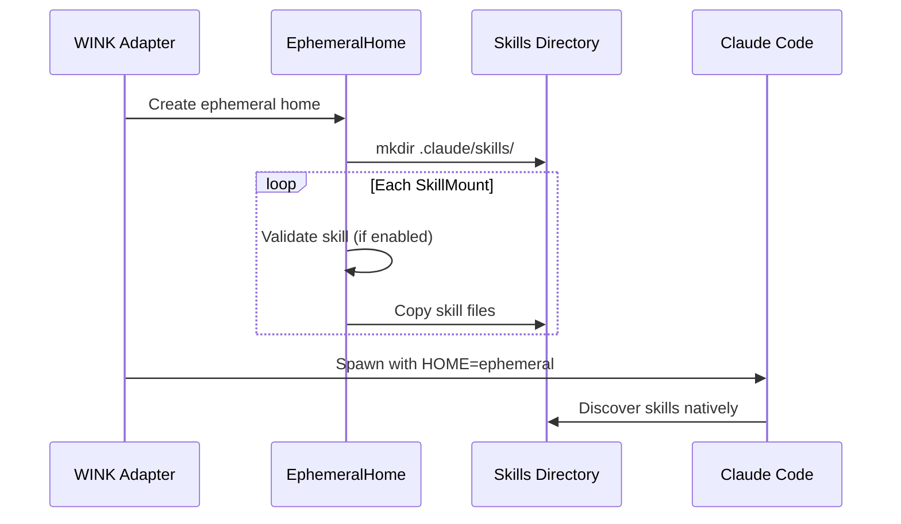

# Skill Mounting Specification

## Purpose

This specification defines how WINK mounts skills into the hermetic workspace
for Claude Code discovery. Skills are markdown files or directories that
Claude Code loads from `.claude/skills/` to provide specialized behavior,
knowledge, or workflows. By mounting skills at isolation setup time, WINK
enables declarative skill composition without modifying prompts or requiring
Claude Code internals.

## Guiding Principles

- **Passthrough over abstraction**: Mount skills for native Claude Code
  discovery rather than re-implementing skill rendering in WINK.
- **Hermetic by default**: Skills are copied into the ephemeral home's
  `.claude/skills/` directory, isolated from the host's configuration.
- **Declarative composition**: Skills are specified as configuration, not
  imperative setup code.
- **Fail-fast validation**: Invalid skill paths or malformed skill files
  surface errors before Claude Code spawns.

## Success Criteria

This feature is considered complete when:

1. **Code reviewer example refactored**: `code_reviewer_example.py` automatically
   mounts skills from `demo-skills/` when running in `--claude-agent` mode. The
   `build_claude_agent_adapter()` function uses `SkillConfig` to mount all skills
   from the demo directory.

1. **Two example skills available**: The `demo-skills/` directory contains two
   working skills that demonstrate the pattern:

   ```
   demo-skills/
   ├── code-review/
   │   └── SKILL.md      # Code review guidance and checklist
   └── python-style/
       └── SKILL.md      # Python style conventions (PEP 8, type hints)
   ```

### Refactored Code Reviewer Example

```python
# In build_claude_agent_adapter()
DEMO_SKILLS_ROOT = PROJECT_ROOT / "demo-skills"

def build_claude_agent_adapter() -> tuple[
    ProviderAdapter[ReviewResponse], ClaudeAgentWorkspaceSection
]:
    # ... existing workspace setup ...

    # Auto-discover and mount all skills from demo-skills/
    skill_mounts = tuple(
        SkillMount(source=skill_dir)
        for skill_dir in DEMO_SKILLS_ROOT.iterdir()
        if skill_dir.is_dir() and (skill_dir / "SKILL.md").exists()
    )

    isolation = IsolationConfig(
        network_policy=NetworkPolicy(allowed_domains=CODE_REVIEW_ALLOWED_DOMAINS),
        sandbox=SandboxConfig(
            enabled=True,
            readable_paths=(str(workspace_section.temp_dir),),
            bash_auto_allow=True,
        ),
        skills=SkillConfig(skills=skill_mounts),
    )
    # ...
```

### Example Skill: code-review

`demo-skills/code-review/SKILL.md`:

```markdown
# Code Review Skill

You are a thorough code reviewer. When reviewing code:

## Review Checklist

- [ ] Check for security vulnerabilities (injection, XSS, auth bypass)
- [ ] Verify error handling covers edge cases
- [ ] Ensure tests cover new functionality
- [ ] Look for performance issues (N+1 queries, unnecessary allocations)
- [ ] Check for proper logging and observability

## Output Format

Structure your review as:

1. **Summary**: One-paragraph overview
2. **Issues**: Concrete problems found (severity: high/medium/low)
3. **Suggestions**: Improvements that aren't blocking
4. **Questions**: Clarifications needed from the author
```

### Example Skill: python-style

`demo-skills/python-style/SKILL.md`:

```markdown
# Python Style Skill

Apply Python best practices when reviewing or writing code.

## Style Guidelines

- Follow PEP 8 for formatting
- Use type annotations for all public functions (PEP 484)
- Write docstrings for public APIs (PEP 257)
- Prefer f-strings over .format() or % formatting

## Common Issues to Flag

- Missing type annotations on public functions
- Mutable default arguments (def foo(items=[]))
- Bare except clauses (except: instead of except Exception:)
- Using assert for validation (stripped in optimized mode)

## References

- PEP 8: https://peps.python.org/pep-0008/
- PEP 484: https://peps.python.org/pep-0484/
- PEP 257: https://peps.python.org/pep-0257/
```

### Verification

Run the code reviewer with skills mounted:

```bash
python code_reviewer_example.py --claude-agent
```

Expected behavior:

- Skills are copied to `{ephemeral_home}/.claude/skills/`
- Claude Code discovers both skills natively
- Review responses incorporate guidance from mounted skills
- No prompt modifications required in WINK

## Data Model

### SkillMount

```python
@FrozenDataclass()
class SkillMount:
    """Mount a skill into the hermetic environment.

    Attributes:
        source: Path to a skill file (SKILL.md) or skill directory on the
            host filesystem. Relative paths are resolved against the current
            working directory.
        name: Optional skill name override. If None, derived from the source
            path (directory name or filename without extension).
        enabled: Whether the skill is active. Disabled skills are not copied.
            Defaults to True.
    """

    source: Path
    name: str | None = None
    enabled: bool = True
```

### SkillConfig

```python
@FrozenDataclass()
class SkillConfig:
    """Skills to install in the hermetic environment.

    Attributes:
        skills: Tuple of skill mounts to copy into the workspace.
        validate_on_mount: If True, validate skill structure before copying.
            Validation checks for required SKILL.md file in directories.
            Defaults to True.
    """

    skills: tuple[SkillMount, ...] = ()
    validate_on_mount: bool = True
```

### Integration with IsolationConfig

```python
@FrozenDataclass()
class IsolationConfig:
    """Configuration for hermetic SDK isolation.

    Attributes:
        network_policy: Network access constraints.
        sandbox: Sandbox configuration.
        env: Additional environment variables.
        api_key: Anthropic API key.
        include_host_env: Inherit non-sensitive host env vars.
        skills: Skills to mount in the hermetic environment. Skills are
            copied to {ephemeral_home}/.claude/skills/ before spawning
            Claude Code.
    """

    network_policy: NetworkPolicy | None = None
    sandbox: SandboxConfig | None = None
    env: Mapping[str, str] | None = None
    api_key: str | None = None
    include_host_env: bool = False
    skills: SkillConfig | None = None
```

## Skill Discovery Behavior

Claude Code discovers skills in the following order (first match wins):

1. `.claude/skills/` in the current working directory
1. `~/.claude/skills/` in the user's home directory

When `IsolationConfig.skills` is set, WINK:

1. Creates `{ephemeral_home}/.claude/skills/` during `EphemeralHome` setup
1. Copies each enabled `SkillMount` into the skills directory
1. Claude Code discovers them via path #2 (redirected `HOME`)



## Skill Validation

When `SkillConfig.validate_on_mount` is True (default), each skill mount is
validated before copying:

### Directory Skills

A skill directory must contain:

- `SKILL.md` file at the root (required)
- Optional subdirectories and supporting files

```
my-skill/
├── SKILL.md        # Required: skill definition
├── examples/       # Optional: example files
└── templates/      # Optional: templates
```

### File Skills

A single-file skill must:

- Have `.md` extension
- Contain valid markdown content
- File size must be ≤ 1 MiB

### Validation Errors

```python
class SkillValidationError(WinkError):
    """Raised when skill validation fails."""
    pass

class SkillNotFoundError(WinkError):
    """Raised when a skill source path does not exist."""
    pass

class SkillMountError(WinkError):
    """Raised when skill mounting fails."""
    pass
```

Validation errors include:

| Error | Condition |
| ---------------------- | ------------------------------- |
| `SkillNotFoundError` | Source path does not exist |
| `SkillValidationError` | Directory missing SKILL.md |
| `SkillValidationError` | File not a markdown file |
| `SkillValidationError` | File exceeds size limit |
| `SkillMountError` | Duplicate skill names in config |
| `SkillMountError` | I/O error during copy |

## Copying Behavior

### Name Resolution

The skill name determines its destination directory:

```python
def resolve_skill_name(mount: SkillMount) -> str:
    """Resolve the effective skill name from a mount."""
    if mount.name is not None:
        return mount.name
    if mount.source.is_dir():
        return mount.source.name
    # File: strip .md extension
    return mount.source.stem
```

### Destination Layout

Skills are copied to `{ephemeral_home}/.claude/skills/{skill_name}/`:

| Source Type | Destination |
| ----------- | ----------------------------------------------- |
| Directory | `{skills_dir}/{name}/` (recursive copy) |
| File | `{skills_dir}/{name}/SKILL.md` (wrapped in dir) |

Example:

```python
# Source: ./skills/code-review/ (directory with SKILL.md)
# Destination: ~/.claude/skills/code-review/

# Source: ./my-skill.md (single file)
# Destination: ~/.claude/skills/my-skill/SKILL.md
```

### Copy Options

```python
def _copy_skill(
    source: Path,
    dest_dir: Path,
    *,
    follow_symlinks: bool = False,
    max_total_bytes: int = 10 * 1024 * 1024,  # 10 MiB per skill
) -> int:
    """Copy a skill to the destination directory.

    Returns:
        Total bytes copied.

    Raises:
        SkillMountError: If copy fails or exceeds byte limit.
    """
```

## Usage Examples

### Basic Skill Mounting

```python
from pathlib import Path
from weakincentives.adapters.claude_agent_sdk import (
    ClaudeAgentSDKAdapter,
    ClaudeAgentSDKClientConfig,
    IsolationConfig,
    NetworkPolicy,
    SkillConfig,
    SkillMount,
)

adapter = ClaudeAgentSDKAdapter(
    client_config=ClaudeAgentSDKClientConfig(
        permission_mode="bypassPermissions",
        isolation=IsolationConfig(
            network_policy=NetworkPolicy.no_network(),
            skills=SkillConfig(
                skills=(
                    SkillMount(Path("./skills/code-review")),
                    SkillMount(Path("./skills/testing")),
                )
            ),
        ),
    ),
)
```

### Custom Skill Names

```python
skills = SkillConfig(
    skills=(
        # Use custom name instead of directory name
        SkillMount(
            source=Path("./internal/review-v2"),
            name="code-review",
        ),
        # Single-file skill with explicit name
        SkillMount(
            source=Path("./prompts/test-helper.md"),
            name="testing",
        ),
    )
)
```

### Conditional Skills

```python
def get_skills(include_experimental: bool) -> SkillConfig:
    """Build skill config based on feature flags."""
    mounts = [
        SkillMount(Path("./skills/core")),
        SkillMount(
            source=Path("./skills/experimental"),
            enabled=include_experimental,
        ),
    ]
    return SkillConfig(skills=tuple(mounts))
```

### Disable Validation for Development

```python
# Skip validation during rapid iteration
skills = SkillConfig(
    skills=(SkillMount(Path("./wip-skill")),),
    validate_on_mount=False,
)
```

## EphemeralHome Integration

The `EphemeralHome` class handles skill mounting during setup:

```python
class EphemeralHome:
    def __init__(
        self,
        isolation: IsolationConfig,
        *,
        workspace_path: str | None = None,
        temp_dir_prefix: str = "claude-agent-",
    ) -> None:
        # ... existing initialization ...
        self._generate_settings()
        self._mount_skills()  # New step

    def _mount_skills(self) -> None:
        """Mount configured skills into the ephemeral home."""
        skills_config = self._isolation.skills
        if skills_config is None:
            return

        skills_dir = self._claude_dir / "skills"
        skills_dir.mkdir(parents=True, exist_ok=True)

        seen_names: set[str] = set()
        for mount in skills_config.skills:
            if not mount.enabled:
                continue

            name = resolve_skill_name(mount)
            if name in seen_names:
                raise SkillMountError(f"Duplicate skill name: {name}")
            seen_names.add(name)

            source = Path(mount.source).resolve()
            if not source.exists():
                raise SkillNotFoundError(f"Skill not found: {mount.source}")

            if skills_config.validate_on_mount:
                _validate_skill(source)

            dest = skills_dir / name
            _copy_skill(source, dest)

    @property
    def skills_dir(self) -> Path:
        """Path to the skills directory within ephemeral home."""
        return self._claude_dir / "skills"
```

## Testing Considerations

### Unit Tests

- Skill name resolution for directories and files
- Validation of directory skills (SKILL.md present/missing)
- Validation of file skills (extension, size)
- Duplicate name detection
- Disabled skill filtering
- Copy behavior for directories and files

### Integration Tests

- End-to-end skill discovery by Claude Code
- Skills from hermetic home override CWD skills
- Multiple skills compose correctly
- Skill with subdirectories copies recursively

### Test Fixtures

```python
@pytest.fixture
def skill_directory(tmp_path: Path) -> Path:
    """Create a valid skill directory."""
    skill_dir = tmp_path / "test-skill"
    skill_dir.mkdir()
    (skill_dir / "SKILL.md").write_text("# Test Skill\n\nDoes testing.")
    return skill_dir

@pytest.fixture
def skill_file(tmp_path: Path) -> Path:
    """Create a valid skill file."""
    skill_file = tmp_path / "test-skill.md"
    skill_file.write_text("# Test Skill\n\nDoes testing.")
    return skill_file
```

## Limitations

- **No runtime skill updates**: Skills are copied at `EphemeralHome` creation.
  Changes to source skills require recreating the adapter.
- **No skill dependencies**: Skills cannot declare dependencies on other skills.
  Compose manually via `SkillConfig`.
- **No skill templating**: Skills are copied verbatim. Use prompt composition
  for dynamic content.
- **Size limits enforced**: Individual skills capped at 10 MiB, total skill
  directory at 50 MiB to prevent workspace bloat.

## Security Considerations

- **Path traversal**: Skill names are sanitized to prevent directory traversal.
  Names containing `/`, `\`, or `..` raise `SkillMountError`.
- **Symlink following**: Disabled by default. Enable with caution as symlinks
  can escape intended boundaries.
- **Executable files**: Skill directories may contain scripts. The sandbox
  config controls whether these can execute.

## Future Extensions

- **Skill registries**: Load skills from remote registries (PyPI, npm, custom).

- **Skill versioning**: Pin skill versions for reproducible agent behavior.

- **Skill composition**: Define skill dependencies and load order.

- **Runtime skill injection**: Add skills to running sessions via events.

- **PromptOverridesStore integration**: Skills are a form of prompt customization.
  The override system could manage skill selection per tag:

  ```python
  # Conceptual: skills as overridable prompt artifacts
  @FrozenDataclass()
  class SkillOverride:
      """Override skill configuration per environment/tag."""
      skill_name: str
      enabled: bool = True
      source_override: Path | None = None  # Replace skill source

  # In PromptOverridesStore
  store.set_skill_override(
      prompt_key="code-review-session",
      tag="production",
      override=SkillOverride(skill_name="experimental-review", enabled=False),
  )
  ```

  This unifies skill management with the existing override workflow: operators
  can enable/disable skills or swap implementations per deployment tag without
  code changes. The `LocalPromptOverridesStore` would persist skill overrides
  alongside section overrides.

## Related Specifications

- [CLAUDE_AGENT_SDK.md](CLAUDE_AGENT_SDK.md): Parent adapter specification
- [WORKSPACE.md](WORKSPACE.md): Workspace and mount patterns
- [PROMPTS.md](PROMPTS.md): Prompt composition (alternative to skills)
