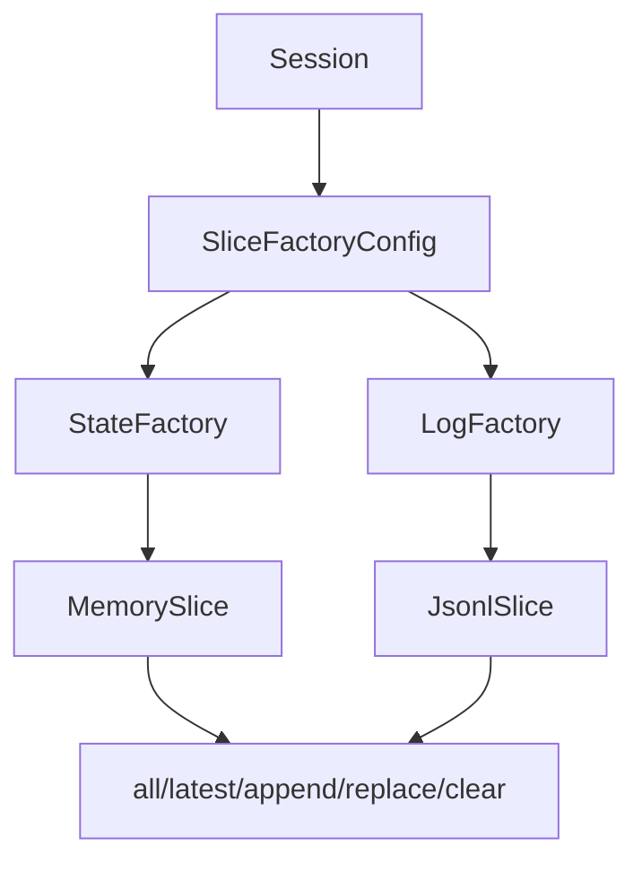

# Slice Storage Specification

Protocol abstracting storage backend for session state slices. Enables different
implementations (in-memory, file-backed) while maintaining Redux-style semantics.

**Source:** `src/weakincentives/runtime/session/slices.py`

## Principles

- **Single access pattern**: Operations work identically across backends
- **Policy-driven**: STATE and LOG can use different factories
- **Immutable semantics**: All backends present tuple-like views
- **Serialization via serde**: Consistent dataclass serialization



## Slice Protocol

**Definition:** `runtime/session/slices.py:Slice`

| Method | Purpose |
|--------|---------|
| `all()` | Return all items as tuple |
| `latest()` | Most recent item or None |
| `append(item)` | Add single item |
| `extend(items)` | Add multiple items |
| `replace(items)` | Replace all atomically |
| `clear(predicate)` | Remove items |
| `snapshot()` | Capture for serialization |
| `view()` | Lazy readonly view |

## SliceView Protocol

Lazy access for reducers. Enables append-only reducers to avoid loading data.

| Method | Purpose |
|--------|---------|
| `is_empty` | Check without loading |
| `latest()` | Get most recent |
| `all()` | Load all (expensive) |
| `where(pred)` | Filtered iteration |

## SliceOp Types

Reducers return operations describing mutations:

| Type | Behavior |
|------|----------|
| `Append(item)` | Add single item (O(1) for file-backed) |
| `Extend(items)` | Add multiple items |
| `Replace(items)` | Replace entire slice |
| `Clear(predicate)` | Remove items |

## Implementations

### MemorySlice

In-memory tuple-backed. O(1) reads, O(n) appends. Default backend.

### JsonlSlice

JSONL file-backed. Append-optimized I/O. Uses `weakincentives.serde`.

| Operation | Performance |
|-----------|-------------|
| `append()` | **O(1)** file append |
| `all()` | O(n) file read |
| `is_empty` | **O(1)** file stat |

## Configuration

```python
config = SliceFactoryConfig(
    state_factory=MemorySliceFactory(),
    log_factory=JsonlSliceFactory(base_dir=Path("./logs")),
)
session = Session(dispatcher=dispatcher, slice_config=config)
```

## Reducer Contract

```python
def reducer(view: SliceView[S], event: E, *, context: ReducerContext) -> SliceOp[S]:
    return Append(new_item)  # Or Replace, Extend, Clear
```

### Declarative Reducers

```python
@dataclass(frozen=True)
class AgentPlan:
    steps: tuple[str, ...] = ()

    @reducer(on=AddStep)
    def add_step(self, event: AddStep) -> Replace["AgentPlan"]:
        return Replace((replace(self, steps=(*self.steps, event.step)),))
```

## Thread Safety

- `MemorySlice`: Delegated to Session's RLock
- `JsonlSlice`: Uses `fcntl.flock()` for file-level locking

## Limitations

- No partial reads (loads entire slice)
- No indexing for file-backed
- Single-process locking only
- Eager caching may exhaust memory
