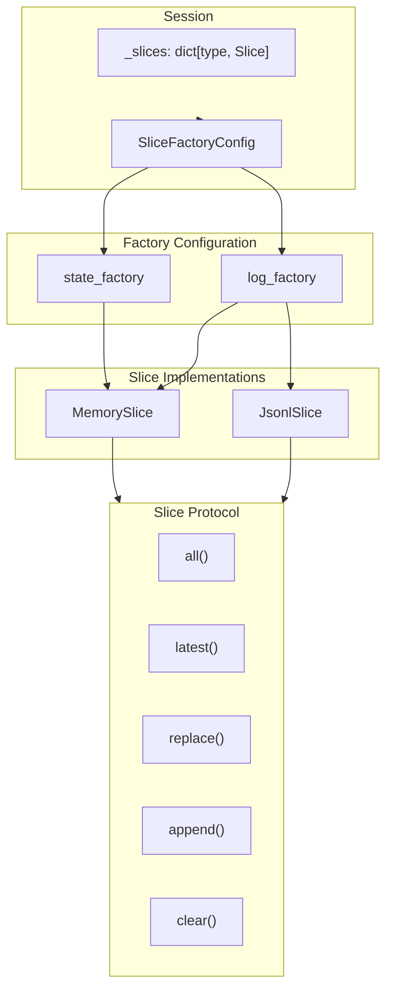

# Slice Storage Specification

## Purpose

This specification defines a `Slice` protocol that abstracts the storage
backend for session state slices. The protocol enables different storage
implementations (in-memory, file-backed) while maintaining the same
Redux-style semantics. Slice factories can be configured per `SlicePolicy`,
allowing logs to persist to disk while keeping working state in memory.

## Guiding Principles

- **Single access pattern**: Session operations work identically regardless
  of storage backend.
- **Policy-driven configuration**: `SlicePolicy.STATE` and `SlicePolicy.LOG`
  can use different factories.
- **Immutable semantics preserved**: All backends present tuple-like immutable
  views; mutations create new versions.
- **Backend-managed persistence**: File-backed slices handle their own I/O;
  no special session logic required.
- **Serialization via serde**: File backends use `weakincentives.serde` for
  consistent dataclass serialization.



## Protocol Definition

### Slice Protocol

```python
from typing import Protocol, Callable, Iterable, runtime_checkable
from weakincentives.types.dataclass import SupportsDataclass

@runtime_checkable
class Slice[T: SupportsDataclass](Protocol):
    """Protocol for slice storage backends.

    Slices store immutable tuples of dataclass instances. All read operations
    return tuples; mutations replace the underlying storage atomically.
    """

    def all(self) -> tuple[T, ...]:
        """Return all items in the slice as an immutable tuple."""
        ...

    def latest(self) -> T | None:
        """Return the most recent item, or None if empty."""
        ...

    def append(self, item: T) -> None:
        """Append a single item to the slice."""
        ...

    def extend(self, items: Iterable[T]) -> None:
        """Append multiple items to the slice."""
        ...

    def replace(self, items: tuple[T, ...]) -> None:
        """Replace all items atomically.

        Used by reducers after transforming state. The tuple is the
        complete new state for the slice.
        """
        ...

    def clear(self, predicate: Callable[[T], bool] | None = None) -> None:
        """Remove items from the slice.

        Args:
            predicate: If provided, only items where predicate returns True
                are removed. If None, all items are removed.
        """
        ...

    def __len__(self) -> int:
        """Return the number of items in the slice."""
        ...

    def snapshot(self) -> tuple[T, ...]:
        """Create a snapshot of current state for serialization.

        Returns the same as all() but signals intent for snapshot use.
        Backends may optimize for this (e.g., flush pending writes).
        """
        ...

    def view(self) -> "SliceView[T]":
        """Return a lazy readonly view for reducer input.

        The view provides lazy access to slice contents, enabling
        efficient append-only reducers that never load existing data.
        """
        ...
```

### SliceFactory Protocol

```python
from typing import Protocol
from weakincentives.types.dataclass import SupportsDataclass

class SliceFactory(Protocol):
    """Factory for creating slice storage backends."""

    def create[T: SupportsDataclass](self, slice_type: type[T]) -> Slice[T]:
        """Create a new slice for the given dataclass type.

        Args:
            slice_type: The dataclass type this slice will store.

        Returns:
            A new empty Slice instance.
        """
        ...
```

### SliceFactoryConfig

```python
from dataclasses import dataclass
from weakincentives.runtime.session.slice_policy import SlicePolicy

@dataclass(slots=True, frozen=True)
class SliceFactoryConfig:
    """Configuration mapping slice policies to factories.

    Allows different storage backends for STATE vs LOG slices:
    - STATE: Working state rolled back on failure (default: memory)
    - LOG: Append-only records preserved during restore (default: memory)

    Example::

        config = SliceFactoryConfig(
            state_factory=MemorySliceFactory(),
            log_factory=JsonlSliceFactory(base_dir=Path("./logs")),
        )
        session = Session(slice_config=config)
    """

    state_factory: SliceFactory
    log_factory: SliceFactory

    def factory_for_policy(self, policy: SlicePolicy) -> SliceFactory:
        """Return the factory for the given policy."""
        if policy == SlicePolicy.LOG:
            return self.log_factory
        return self.state_factory
```

### SliceView Protocol

```python
from typing import Protocol, Iterator
from collections.abc import Callable
from weakincentives.types.dataclass import SupportsDataclass

class SliceView[T: SupportsDataclass](Protocol):
    """Readonly lazy view of a slice for reducer input.

    SliceView provides lazy access to slice contents, enabling reducers
    that only append to avoid loading existing data entirely. For
    file-backed slices, methods like `is_empty` and `latest()` can be
    optimized to avoid full file reads.

    This is the input type for reducers, replacing the eager tuple.
    """

    @property
    def is_empty(self) -> bool:
        """Check if slice is empty without loading all items.

        For file-backed slices, this can check file existence/size
        without parsing contents.
        """
        ...

    def __len__(self) -> int:
        """Return item count.

        May require loading for some backends, but can be optimized
        (e.g., counting newlines in JSONL without parsing).
        """
        ...

    def __iter__(self) -> Iterator[T]:
        """Iterate items lazily.

        Enables streaming for large slices without loading all into memory.
        """
        ...

    def all(self) -> tuple[T, ...]:
        """Load and return all items as a tuple.

        This is the expensive operation - avoid if possible.
        Results may be cached by the implementation.
        """
        ...

    def latest(self) -> T | None:
        """Return most recent item, or None if empty.

        Can be optimized for file-backed slices (e.g., read last line).
        """
        ...

    def where(self, predicate: Callable[[T], bool]) -> Iterator[T]:
        """Yield items matching predicate.

        Enables filtered iteration without materializing full tuple.
        """
        ...
```

### SliceOp Types

```python
from dataclasses import dataclass
from typing import Callable
from weakincentives.types.dataclass import SupportsDataclass

@dataclass(frozen=True, slots=True)
class Append[T: SupportsDataclass]:
    """Append a single item to the slice.

    Most efficient operation for file-backed slices - just appends
    to the file without reading existing contents.
    """
    item: T


@dataclass(frozen=True, slots=True)
class Extend[T: SupportsDataclass]:
    """Append multiple items to the slice."""
    items: tuple[T, ...]


@dataclass(frozen=True, slots=True)
class Replace[T: SupportsDataclass]:
    """Replace entire slice contents.

    Required when reducer transforms existing state. For file-backed
    slices, this rewrites the entire file.
    """
    items: tuple[T, ...]


@dataclass(frozen=True, slots=True)
class Clear[T: SupportsDataclass]:
    """Clear items from the slice.

    Args:
        predicate: If provided, only items where predicate returns True
            are removed. If None, all items are removed.
    """
    predicate: Callable[[T], bool] | None = None


# Union of all slice operations - reducers must return one of these
type SliceOp[T: SupportsDataclass] = Append[T] | Extend[T] | Replace[T] | Clear[T]
```

## Reducer Contract

Reducers receive a lazy `SliceView` and return a `SliceOp` describing
the mutation:

### Signature

```python
from weakincentives.runtime.session import ReducerContext

def reducer[S: SupportsDataclass](
    view: SliceView[S],
    event: SupportsDataclass,
    *,
    context: ReducerContext,
) -> SliceOp[S]:
    """Transform slice state in response to an event.

    Args:
        view: Lazy readonly view of current slice state. Access only
            what you need - for append-only reducers, don't access at all.
        event: The dispatched event triggering this reducer.
        context: Reducer context with session metadata.

    Returns:
        A SliceOp describing the mutation to apply.
    """
    ...
```

### Built-in Reducers

The following built-in reducers are available in `weakincentives.runtime.session`:

| Reducer | Description | View Access | Performance |
|---------|-------------|-------------|-------------|
| `append_all` | Append event to slice (ledger semantics) | None | O(1) for file-backed |
| `replace_latest` | Keep only the most recent value | None | O(1) all backends |
| `upsert_by(key_fn)` | Upsert by derived key | Full | O(n) all backends |

**Implementation:** See `src/weakincentives/runtime/session/reducers.py`

### Declarative Reducers

The `@reducer` decorator enables method-style reducers on frozen dataclasses.
Methods must return `SliceOp`, maintaining consistency with the functional
reducer API:

```python
@dataclass(frozen=True)
class AgentPlan:
    steps: tuple[str, ...]
    current_step: int = 0

    @reducer(on=AddStep)
    def add_step(self, event: AddStep) -> Replace["AgentPlan"]:
        # self is the current state (from view.latest())
        # Must return a SliceOp - typically Replace for state slices
        new_plan = replace(self, steps=(*self.steps, event.step))
        return Replace((new_plan,))

    @reducer(on=CompleteStep)
    def complete(self, event: CompleteStep) -> Replace["AgentPlan"]:
        new_plan = replace(self, current_step=self.current_step + 1)
        return Replace((new_plan,))

    @reducer(on=ResetPlan)
    def reset(self, event: ResetPlan) -> Replace["AgentPlan"]:
        # Can create entirely new state
        return Replace((AgentPlan(steps=(), current_step=0),))
```

The decorator wrapper:

1. Calls `view.latest()` to get current state (or uses initial factory)
1. Invokes the method with `self` bound to current state
1. Returns the `SliceOp` from the method directly

**Why SliceOp for declarative reducers?**

- **Consistency**: Same return type as functional reducers
- **Explicitness**: Clear intent - Replace, Append, etc.
- **Flexibility**: Methods can return Append for ledger-style slices
- **No magic**: No implicit wrapping or type inspection

**Ledger-style declarative slice:**

```python
@dataclass(frozen=True)
class AuditEntry:
    action: str
    timestamp: datetime

    @reducer(on=UserAction)
    def log_action(self, event: UserAction) -> Append["AuditEntry"]:
        # Append new entry without loading existing ones
        return Append(AuditEntry(action=event.name, timestamp=event.at))
```

### Session Dispatch

```python
def _apply_slice_op[S: SupportsDataclass](
    self,
    op: SliceOp[S],
    slice: Slice[S],
) -> None:
    """Apply slice operation using optimal method."""
    match op:
        case Append(item=item):
            slice.append(item)
        case Extend(items=items):
            slice.extend(items)
        case Replace(items=items):
            slice.replace(items)
        case Clear(predicate=pred):
            slice.clear(pred)
```

### Performance Characteristics

| Reducer Pattern | MemorySlice | JsonlSlice |
| ------------------------ | ----------- | -------------------------- |
| `Append(item)` | O(n) copy | **O(1) file append** |
| `Extend(items)` | O(n) copy | **O(k) file append** |
| `Replace(items)` | O(1) | O(n) file rewrite |
| `view.all()` + transform | O(1) read | O(n) file read |
| `view.latest()` | O(1) | O(n) or **O(1) optimized** |
| `view.is_empty` | O(1) | **O(1) file stat** |

**Key insight**: Append-only reducers (the common case) become O(1) for
file-backed slices because they never access the view.

## Implementations

### MemorySlice

In-memory tuple-backed slice providing O(1) reads and O(n) appends. Implements both `Slice` and `SliceView` protocols, serving as its own view since all data is already in memory. All operations are performed on immutable tuples, matching current Session semantics.

**Implementation:** `src/weakincentives/runtime/session/slices.py`

**Key characteristics:**

- Zero I/O overhead
- Backed by Python tuples (immutable)
- Serves as its own SliceView
- Default backend for all slice policies

### MemorySliceFactory

Factory that creates in-memory slices. Takes no configuration parameters and returns fresh `MemorySlice` instances for each slice type.

**Implementation:** `src/weakincentives/runtime/session/slices.py`

### JsonlSlice

JSONL file-backed slice for persistent storage. Each item stored as a single JSON line. Reads load the entire file; appends are O(1) file operations. Uses separate `JsonlSliceView` for lazy access to avoid loading data when not needed. Includes type information (`__type__` field) for polymorphic deserialization.

**Implementation:** `src/weakincentives/runtime/session/slices.py`

**Key characteristics:**

- File-based persistence with append-optimized I/O
- Lazy view with optimized `is_empty`, `latest()`, streaming iteration
- Write-through cache invalidation
- Thread safety via `fcntl.flock` (POSIX) or `msvcrt.locking` (Windows)
- Uses `weakincentives.serde` for serialization

**View optimizations:**

- `is_empty`: O(1) file stat check
- `latest()`: Can seek to last line (implementation uses cache)
- `__iter__`: Streams items without loading all into memory

### JsonlSliceFactory

Factory that creates JSONL file-backed slices. Each slice type gets its own file based on qualified class name. When `base_dir` is not provided, creates a temporary directory that persists for the factory lifetime.

**Implementation:** `src/weakincentives/runtime/session/slices.py`

**Configuration:**

- `base_dir: Path | None` - Directory for slice files (temp dir if None)
- `directory` property - Returns resolved directory path for debugging

## Session Integration

### Constructor Changes

```python
class Session:
    def __init__(
        self,
        *,
        dispatcher: TelemetryDispatcher | None = None,
        parent: Session | None = None,
        session_id: UUID | None = None,
        created_at: datetime | None = None,
        tags: Mapping[object, object] | None = None,
        slice_config: SliceFactoryConfig | None = None,  # NEW
    ) -> None:
        # ...
        self._slice_config = slice_config or SliceFactoryConfig(
            state_factory=MemorySliceFactory(),
            log_factory=MemorySliceFactory(),
        )
        self._slices: dict[SessionSliceType, Slice[Any]] = {}
        # ...
```

### Slice Access

```python
def _get_or_create_slice[T: SupportsDataclass](
    self, slice_type: type[T]
) -> Slice[T]:
    """Get existing slice or create one using the appropriate factory."""
    if slice_type not in self._slices:
        policy = self._slice_policies.get(slice_type, SlicePolicy.STATE)
        factory = self._slice_config.factory_for_policy(policy)
        self._slices[slice_type] = factory.create(slice_type)
    return cast(Slice[T], self._slices[slice_type])
```

### State Operations

Replace direct tuple manipulation with slice protocol calls:

```python
# Before
self._state[slice_type] = tuple(values)

# After
self._get_or_create_slice(slice_type).replace(tuple(values))
```

```python
# Before
existing = self._state.get(slice_type, EMPTY_SLICE)

# After
existing = self._get_or_create_slice(slice_type).all()
```

## Usage Patterns

Full usage examples are available in the test suite at `tests/runtime/test_slices.py`. The following patterns are demonstrated:

- **Default configuration**: All slices use in-memory storage (backward compatible)
- **Temporary logs for debugging**: JsonlSliceFactory with auto-generated temp directory
- **Persistent logs with in-memory state**: STATE uses memory, LOG uses JSONL files
- **All slices persistent**: Both STATE and LOG use JSONL files
- **Custom factory per slice type**: Extend SliceFactoryConfig for per-type overrides

**Quick example:**

```python
from pathlib import Path
from weakincentives.runtime.session import Session
from weakincentives.runtime.session.slices import (
    MemorySliceFactory,
    JsonlSliceFactory,
    SliceFactoryConfig,
)

config = SliceFactoryConfig(
    state_factory=MemorySliceFactory(),
    log_factory=JsonlSliceFactory(base_dir=Path("./session_logs")),
)

session = Session(dispatcher=dispatcher, slice_config=config)
```

## Snapshot and Restore Behavior

### Snapshot Creation

Snapshots call `slice.snapshot()` for each slice:

```python
def snapshot(self) -> Snapshot:
    state: dict[SessionSliceType, tuple[SupportsDataclass, ...]] = {}
    for slice_type, slice_instance in self._slices.items():
        policy = self._slice_policies.get(slice_type, SlicePolicy.STATE)
        if policy in snapshot_policies:
            state[slice_type] = slice_instance.snapshot()
    return Snapshot(state=state, ...)
```

### Restore Behavior

Restore uses `slice.replace()` to set state:

```python
def restore(self, snapshot: Snapshot) -> None:
    for slice_type, items in snapshot.state.items():
        policy = self._slice_policies.get(slice_type, SlicePolicy.STATE)
        if policy == SlicePolicy.LOG:
            continue  # Logs are preserved, not restored
        self._get_or_create_slice(slice_type).replace(items)
```

### File-Backed Snapshot Considerations

For `JsonlSlice`:

- `snapshot()` returns the current in-memory view (after loading from disk)
- `replace()` rewrites the entire file atomically
- Session snapshots are still JSON; file contents are separate persistence

## Thread Safety

### MemorySlice

Thread safety delegated to Session's RLock. Slice operations are simple
tuple reassignments protected by the session lock.

### JsonlSlice

Uses `fcntl.flock()` for file-level locking:

- `LOCK_SH` (shared) for reads
- `LOCK_EX` (exclusive) for writes

Combined with Session's RLock, this provides:

- Session-level atomicity for reducer execution
- File-level atomicity for disk operations

### Cross-Platform File Locking

For Windows compatibility, use `msvcrt.locking()` or the `filelock` library:

```python
try:
    import fcntl
    HAS_FCNTL = True
except ImportError:
    import msvcrt
    HAS_FCNTL = False

def lock_shared(f):
    if HAS_FCNTL:
        fcntl.flock(f.fileno(), fcntl.LOCK_SH)
    else:
        msvcrt.locking(f.fileno(), msvcrt.LK_LOCK, 1)

def lock_exclusive(f):
    if HAS_FCNTL:
        fcntl.flock(f.fileno(), fcntl.LOCK_EX)
    else:
        msvcrt.locking(f.fileno(), msvcrt.LK_LOCK, 1)

def unlock(f):
    if HAS_FCNTL:
        fcntl.flock(f.fileno(), fcntl.LOCK_UN)
    else:
        msvcrt.locking(f.fileno(), msvcrt.LK_UNLCK, 1)
```

## Performance Characteristics

| Operation | MemorySlice | JsonlSlice (cached) | JsonlSlice (cold) |
| ----------- | ------------ | ------------------- | ------------------- |
| `all()` | O(1) | O(1) | O(n) file read |
| `latest()` | O(1) | O(1) | O(n) file read |
| `append()` | O(n) copy | O(1) file append | O(1) file append |
| `replace()` | O(1) | O(n) file write | O(n) file write |
| `clear()` | O(1) or O(n) | O(1) delete or O(n) | O(1) delete or O(n) |
| Memory | O(n) | O(n) when cached | O(1) base |

### Recommendations

- **Short-lived sessions**: Use `MemorySliceFactory` for everything
- **Debug/audit needs**: Use `JsonlSliceFactory` for LOG slices only
- **Crash recovery**: Use `JsonlSliceFactory` for both (accept performance cost)
- **Large slices**: Consider custom streaming implementation

## File Format

JSONL files use one JSON object per line:

```jsonl
{"__type__":"myapp.events:ToolInvoked","name":"search","params":{"query":"test"},"result":"..."}
{"__type__":"myapp.events:ToolInvoked","name":"read","params":{"path":"/foo"},"result":"..."}
```

The `__type__` field enables polymorphic deserialization when slice types
use union types or inheritance.

## Error Handling

### File I/O Errors

`JsonlSlice` propagates I/O errors (permission denied, disk full, etc.).
Callers should handle:

```python
try:
    session.dispatch(event)
except OSError as e:
    logger.error(f"Slice persistence failed: {e}")
    # Consider falling back to memory-only mode
```

### Serialization Errors

Non-serializable dataclass fields raise during `dump()`. Ensure slice types
use serializable fields only (primitives, nested dataclasses, standard
collections).

### Deserialization Errors

Corrupt JSONL files or missing types raise during `parse()`. The error
includes the problematic line for debugging:

```python
try:
    items = slice.all()
except (json.JSONDecodeError, TypeError, ValueError) as e:
    logger.error(f"Failed to load {slice.path}: {e}")
    # Consider clearing and starting fresh
    slice.clear()
```

## Future Backends

Potential implementations beyond the core MemorySlice and JsonlSlice:

- **SqliteSlice** - Indexed queries, better for large slices with complex access patterns
- **RedisSlice** - Distributed session state for multi-process agents
- **S3Slice** - Cloud persistence for long-running agents with durable storage

## Limitations

- **No partial reads**: `all()` loads entire slice; large slices may be slow
- **No indexing**: File-backed slices don't support indexed queries
- **Single-process locking**: `fcntl.flock` doesn't work across NFS/distributed
- **Eager caching**: `JsonlSlice` caches all items; very large slices may
  exhaust memory
- **No streaming writes**: Each append is a separate file operation; high-
  frequency appends may bottleneck on I/O

## Related Specifications

- `specs/SESSIONS.md` - Session lifecycle, reducers, snapshots
- `specs/DATACLASSES.md` - Serde utilities for serialization
- `specs/THREAD_SAFETY.md` - Concurrency patterns
