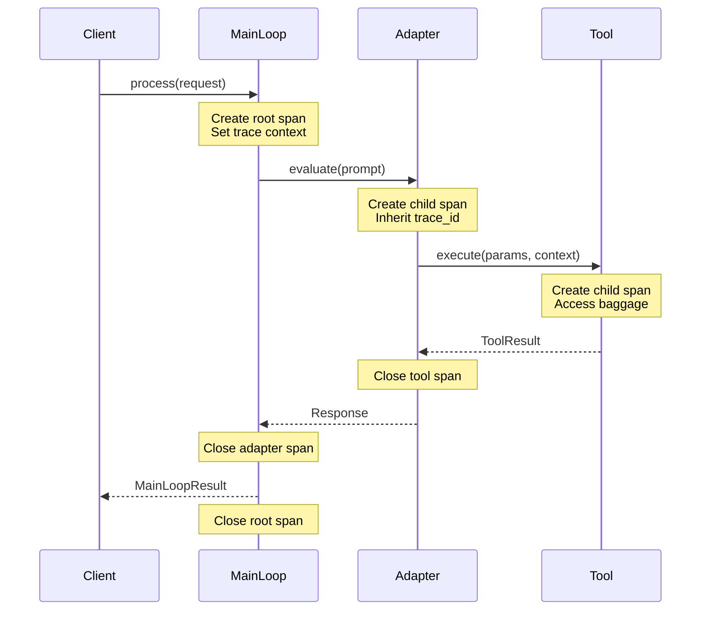

# Span Context Management Specification

## Purpose

This specification defines how WINK propagates trace context across execution
boundaries using `contextvars`. It establishes patterns for:

- **Parent/child span relationships** with automatic hierarchy tracking
- **Trace ID propagation** across sync and async boundaries
- **Baggage/attributes** for cross-cutting concerns (tenant ID, feature flags)
- **Integration** with OpenTelemetry and existing WINK observability

The goal is transparent, zero-boilerplate tracing that works with WINK's
existing `ToolContext`, `ExecutionState`, and event infrastructure.

## Guiding Principles

1. **Implicit propagation, explicit access** — Context flows automatically via
   `contextvars`; code accesses it through typed APIs when needed.
2. **Async-safe by design** — `contextvars` provides correct semantics for
   `asyncio`, threads, and task groups without manual copying.
3. **Composable with OpenTelemetry** — Span context maps directly to OTel's
   `SpanContext` and `Baggage` for seamless interop.
4. **Zero overhead when disabled** — Tracing is opt-in; disabled tracing
   introduces no runtime cost beyond a context variable check.
5. **Immutable propagation** — Baggage and attributes use copy-on-write
   semantics to prevent accidental cross-span pollution.

## Core Components

### SpanContext

The immutable trace context that identifies a span within a trace:

```python
from dataclasses import dataclass
from typing import Mapping
from uuid import UUID

@dataclass(frozen=True, slots=True)
class SpanContext:
    """Immutable trace context identifying a span within a trace."""

    trace_id: UUID
    """Globally unique identifier for the entire trace."""

    span_id: UUID
    """Unique identifier for this specific span."""

    parent_span_id: UUID | None
    """Span ID of the parent, or None for root spans."""

    trace_flags: int = 0
    """Bit field for trace options (e.g., sampled=0x01)."""

    trace_state: Mapping[str, str] = field(default_factory=dict)
    """Vendor-specific trace state (W3C Trace Context compliant)."""

    @property
    def is_sampled(self) -> bool:
        """Check if the sampled flag is set."""
        return bool(self.trace_flags & 0x01)

    @property
    def is_root(self) -> bool:
        """Check if this is a root span (no parent)."""
        return self.parent_span_id is None

    def child(self) -> SpanContext:
        """Create a child span context with this span as parent."""
        return SpanContext(
            trace_id=self.trace_id,
            span_id=uuid4(),
            parent_span_id=self.span_id,
            trace_flags=self.trace_flags,
            trace_state=self.trace_state,
        )
```

### Baggage

Cross-cutting attributes that propagate with the trace:

```python
from dataclasses import dataclass
from typing import Mapping, Self

@dataclass(frozen=True, slots=True)
class Baggage:
    """Immutable key-value pairs propagated across span boundaries."""

    items: Mapping[str, str] = field(default_factory=dict)
    """String key-value pairs. Values should be URL-safe."""

    def with_item(self, key: str, value: str) -> Self:
        """Return new Baggage with an additional item."""
        return Baggage(items={**self.items, key: value})

    def without_item(self, key: str) -> Self:
        """Return new Baggage without the specified key."""
        return Baggage(items={k: v for k, v in self.items.items() if k != key})

    def get(self, key: str, default: str | None = None) -> str | None:
        """Retrieve a baggage item by key."""
        return self.items.get(key, default)
```

### TraceContext

The combined context that flows through execution:

```python
from dataclasses import dataclass
from typing import Mapping, Self

@dataclass(frozen=True, slots=True)
class TraceContext:
    """Combined span context and baggage for propagation."""

    span: SpanContext
    """The current span context."""

    baggage: Baggage = field(default_factory=Baggage)
    """Cross-cutting attributes for this trace."""

    attributes: Mapping[str, str | int | float | bool] = field(
        default_factory=dict
    )
    """Span-local attributes (not propagated to children)."""

    def child(
        self,
        *,
        attributes: Mapping[str, str | int | float | bool] | None = None,
    ) -> Self:
        """Create child context. Baggage propagates; attributes reset."""
        return TraceContext(
            span=self.span.child(),
            baggage=self.baggage,
            attributes=attributes or {},
        )

    def with_baggage(self, key: str, value: str) -> Self:
        """Return context with additional baggage item."""
        return TraceContext(
            span=self.span,
            baggage=self.baggage.with_item(key, value),
            attributes=self.attributes,
        )

    def with_attribute(self, key: str, value: str | int | float | bool) -> Self:
        """Return context with additional span attribute."""
        return TraceContext(
            span=self.span,
            baggage=self.baggage,
            attributes={**self.attributes, key: value},
        )
```

## Context Variables

### Variable Definitions

```python
from contextvars import ContextVar

# Primary context variable for trace propagation
_trace_context: ContextVar[TraceContext | None] = ContextVar(
    "wink_trace_context", default=None
)

# Optional override for forced sampling decisions
_force_sample: ContextVar[bool | None] = ContextVar(
    "wink_force_sample", default=None
)
```

### Accessor Functions

```python
from uuid import uuid4

def get_current_context() -> TraceContext | None:
    """Get the current trace context, or None if not in a traced scope."""
    return _trace_context.get()

def get_current_span() -> SpanContext | None:
    """Get the current span context, or None if not in a traced scope."""
    ctx = _trace_context.get()
    return ctx.span if ctx else None

def get_current_baggage() -> Baggage:
    """Get current baggage, or empty Baggage if not in a traced scope."""
    ctx = _trace_context.get()
    return ctx.baggage if ctx else Baggage()

def get_trace_id() -> UUID | None:
    """Get the current trace ID, or None if not in a traced scope."""
    span = get_current_span()
    return span.trace_id if span else None

def get_span_id() -> UUID | None:
    """Get the current span ID, or None if not in a traced scope."""
    span = get_current_span()
    return span.span_id if span else None
```

## Span Lifecycle

### Creating Spans

```python
from contextlib import contextmanager
from typing import Iterator, Mapping

@contextmanager
def span(
    name: str,
    *,
    attributes: Mapping[str, str | int | float | bool] | None = None,
    baggage: Mapping[str, str] | None = None,
) -> Iterator[TraceContext]:
    """Create a new span as a child of the current context.

    Args:
        name: Human-readable span name for display.
        attributes: Span-local attributes (not propagated).
        baggage: Additional baggage items (propagated to children).

    Yields:
        The new TraceContext for this span.

    Example:
        with span("process_request", attributes={"user_id": 123}):
            do_work()
    """
    parent = _trace_context.get()

    if parent is None:
        # Create root span
        new_span = SpanContext(
            trace_id=uuid4(),
            span_id=uuid4(),
            parent_span_id=None,
            trace_flags=_resolve_sampling(),
        )
        new_baggage = Baggage(items=baggage or {})
    else:
        # Create child span
        new_span = parent.span.child()
        new_baggage = parent.baggage
        if baggage:
            for k, v in baggage.items():
                new_baggage = new_baggage.with_item(k, v)

    ctx = TraceContext(
        span=new_span,
        baggage=new_baggage,
        attributes={"span.name": name, **(attributes or {})},
    )

    token = _trace_context.set(ctx)
    try:
        yield ctx
    finally:
        _trace_context.reset(token)

def _resolve_sampling() -> int:
    """Determine trace flags for a new root span."""
    forced = _force_sample.get()
    if forced is not None:
        return 0x01 if forced else 0x00
    # Default: sampled (configurable via TracerConfig)
    return 0x01
```

### Async Span Context Manager

```python
from contextlib import asynccontextmanager
from typing import AsyncIterator

@asynccontextmanager
async def async_span(
    name: str,
    *,
    attributes: Mapping[str, str | int | float | bool] | None = None,
    baggage: Mapping[str, str] | None = None,
) -> AsyncIterator[TraceContext]:
    """Async version of span() for use with async with."""
    # contextvars automatically propagate across await boundaries
    with span(name, attributes=attributes, baggage=baggage) as ctx:
        yield ctx
```

## Propagation Across Boundaries

### Async Task Propagation

`contextvars` automatically copies context to new tasks:

```python
import asyncio

async def example():
    with span("parent"):
        # Context automatically propagates to the task
        task = asyncio.create_task(child_operation())
        await task

async def child_operation():
    # get_current_span() returns the parent's child span
    with span("child"):
        pass  # Parent span is correctly set
```

### Thread Pool Propagation

For `ThreadPoolExecutor`, use `contextvars.copy_context()`:

```python
from concurrent.futures import ThreadPoolExecutor
from contextvars import copy_context

def run_in_thread(fn, *args, **kwargs):
    """Execute function in thread with current context."""
    ctx = copy_context()
    return ctx.run(fn, *args, **kwargs)

# Usage
with span("main"):
    with ThreadPoolExecutor() as pool:
        future = pool.submit(run_in_thread, worker_function)
        result = future.result()
```

### Cross-Process Propagation

For HTTP, gRPC, or message queues, serialize context to headers:

```python
from typing import Mapping

def inject_context(headers: dict[str, str]) -> None:
    """Inject trace context into outgoing headers (W3C format)."""
    ctx = get_current_context()
    if ctx is None:
        return

    span = ctx.span
    # W3C Trace Context traceparent header
    headers["traceparent"] = (
        f"00-{span.trace_id.hex}-{span.span_id.hex}-"
        f"{span.trace_flags:02x}"
    )

    # W3C Trace Context tracestate header
    if span.trace_state:
        headers["tracestate"] = ",".join(
            f"{k}={v}" for k, v in span.trace_state.items()
        )

    # W3C Baggage header
    if ctx.baggage.items:
        headers["baggage"] = ",".join(
            f"{k}={v}" for k, v in ctx.baggage.items.items()
        )

def extract_context(headers: Mapping[str, str]) -> TraceContext | None:
    """Extract trace context from incoming headers (W3C format)."""
    traceparent = headers.get("traceparent")
    if not traceparent:
        return None

    parts = traceparent.split("-")
    if len(parts) != 4 or parts[0] != "00":
        return None

    try:
        trace_id = UUID(parts[1])
        parent_span_id = UUID(parts[2])
        trace_flags = int(parts[3], 16)
    except (ValueError, IndexError):
        return None

    # Parse tracestate
    trace_state: dict[str, str] = {}
    if tracestate := headers.get("tracestate"):
        for pair in tracestate.split(","):
            if "=" in pair:
                k, v = pair.split("=", 1)
                trace_state[k.strip()] = v.strip()

    # Parse baggage
    baggage_items: dict[str, str] = {}
    if baggage := headers.get("baggage"):
        for pair in baggage.split(","):
            if "=" in pair:
                k, v = pair.split("=", 1)
                baggage_items[k.strip()] = v.strip()

    # Create child span (we're starting a new span in this process)
    span = SpanContext(
        trace_id=trace_id,
        span_id=uuid4(),
        parent_span_id=parent_span_id,
        trace_flags=trace_flags,
        trace_state=trace_state,
    )

    return TraceContext(span=span, baggage=Baggage(items=baggage_items))

@contextmanager
def with_extracted_context(
    headers: Mapping[str, str],
    span_name: str,
) -> Iterator[TraceContext]:
    """Enter a span extracted from incoming headers."""
    extracted = extract_context(headers)

    if extracted:
        token = _trace_context.set(extracted)
        try:
            yield extracted
        finally:
            _trace_context.reset(token)
    else:
        # No incoming context, create new root span
        with span(span_name) as ctx:
            yield ctx
```

## Integration with WINK Components

### ToolContext Integration

`ToolContext` exposes trace context for tool handlers:

```python
from weakincentives.prompt.tool import ToolContext

class ToolContext:
    # ... existing fields ...

    @property
    def trace_context(self) -> TraceContext | None:
        """Current trace context, if tracing is enabled."""
        return get_current_context()

    @property
    def trace_id(self) -> UUID | None:
        """Current trace ID for correlation."""
        return get_trace_id()

    @property
    def baggage(self) -> Baggage:
        """Current baggage for cross-cutting concerns."""
        return get_current_baggage()
```

Tool handlers access trace context through the injected `ToolContext`:

```python
def my_tool_handler(
    params: MyParams,
    *,
    context: ToolContext,
) -> ToolResult[MyResult]:
    # Access trace for correlation
    trace_id = context.trace_id

    # Read cross-cutting concerns from baggage
    tenant_id = context.baggage.get("tenant_id")

    # Tool execution is automatically wrapped in a span
    return ToolResult(message="done", value=MyResult(...), success=True)
```

### Adapter Integration

Adapters create spans for LLM calls and tool executions:

```python
from weakincentives.tracing import span

class OpenAIAdapter:
    def evaluate(self, prompt, *, bus, session, **kwargs):
        with span(
            "llm.completion",
            attributes={
                "llm.provider": "openai",
                "llm.model": self.model,
                "prompt.name": prompt.name,
            },
        ):
            # Tool calls create child spans automatically
            response = self._call_api(prompt, session)
            return response
```

### Event Correlation

Events include trace context for correlation:

```python
from dataclasses import dataclass
from uuid import UUID

@dataclass(frozen=True, slots=True)
class ToolInvoked:
    name: str
    params: Mapping[str, Any]
    result: Any
    session_id: UUID
    event_id: UUID
    created_at: datetime

    # Trace correlation fields
    trace_id: UUID | None = None
    span_id: UUID | None = None
    parent_span_id: UUID | None = None

    @classmethod
    def from_current_context(
        cls,
        name: str,
        params: Mapping[str, Any],
        result: Any,
        session_id: UUID,
    ) -> Self:
        """Create event with current trace context."""
        span = get_current_span()
        return cls(
            name=name,
            params=params,
            result=result,
            session_id=session_id,
            event_id=uuid4(),
            created_at=datetime.now(UTC),
            trace_id=span.trace_id if span else None,
            span_id=span.span_id if span else None,
            parent_span_id=span.parent_span_id if span else None,
        )
```

### MainLoop Integration

`MainLoop` creates root spans for request processing:

```python
class MainLoop:
    async def process(self, request: MainLoopRequest) -> MainLoopResult:
        with span(
            "main_loop.process",
            attributes={
                "request_id": str(request.request_id),
                "session_id": str(request.session.session_id),
            },
            baggage={
                "request_id": str(request.request_id),
            },
        ):
            result = await self._process_internal(request)
            return result
```

## Span Hierarchy Visualization

```
┌─────────────────────────────────────────────────────────────────────┐
│ Trace: abc123                                                       │
├─────────────────────────────────────────────────────────────────────┤
│                                                                     │
│  ┌─ main_loop.process (root) ─────────────────────────────────────┐ │
│  │  request_id: req-001                                           │ │
│  │  session_id: sess-001                                          │ │
│  │                                                                │ │
│  │  ┌─ llm.completion ──────────────────────────────────────────┐ │ │
│  │  │  llm.provider: openai                                     │ │ │
│  │  │  llm.model: gpt-4o                                        │ │ │
│  │  │  prompt.name: code_review                                 │ │ │
│  │  │                                                           │ │ │
│  │  │  ┌─ tool.execute ───────────────────────────────────────┐ │ │ │
│  │  │  │  tool.name: read_file                                │ │ │ │
│  │  │  │  tool.success: true                                  │ │ │ │
│  │  │  └──────────────────────────────────────────────────────┘ │ │ │
│  │  │                                                           │ │ │
│  │  │  ┌─ tool.execute ───────────────────────────────────────┐ │ │ │
│  │  │  │  tool.name: write_file                               │ │ │ │
│  │  │  │  tool.success: true                                  │ │ │ │
│  │  │  └──────────────────────────────────────────────────────┘ │ │ │
│  │  │                                                           │ │ │
│  │  └───────────────────────────────────────────────────────────┘ │ │
│  │                                                                │ │
│  └────────────────────────────────────────────────────────────────┘ │
│                                                                     │
└─────────────────────────────────────────────────────────────────────┘
```

## Baggage Semantics

### Standard Baggage Keys

| Key | Description | Propagation |
| --- | --- | --- |
| `request_id` | Unique request identifier | Full trace |
| `session_id` | WINK session identifier | Full trace |
| `tenant_id` | Multi-tenant identifier | Full trace |
| `user_id` | Authenticated user ID | Full trace |
| `feature_flags` | Comma-separated flags | Full trace |
| `sampling_priority` | Override sampling decision | Full trace |

### Baggage Best Practices

1. **Keep values small** — Baggage is copied on every span; use IDs not objects.
2. **Use URL-safe characters** — Values may traverse HTTP headers.
3. **Limit cardinality** — High-cardinality values inflate trace storage.
4. **Prefer immutable patterns** — Use `with_item()` instead of mutation.

```python
# Good: Small, URL-safe values
with span("request", baggage={"tenant_id": "acme-corp"}):
    pass

# Bad: Large, high-cardinality values
with span("request", baggage={"full_user_object": json.dumps(user)}):
    pass
```

## OpenTelemetry Interoperability

### Mapping to OpenTelemetry

| WINK Component | OpenTelemetry Equivalent |
| --- | --- |
| `SpanContext.trace_id` | `SpanContext.trace_id` |
| `SpanContext.span_id` | `SpanContext.span_id` |
| `SpanContext.parent_span_id` | Link to parent `SpanContext` |
| `SpanContext.trace_flags` | `SpanContext.trace_flags` |
| `SpanContext.trace_state` | `SpanContext.trace_state` |
| `Baggage` | `opentelemetry.baggage` |
| `TraceContext.attributes` | `Span.attributes` |

### OTel Bridge

```python
from opentelemetry import trace as otel_trace
from opentelemetry import baggage as otel_baggage
from opentelemetry.trace import SpanContext as OtelSpanContext

def to_otel_span_context(ctx: SpanContext) -> OtelSpanContext:
    """Convert WINK SpanContext to OpenTelemetry SpanContext."""
    return OtelSpanContext(
        trace_id=int(ctx.trace_id.hex, 16),
        span_id=int(ctx.span_id.hex, 16),
        is_remote=False,
        trace_flags=otel_trace.TraceFlags(ctx.trace_flags),
        trace_state=otel_trace.TraceState(list(ctx.trace_state.items())),
    )

def from_otel_span_context(otel_ctx: OtelSpanContext) -> SpanContext:
    """Convert OpenTelemetry SpanContext to WINK SpanContext."""
    return SpanContext(
        trace_id=UUID(int=otel_ctx.trace_id),
        span_id=UUID(int=otel_ctx.span_id),
        parent_span_id=None,  # OTel tracks parent differently
        trace_flags=int(otel_ctx.trace_flags),
        trace_state=dict(otel_ctx.trace_state.items()),
    )

def sync_baggage_to_otel(baggage: Baggage) -> None:
    """Synchronize WINK Baggage to OpenTelemetry context."""
    for key, value in baggage.items.items():
        otel_baggage.set_baggage(key, value)
```

## Sampling Strategies

### Configuration

```python
from dataclasses import dataclass
from enum import Enum

class SamplingStrategy(Enum):
    ALWAYS_ON = "always_on"
    ALWAYS_OFF = "always_off"
    RATIO = "ratio"
    PARENT_BASED = "parent_based"

@dataclass(frozen=True, slots=True)
class TracerConfig:
    """Configuration for the tracing system."""

    enabled: bool = True
    """Master switch for tracing."""

    strategy: SamplingStrategy = SamplingStrategy.ALWAYS_ON
    """Sampling strategy for root spans."""

    ratio: float = 1.0
    """Sampling ratio when strategy is RATIO (0.0 to 1.0)."""

    propagate_baggage: bool = True
    """Whether to propagate baggage to child spans."""

    max_baggage_items: int = 64
    """Maximum number of baggage items to prevent unbounded growth."""

    max_attributes: int = 128
    """Maximum number of span attributes."""
```

### Forced Sampling

Override sampling for specific operations:

```python
from contextlib import contextmanager

@contextmanager
def force_sample(sampled: bool = True) -> Iterator[None]:
    """Force sampling decision for spans created in this context."""
    token = _force_sample.set(sampled)
    try:
        yield
    finally:
        _force_sample.reset(token)

# Usage: Always trace this critical path
with force_sample(True):
    with span("critical_operation"):
        do_critical_work()

# Usage: Never trace this noisy path
with force_sample(False):
    with span("health_check"):
        check_health()
```

## Error Handling

### Span Status

```python
from dataclasses import dataclass
from enum import Enum

class SpanStatus(Enum):
    UNSET = "unset"
    OK = "ok"
    ERROR = "error"

@dataclass(frozen=True, slots=True)
class SpanError:
    """Error information attached to a span."""

    status: SpanStatus
    message: str | None = None
    exception_type: str | None = None
    exception_message: str | None = None
    stacktrace: str | None = None
```

### Exception Recording

```python
import traceback

@contextmanager
def span(
    name: str,
    *,
    attributes: Mapping[str, str | int | float | bool] | None = None,
    baggage: Mapping[str, str] | None = None,
    record_exception: bool = True,
) -> Iterator[TraceContext]:
    """Create span with automatic exception recording."""
    # ... span creation logic ...

    try:
        yield ctx
        # Span ends with OK status
    except Exception as exc:
        if record_exception:
            # Record exception details on the span
            ctx = ctx.with_attribute("error", True)
            ctx = ctx.with_attribute("exception.type", type(exc).__name__)
            ctx = ctx.with_attribute("exception.message", str(exc))
            ctx = ctx.with_attribute("exception.stacktrace", traceback.format_exc())
        raise
    finally:
        _trace_context.reset(token)
```

## Execution Flow



## Testing Support

### Test Utilities

```python
from contextlib import contextmanager
from typing import Iterator

@contextmanager
def traced_test(
    test_name: str,
    *,
    baggage: Mapping[str, str] | None = None,
) -> Iterator[TraceContext]:
    """Create a traced context for testing."""
    with force_sample(True):
        with span(
            f"test.{test_name}",
            attributes={"test.name": test_name},
            baggage=baggage,
        ) as ctx:
            yield ctx

def assert_span_hierarchy(
    spans: list[SpanContext],
    expected_names: list[str],
) -> None:
    """Assert that spans form the expected parent-child hierarchy."""
    # Implementation validates parent_span_id chain
    ...

def get_recorded_spans() -> list[SpanContext]:
    """Get all spans recorded during the test (requires test exporter)."""
    ...
```

### Example Test

```python
def test_tool_execution_creates_child_span():
    with traced_test("tool_execution") as root:
        with span("adapter") as adapter_span:
            with span("tool") as tool_span:
                assert tool_span.span.parent_span_id == adapter_span.span.span_id
                assert adapter_span.span.parent_span_id == root.span.span_id
                assert tool_span.span.trace_id == root.span.trace_id
```

## Limitations

1. **No automatic instrumentation** — Libraries must explicitly create spans;
   there is no bytecode patching or monkey-patching.

2. **UUID-based IDs** — WINK uses UUIDs rather than 128-bit/64-bit integers.
   The OTel bridge handles conversion, but raw hex comparison differs.

3. **No span events** — Only attributes are supported; OpenTelemetry-style
   span events (logs within a span) are not implemented.

4. **Single tracer** — There is one global tracer; multiple independent
   tracers per process are not supported.

5. **No automatic retries** — Context propagation for retry loops must be
   handled manually to avoid duplicate spans.

## Module Notes

### File Locations

| Module | Path |
| --- | --- |
| Core types | `src/weakincentives/tracing/_types.py` |
| Context variables | `src/weakincentives/tracing/_context.py` |
| Span management | `src/weakincentives/tracing/_span.py` |
| Propagation | `src/weakincentives/tracing/_propagation.py` |
| OTel bridge | `src/weakincentives/tracing/_otel.py` |
| Public API | `src/weakincentives/tracing/__init__.py` |

### Public Exports

```python
# src/weakincentives/tracing/__init__.py
from weakincentives.tracing._types import (
    SpanContext,
    Baggage,
    TraceContext,
    SpanStatus,
    SpanError,
    TracerConfig,
    SamplingStrategy,
)
from weakincentives.tracing._context import (
    get_current_context,
    get_current_span,
    get_current_baggage,
    get_trace_id,
    get_span_id,
)
from weakincentives.tracing._span import (
    span,
    async_span,
    force_sample,
)
from weakincentives.tracing._propagation import (
    inject_context,
    extract_context,
    with_extracted_context,
)

__all__ = [
    # Types
    "SpanContext",
    "Baggage",
    "TraceContext",
    "SpanStatus",
    "SpanError",
    "TracerConfig",
    "SamplingStrategy",
    # Accessors
    "get_current_context",
    "get_current_span",
    "get_current_baggage",
    "get_trace_id",
    "get_span_id",
    # Span management
    "span",
    "async_span",
    "force_sample",
    # Propagation
    "inject_context",
    "extract_context",
    "with_extracted_context",
]
```

## Related Specifications

- **LOGGING.md** — Structured logging with trace correlation
- **LANGSMITH.md** — LangSmith telemetry auto-instrumentation
- **EXECUTION_STATE.md** — Transactional snapshots with span metadata
- **SESSIONS.md** — Session ID propagation
- **MAIN_LOOP.md** — Request ID correlation
- **RESOURCE_REGISTRY.md** — Tracer injection via DI
