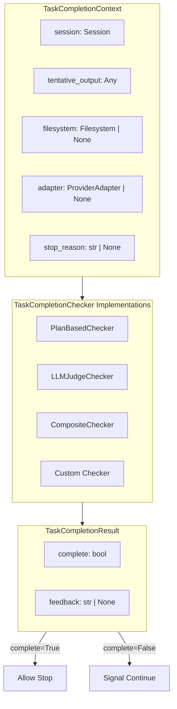

# Task Completion Checking Specification

## Purpose

Task completion checking provides a generic mechanism for verifying that an agent
has completed all assigned tasks before allowing it to stop or produce final
output. This is critical for ensuring agents don't prematurely terminate while
work remains incomplete.

The abstraction supports:

- Plan-based verification (checking session `Plan` state)
- LLM-as-judge verification (using an LLM to evaluate completion)
- Composite verification (combining multiple strategies)
- Custom verification logic via the protocol

## Guiding Principles

- **Protocol-based**: Checkers implement a simple protocol, enabling custom
  implementations without inheritance
- **Context-rich**: Checkers receive session state, tentative output, filesystem,
  and adapter access for comprehensive verification
- **Composable**: Multiple checkers can be combined with configurable logic
- **Feedback-oriented**: Results include natural language feedback explaining
  why tasks are incomplete

## Architecture



## Core Types

### TaskCompletionResult

Immutable result of a completion check:

```python
@FrozenDataclass()
class TaskCompletionResult:
    complete: bool
    feedback: str | None = None

    @classmethod
    def ok(cls, feedback: str | None = None) -> TaskCompletionResult:
        """Create a result indicating tasks are complete."""
        return cls(complete=True, feedback=feedback)

    @classmethod
    def incomplete(cls, feedback: str) -> TaskCompletionResult:
        """Create a result indicating tasks are not complete."""
        return cls(complete=False, feedback=feedback)
```

### TaskCompletionContext

Context provided to checkers for evaluation:

```python
@dataclass(slots=True)
class TaskCompletionContext:
    session: Session              # Session containing state slices
    tentative_output: Any = None  # Output being produced (StructuredOutput payload)
    filesystem: Filesystem | None = None  # Optional filesystem access
    adapter: ProviderAdapter | None = None  # Optional adapter for LLM calls
    stop_reason: str | None = None  # Why the agent is stopping
```

### TaskCompletionChecker Protocol

Protocol for completion verification:

```python
@runtime_checkable
class TaskCompletionChecker(Protocol):
    def check(self, context: TaskCompletionContext) -> TaskCompletionResult:
        """Check if tasks are complete.

        Args:
            context: Context with session, output, filesystem, and adapter.

        Returns:
            Result indicating completion status with natural language feedback.
        """
        ...
```

## Built-in Implementations

### PlanBasedChecker

Checks session `Plan` state for incomplete steps:

```python
checker = PlanBasedChecker()
# Or with explicit plan type
checker = PlanBasedChecker(plan_type=MyCustomPlan)
```

Behavior:

- Returns `ok()` if Plan slice is not registered (no plan to check)
- Returns `ok()` if no plan has been created (nothing to enforce)
- Returns `ok()` if all plan steps have `status == "done"`
- Returns `incomplete()` with feedback listing incomplete tasks otherwise

The feedback includes the count of incomplete tasks and up to 3 task titles,
with guidance on how to proceed:

```
You have 2 incomplete task(s) out of 5. Please either complete all remaining
tasks or update the plan to remove tasks that are no longer needed before
producing output: Implement feature, Write tests...
```

### LLMJudgeChecker (Placeholder)

> **Warning**: `LLMJudgeChecker` is a placeholder implementation that does NOT
> perform actual LLM verification. It always returns `ok()` when an adapter is
> available. Instantiating it emits a `UserWarning`.

Intended for LLM-as-judge verification:

```python
import warnings

# Suppress warning if using intentionally
with warnings.catch_warnings():
    warnings.simplefilter("ignore")
    checker = LLMJudgeChecker(
        criteria="Verify all tests pass and documentation is updated."
    )
```

Current behavior:

- Emits `UserWarning` on instantiation about placeholder status
- Returns `incomplete()` if adapter required but not provided in context
- Returns `ok()` if adapter not required and not provided
- Returns `ok("LLM verification passed (implementation pending).")` when
  adapter is available (does NOT actually call the LLM)

### CompositeChecker

Combines multiple checkers with configurable logic:

```python
# All must pass (default)
checker = CompositeChecker(
    checkers=(PlanBasedChecker(), LLMJudgeChecker()),
    all_must_pass=True,
)

# Any can pass
checker = CompositeChecker(
    checkers=(PlanBasedChecker(), LLMJudgeChecker()),
    all_must_pass=False,
)
```

Behavior with `all_must_pass=True`:

- Short-circuits on first failure, returning that result
- If all pass, combines feedback from all checkers

Behavior with `all_must_pass=False`:

- Short-circuits on first success, returning that result
- If all fail, combines feedback from all failing checkers

## Integration with Claude Agent SDK

### Default Behavior

Task completion checking is **enabled by default** using `PlanBasedChecker`.
This ensures agents complete all planned tasks before stopping or producing
final output. No configuration is required for this default behavior:

```python
from weakincentives.adapters.claude_agent_sdk import ClaudeAgentSDKAdapter

# PlanBasedChecker is used automatically
adapter = ClaudeAgentSDKAdapter()
```

### Custom Configuration

Override the default checker via `ClaudeAgentSDKClientConfig`:

```python
from weakincentives.adapters.claude_agent_sdk import (
    ClaudeAgentSDKAdapter,
    ClaudeAgentSDKClientConfig,
    CompositeChecker,
    LLMJudgeChecker,
    PlanBasedChecker,
)

# Use a composite checker with multiple strategies
adapter = ClaudeAgentSDKAdapter(
    client_config=ClaudeAgentSDKClientConfig(
        task_completion_checker=CompositeChecker(
            checkers=(PlanBasedChecker(), LLMJudgeChecker()),
        ),
    ),
)
```

### Hook Integration

When `task_completion_checker` is configured:

1. **Stop Hook**: Before allowing the agent to stop, the checker verifies
   completion. If incomplete, returns `{"needsMoreTurns": True, "decision":
   "continue", "reason": feedback}` to signal continuation.

2. **StructuredOutput Hook**: Before accepting `StructuredOutput` as final
   output, verifies completion. If incomplete, the output is not accepted and
   execution continues.

## User Stories

### Story 1: Enforce Plan Completion

As a developer, I want agents to complete all planned tasks before stopping:

```python
from weakincentives.adapters.claude_agent_sdk import (
    ClaudeAgentSDKAdapter,
    ClaudeAgentSDKClientConfig,
    PlanBasedChecker,
)
from weakincentives.contrib.tools import PlanningToolsSection
from weakincentives.prompt import Prompt, PromptTemplate
from weakincentives.runtime import InProcessDispatcher, Session

session = Session(bus=InProcessDispatcher())

template = PromptTemplate[None](
    ns="demo",
    key="with-plan",
    sections=[
        PlanningToolsSection(session=session),
        # ... other sections
    ],
)

adapter = ClaudeAgentSDKAdapter(
    client_config=ClaudeAgentSDKClientConfig(
        task_completion_checker=PlanBasedChecker(),
    ),
)

response = adapter.evaluate(Prompt(template), session=session)
# Agent will continue working until all plan steps are "done"
```

### Story 2: Custom Completion Logic

As a platform team, I want custom completion verification for my domain:

```python
from weakincentives.adapters.claude_agent_sdk import (
    ClaudeAgentSDKAdapter,
    ClaudeAgentSDKClientConfig,
    TaskCompletionChecker,
    TaskCompletionContext,
    TaskCompletionResult,
)


class TestPassingChecker:
    """Check that all tests pass before allowing completion."""

    def check(self, context: TaskCompletionContext) -> TaskCompletionResult:
        # Access session state
        test_results = context.session[TestResult].latest()

        if test_results is None:
            return TaskCompletionResult.incomplete(
                "No test results found. Please run the test suite."
            )

        if test_results.failed > 0:
            return TaskCompletionResult.incomplete(
                f"{test_results.failed} tests failing. Fix before completing."
            )

        return TaskCompletionResult.ok(
            f"All {test_results.passed} tests passing."
        )


adapter = ClaudeAgentSDKAdapter(
    client_config=ClaudeAgentSDKClientConfig(
        task_completion_checker=TestPassingChecker(),
    ),
)
```

### Story 3: Combined Verification

As a platform team, I want both plan completion AND custom checks:

```python
from weakincentives.adapters.claude_agent_sdk import (
    ClaudeAgentSDKAdapter,
    ClaudeAgentSDKClientConfig,
    CompositeChecker,
    PlanBasedChecker,
)


checker = CompositeChecker(
    checkers=(
        PlanBasedChecker(),
        TestPassingChecker(),  # Custom checker from Story 2
    ),
    all_must_pass=True,  # Both must pass
)

adapter = ClaudeAgentSDKAdapter(
    client_config=ClaudeAgentSDKClientConfig(
        task_completion_checker=checker,
    ),
)
```

### Story 4: LLM Verification with Custom Criteria

As a developer, I want LLM-based verification of task completion:

```python
from weakincentives.adapters.claude_agent_sdk import (
    ClaudeAgentSDKAdapter,
    ClaudeAgentSDKClientConfig,
    CompositeChecker,
    LLMJudgeChecker,
    PlanBasedChecker,
)

# Combine plan-based checking with LLM verification
checker = CompositeChecker(
    checkers=(
        PlanBasedChecker(),
        LLMJudgeChecker(
            criteria=(
                "Verify the implementation is complete:\n"
                "1. All requested features are implemented\n"
                "2. Code follows the existing patterns\n"
                "3. No TODOs or placeholder comments remain"
            ),
        ),
    ),
    all_must_pass=True,
)

adapter = ClaudeAgentSDKAdapter(
    client_config=ClaudeAgentSDKClientConfig(
        task_completion_checker=checker,
    ),
)
```

## Operational Notes

- **Stop Hook Response**: When tasks are incomplete, the stop hook returns
  `needsMoreTurns: True` which signals the SDK to continue execution
- **Budget/Deadline Bypass**: Task completion checking is skipped when the
  budget is exhausted or deadline has expired. In these cases, the agent is
  allowed to stop since it cannot do more work anyway.
- **Feedback Truncation**: `PlanBasedChecker` truncates task lists to 3 items
  with ellipsis to keep feedback concise
- **Lazy Plan Resolution**: `PlanBasedChecker` imports the `Plan` type lazily,
  allowing use in environments where planning tools aren't installed
- **Protocol Compliance**: Any object with a `check(context) -> result` method
  satisfies `TaskCompletionChecker` due to `@runtime_checkable`
- **Placeholder Warning**: `LLMJudgeChecker` emits a `UserWarning` on
  instantiation to indicate it's a placeholder implementation

## Implementation Notes

### Extending with Custom Checkers

Custom checkers only need to implement the `check` method:

```python
class FileExistsChecker:
    def __init__(self, required_files: tuple[str, ...]) -> None:
        self._required = required_files

    def check(self, context: TaskCompletionContext) -> TaskCompletionResult:
        if context.filesystem is None:
            return TaskCompletionResult.ok("No filesystem to check.")

        missing = [
            f for f in self._required
            if not context.filesystem.exists(f)
        ]

        if missing:
            return TaskCompletionResult.incomplete(
                f"Missing required files: {', '.join(missing)}"
            )

        return TaskCompletionResult.ok("All required files exist.")
```

### Testing Checkers

Test checkers in isolation with mock contexts:

```python
def test_checker_returns_incomplete_when_files_missing():
    session = Session(bus=InProcessDispatcher())
    fs = InMemoryFilesystem()

    context = TaskCompletionContext(
        session=session,
        filesystem=fs,
    )

    checker = FileExistsChecker(required_files=("output.txt",))
    result = checker.check(context)

    assert result.complete is False
    assert "output.txt" in result.feedback
```
