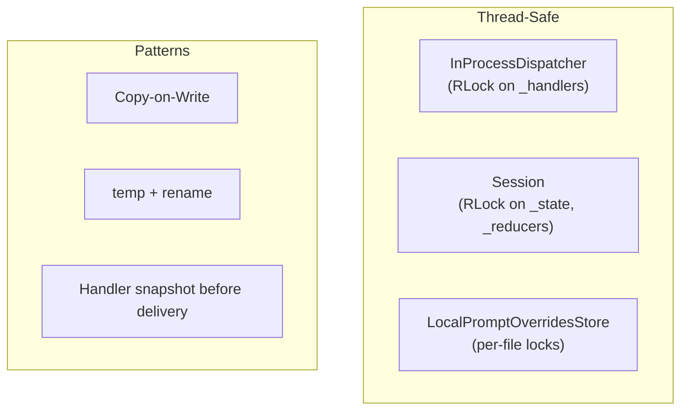

# Thread Safety Specification

Threading model for tool adapters and orchestration code.

**Source:** Component-specific (Session, Dispatcher, OverrideStore)

## Principles

- Deterministic, synchronous delivery over opportunistic concurrency
- Copy-on-write for state transitions
- Single lock per shared structure
- Document single-threaded assumptions explicitly

## Thread-Safe Components

### InProcessDispatcher

- `_handlers` protected by `RLock`
- Handler list snapshotted before delivery (lock released)
- `subscribe`/`unsubscribe`/`publish` safe for concurrent calls

### Session

- `_reducers` and `_state` protected by `RLock`
- Copy-on-write inside critical section
- `_attach_to_dispatcher` uses flag for one-time registration

### LocalPromptOverridesStore

- Root discovery runs once (protected by lock)
- Per-file locks serialize operations
- Atomic writes: temp file + rename

## Guarantees

- `InProcessDispatcher`: Safe for concurrent subscribe/unsubscribe/publish
- `Session`: Atomic slice updates per reducer application
- `LocalPromptOverridesStore`: Safe within single process

## Non-Guarantees

- User-provided handlers not synchronized by framework
- Example orchestration code may have mutable state
- Override store has no inter-process locking
- Handler ordering only within single publish call
