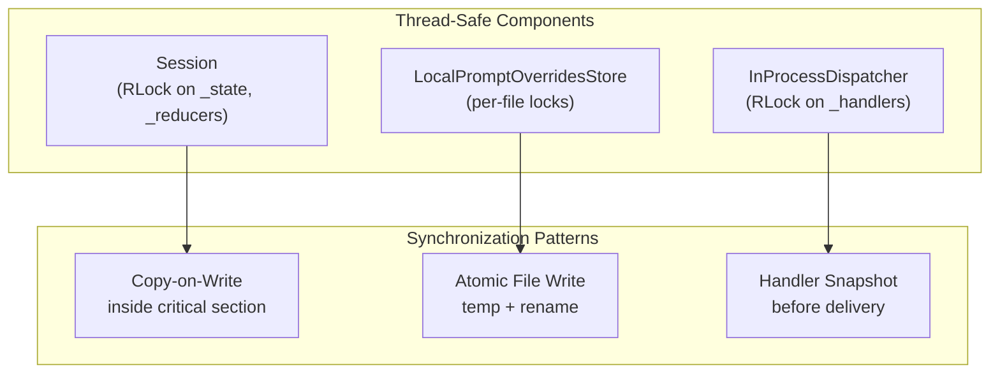

# Thread Safety Specification

## Purpose and Rationale

Threading remains the simplest way to run tool adapters and orchestration code
without duplicating session state, so contributors need a single reference that
captures both the target posture and the reasoning behind it. This document
combines design goals, current assumptions, and actionable guidance so that
future improvements can be layered without guessing at implicit expectations.

## Guiding Principles

- Prefer deterministic, synchronous delivery over opportunistic concurrency;
  keep locks localized and lean so handler ordering is stable and testable.
- Maintain copy-on-write semantics for state transitions to avoid leaking
  partially-mutated objects across reducer boundaries.
- Use a single synchronization primitive per shared structure (e.g., one lock
  for the event bus registry) instead of sprinkling bespoke guards throughout
  call sites.
- Document invariants where they are enforced. If a component assumes
  single-threaded use, state it explicitly so downstream callers know when to
  add their own coordination.

## Scope

This document inventories the components that currently assume single-threaded
usage and outlines the changes required to support multi-threaded adapters or
hosts. The focus areas were identified while reviewing the session subsystem and
the code review examples, which exercise the most realistic orchestration loop
in the repository. Asynchronous adapters are out of scope; the immediate goal is
to provide thread-based synchronization only.

## Current Thread Model and Assumptions

- The event bus delivers events synchronously on the publisher thread. No thread
  pools or async dispatchers wrap handler execution today.
- Session reducers are invoked inline as the bus delivers events; callers expect
  eventual consistency at the end of a publish call rather than background
  reconciliation.
- File-backed prompt overrides are written synchronously using atomic rename
  semantics, but the code assumes a single process and makes no attempt at
  inter-process coordination.
- Stress tests rely on `tests/plugins/threadstress.py` to rerun marked tests with
  varying thread pool sizes. If a component opts out of threadstress markers, it
  should document why.

## Current State Assessment

### Event Bus Implementations

- `InProcessDispatcher` protects `_handlers` with a `threading.RLock`. Handler
  snapshots are taken under the lock before delivery so the lock is not held
  during handler execution. Both `subscribe` and `unsubscribe` are thread-safe.
- The test helper `tests.helpers.events.NullDispatcher` is effectively stateless
  and thread-safe today.

### Session State Store

- `Session` protects `_reducers` and `_state` with a `threading.RLock`. All
  read/modify/write operations (`mutation_register_reducer`, `_dispatch_data_event`,
  `clone`, `snapshot`, `mutation_rollback`, and selectors) acquire the lock.
- Copy-on-write patterns take the copy inside the critical section to prevent
  observing partially updated tuples.
- `_attach_to_bus` uses a flag to ensure handlers are registered only once even
  when called concurrently.

### Prompt Override Store

- `LocalPromptOverridesStore` protects `_root` lazy initialization with a lock
  so the git root discovery runs only once.
- Per-file locks serialize `exists`/`unlink`/`rename` flows per override path.
- Atomic file writes use temporary files (already in place) with locking to
  prevent concurrent writes from corrupting files.

### Code Review Example Sessions

- The code reviewer example and `CodeReviewSession` both keep mutable state such
  as `_history` lists and override tags that are mutated from event handlers
  without locks. The event bus invokes those handlers synchronously on the
  publisher thread, so cross-thread publish calls would interleave access to
  these lists.
- The planning tools (`PlanningToolsSection`, `_PlanningToolSuite`) lean on the
  shared `Session` instance for coordination. They assume reducer registration is
  idempotent and will suffer from the same races described above.

### Serde and Tool Helpers

- Tool reducer helpers (`append`, `replace_latest`, etc.) are pure, but they rely
  on the caller to provide immutable tuples. Without a thread-safe session, the
  helpers will receive stale data or lose updates. No additional locking is
  currently required in these helpers once the caller provides atomic slice
  updates.

## Enforcement Points

- Contracts enforced by `tests/plugins/dbc.py` assume deterministic state
  transitions; any synchronization added to session code must preserve contract
  evaluation order and visibility.
- Thread stress runs via the `threadstress` plugin should accompany any new
  synchronization to prove reducers and prompt override flows behave under
  contention.
- Logging and stdout writes in example sessions should use existing structured
  logging helpers so that cross-thread interleaving is easier to audit and test.
- When locks are introduced, ensure type annotations remain accurate; static
  analysis (`make typecheck`, `pyright`) is part of the enforcement pipeline and
  will flag mismatches between contracts and runtime guards.

## Caveats and Open Questions

- Asynchronous adapters are intentionally excluded for now. Introducing async
  dispatch would require a separate coordination layer to avoid deadlocks
  between thread and event loop locks.
- File-level locking is out of scope; the prompt override store remains
  best-effort within a single process and should not be treated as a
  multi-process rendezvous point.
- Handler ordering is preserved only within a single publish call. If multiple
  threads publish concurrently, interleaving is possible even after the bus is
  made thread-safe—callers should not assume global ordering across threads.
- The current design assumes thread safety is achieved through cooperation
  (shared session and bus). If callers spawn isolated sessions per thread, they
  must handle reconciliation manually.

## Guarantees

- `InProcessDispatcher` is safe for concurrent `subscribe`, `unsubscribe`, and
  `publish` calls. It snapshots the handler list under an `RLock` before
  delivering events.
- `Session` protects reducer registration, state mutation, and snapshot capture
  behind an `RLock` so slice updates are atomic per reducer application.
- `LocalPromptOverridesStore` is safe within a single process: root resolution
  and per-file operations are guarded by locks, and writes use temp + rename.

## Non-Guarantees

- User-provided event handlers and tool handlers are not synchronized by the
  framework; callers must add their own coordination if they publish from
  multiple threads.
- Example orchestration code (e.g., interactive REPL loops) may keep mutable
  state and is not guaranteed safe under concurrent publishes.
- The override store does not implement inter-process locking; concurrent
  writers from multiple processes can race.
