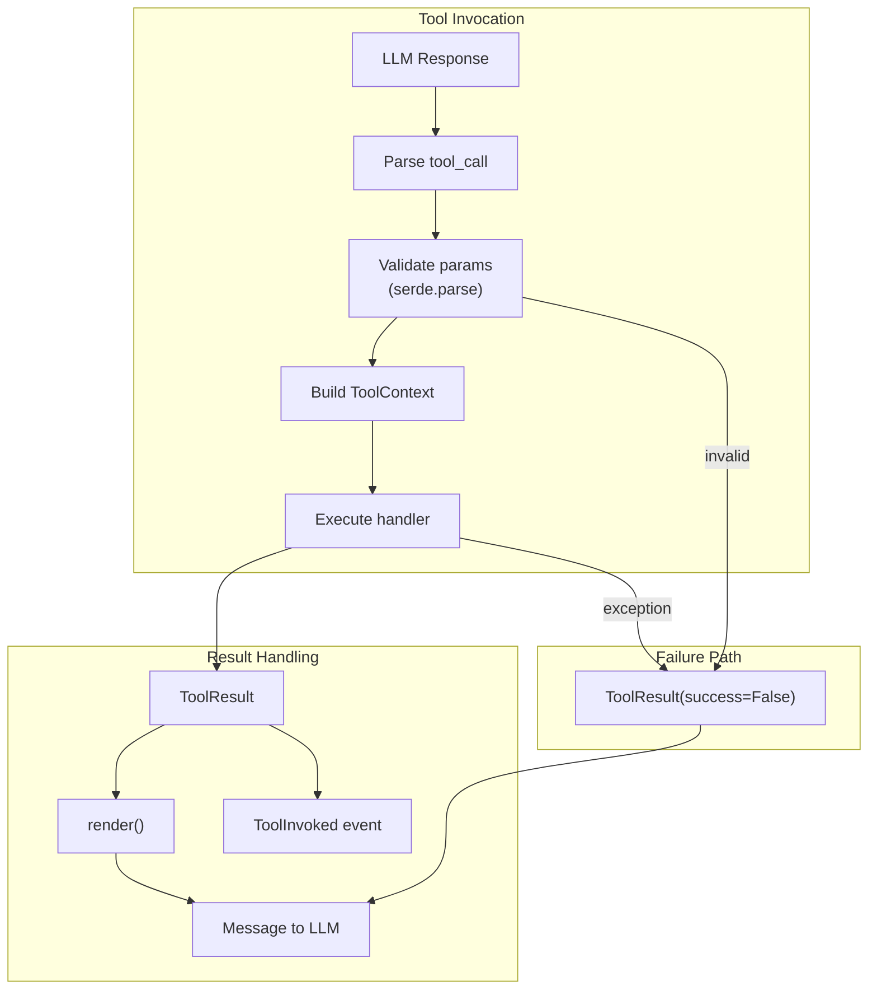

# Tool Runtime Specification

## Purpose

Large language model runtimes expect prompts to advertise structured "tools"
that can be invoked mid-interaction. This specification covers the tool
registration lifecycle, context injection, failure semantics, and the planning
tool suite.

## Guiding Principles

- **Section-first integration**: Tooling lives within the section hierarchy so
  enablement and ordering align with rendered instructions.
- **Single source of truth**: Tool definitions live alongside the sections that
  document them.
- **Type-safe tooling**: Dataclass-based params and result payloads keep schemas
  explicit and validated.
- **Predictable failure semantics**: Tool failures never abort evaluation; they
  return structured error results.



## Core Schemas

### Tool

`Tool[ParamsT, ResultT]` describes a callable affordance:

```python
@dataclass
class Tool(Generic[ParamsT, ResultT]):
    name: str                                    # ^[a-z0-9_-]{1,64}$
    description: str                             # 1-200 chars
    handler: ToolHandler[ParamsT, ResultT] | None
    accepts_overrides: bool = True
    examples: tuple[ToolExample[ParamsT, ResultT], ...] = ()
```

Handler signature:

```python
def handle_tool(
    params: ParamsT,
    *,
    context: ToolContext,
) -> ToolResult[ResultT]: ...
```

### ToolResult

`ToolResult[PayloadT]` models the data returned to orchestrators and the LLM:

```python
@dataclass
class ToolResult(Generic[PayloadT]):
    message: str                           # Text forwarded to model
    value: PayloadT | None                 # Typed payload (may be None)
    success: bool = True                   # Normal vs. failure
    exclude_value_from_context: bool = False  # Hide from provider
```

**Convenience Constructors:**

Use these for common cases instead of the full constructor:

```python
# Success with typed value (most common)
ToolResult.ok(MyResult(...), message="Done")

# Failure with no value
ToolResult.error("Something went wrong")
```

The full constructor form is needed when `exclude_value_from_context=True`.

**Result Rendering Protocol:**

```python
class ToolRenderableResult(Protocol):
    def render(self) -> str: ...
```

Default implementation serializes via `weakincentives.serde.dump`.

### ToolContext

Immutable snapshot passed to every handler:

```python
@dataclass(slots=True, frozen=True)
class ToolContext:
    prompt: PromptProtocol[Any]
    rendered_prompt: RenderedPromptProtocol[Any] | None
    adapter: ProviderAdapterProtocol[Any]
    session: SessionProtocol
    deadline: Deadline | None = None
    budget_tracker: BudgetTracker | None = None

    @property
    def resources(self) -> ScopedResourceContext:
        """Access resources from the prompt's resource context."""
        return self.prompt.resources

    @property
    def filesystem(self) -> Filesystem | None:
        """Shortcut for accessing the Filesystem resource."""
        return self.resources.get_optional(Filesystem)
```

Tool handlers that need an event bus should publish via `context.session.dispatcher`.

### Resource Access

Tools access resources through the prompt's resource context:

```python
def my_handler(params: Params, *, context: ToolContext) -> ToolResult[Result]:
    # Access via resources property
    fs = context.resources.get(Filesystem)
    http = context.resources.get(HTTPClient)

    # Common resources have sugar properties
    fs = context.filesystem  # Shorthand for context.resources.get_optional(Filesystem)

    if fs is None:
        return ToolResult(message="No filesystem available", value=None, success=False)

    # Use resources...
    content = fs.read("config.yaml")
    return ToolResult(message="Done", value=Result(...), success=True)
```

**Design rationale**: Resources are owned by the prompt and accessed via its
resource context. The `ToolContext.resources` property delegates to
`context.prompt.resources`. This ensures:

- Single ownership (prompt owns lifecycle)
- Consistent access pattern
- Automatic cleanup when prompt context exits

### ToolExample

Representative invocation for documentation:

```python
@dataclass(slots=True, frozen=True)
class ToolExample(Generic[ParamsT, ResultT]):
    description: str   # <= 200 chars
    input: ParamsT     # Params dataclass instance
    output: ResultT    # Result dataclass instance
```

## Registration Lifecycle

### Section Integration

`Section.__init__` accepts an optional `tools` sequence:

```python
section = MarkdownSection[Params](
    title="Guidance",
    template="Use tools when needed.",
    key="guidance",
    tools=[lookup_tool, search_tool],
)
```

### Prompt Rendering

`Prompt` walks the section tree depth-first to validate tools:

1. Duplicate names trigger `PromptValidationError`
1. Examples validated against params/result dataclasses
1. Declaration order cached for stable retrieval

`RenderedPrompt.tools` contains ordered tuple from enabled sections.

## Runtime Dispatch

Adapters drive tool invocation using a shared dispatcher:

1. **Registry lookup** - Resolve tool name against rendered prompt
1. **Argument parsing** - Decode via `serde.parse(..., extra="forbid")`
1. **Deadline check** - Refuse invocation if deadline elapsed
1. **Context construction** - Build `ToolContext` from active state
1. **Snapshot** - Capture session and resource state before execution
1. **Handler execution** - Run with params/context pair
1. **Restore on failure** - Rollback state if handler fails or raises
1. **Telemetry** - Publish `ToolInvoked` event to `session.dispatcher`
1. **Response assembly** - Return result to calling loop

### Exception Handling

- Unexpected exceptions convert to `ToolResult(success=False, value=None)`
- State is restored before returning error result
- `ToolResult.message` contains error guidance for the LLM

## Planning Tool Suite

The planning tools let background agents maintain a session-scoped todo list.

### Data Model

```python
StepStatus = Literal["pending", "in_progress", "done"]
PlanStatus = Literal["active", "completed"]

@dataclass(slots=True, frozen=True)
class PlanStep:
    step_id: int
    title: str
    status: StepStatus

@dataclass(slots=True, frozen=True)
class Plan:
    objective: str
    status: PlanStatus
    steps: tuple[PlanStep, ...] = ()
```

### Tools

| Tool | Purpose |
| ---------------------- | --------------------------- |
| `planning_setup_plan` | Create or replace the plan |
| `planning_add_step` | Append steps to active plan |
| `planning_update_step` | Modify step title or status |
| `planning_read_plan` | Retrieve current plan state |

### Tool Parameters

```python
@dataclass(slots=True, frozen=True)
class SetupPlan:
    objective: str
    initial_steps: tuple[str, ...] = ()

@dataclass(slots=True, frozen=True)
class AddStep:
    steps: tuple[str, ...]

@dataclass(slots=True, frozen=True)
class UpdateStep:
    step_id: int
    title: str | None = None
    status: StepStatus | None = None

@dataclass(slots=True, frozen=True)
class ReadPlan:
    pass
```

### Behavior

- **Plan lifecycle**: `setup_plan` creates or replaces; others require existing
- **Step IDs**: Incrementing integers (1, 2, 3...); never reused
- **Auto-completion**: All steps `done` sets plan to `completed`
- **Validation**: Titles non-empty and \<= 500 chars

### Session Integration

```python
session = Session(bus=bus)
section = PlanningToolsSection(session=session, accepts_overrides=False)
# ... after tool calls ...
plan = session[Plan].latest()
```

Note: `PlanningToolsSection` automatically registers reducers for `Plan`,
`SetupPlan`, `AddStep`, and `UpdateStep` on the provided session. The
`planning_read_plan` tool returns the `Plan` object (not `ReadPlan`).

## Planning Strategies

Strategies tune the instructional copy for different reasoning styles.

### Strategy Enum

```python
class PlanningStrategy(Enum):
    REACT = "react"
    PLAN_ACT_REFLECT = "plan_act_reflect"
    GOAL_DECOMPOSE_ROUTE_SYNTHESISE = "goal_decompose_route_synthesise"
```

### Usage

```python
section = PlanningToolsSection(
    session=session,
    strategy=PlanningStrategy.PLAN_ACT_REFLECT,
)
```

### Strategy Descriptions

**ReAct** (default):

- Alternate between reasoning bursts, tool calls, and observations
- Capture observations as plan step notes

**Plan -> Act -> Reflect (PAR)**:

- Outline entire plan first
- Execute steps with reflections after each
- Append reflections as plan notes

**Goal -> Decompose -> Route -> Synthesize**:

- Restate goal in own words
- Break into sub-problems before tool routing
- Synthesize results into cohesive answer

### Rendering Rules

- Same markdown structure across strategies
- Only mindset paragraphs vary
- Tool usage references unchanged

## Example Registration

```python
@dataclass
class LookupParams:
    entity_id: str = field(metadata={"description": "ID to fetch"})

@dataclass
class LookupResult:
    entity_id: str
    url: str

def lookup_handler(
    params: LookupParams,
    *,
    context: ToolContext,
) -> ToolResult[LookupResult]:
    result = LookupResult(entity_id=params.entity_id, url="https://...")
    return ToolResult(message=f"Fetched {result.entity_id}", value=result)

lookup_tool = Tool[LookupParams, LookupResult](
    name="lookup_entity",
    description="Fetch information for an entity ID.",
    handler=lookup_handler,
    examples=(
        ToolExample(
            description="Basic lookup",
            input=LookupParams(entity_id="abc-123"),
            output=LookupResult(entity_id="abc-123", url="https://..."),
        ),
    ),
)

template = PromptTemplate(
    ns="examples/tooling",
    key="demo",
    sections=[
        MarkdownSection(
            title="Guidance",
            key="guidance",
            template="Use tools for context.",
            tools=[lookup_tool],
        ),
    ],
)
prompt = Prompt(template)
```

## Failure Semantics

### ToolResult Contract

- `success=True`: Normal payload in `value`
- `success=False`: Error condition; `value=None` unless error payload

### Adapter Behavior

Exception handling is nuanced by exception type:

- `ToolValidationError` → Wrap as `ToolResult(success=False)`
- `VisibilityExpansionRequired` → Re-raise (not wrapped)
- `PromptEvaluationError` → Re-raise (not wrapped)
- `DeadlineExceededError` → Convert to `PromptEvaluationError`
- `TypeError` → Wrap as `ToolResult(success=False)` with descriptive message
- Other exceptions → Wrap as `ToolResult(success=False)`

All failure paths restore session and resource state before returning.

### Handler Signature Validation

Tool handlers are validated using a **fail-fast** approach:

- **Development time**: pyright strict mode catches signature mismatches
- **Runtime**: TypeErrors during execution are caught and converted to
  `ToolResult(success=False)` with an informative error message

This approach eliminates redundant runtime validation while ensuring type safety
through static analysis. The handler signature must match:

```python
def handler(params: ParamsT, *, context: ToolContext) -> ToolResult[ResultT]: ...
```

If a handler with an incorrect signature is invoked at runtime, the resulting
TypeError is logged and returned as a failed tool result.

Tool failures forward error messages to the LLM via `role: "tool"` response.
Original exceptions are logged for observability.

### Session and Telemetry

- Reducers tolerate `ToolResult.value is None`
- `ToolInvoked` events fire for all outcomes
- `success` flag determines slice routing

## Limitations

- **Synchronous handlers**: Execute on provider loop thread
- **Dataclass-only schemas**: No TypedDict or arbitrary mappings
- **Payload visibility**: `exclude_value_from_context` not a security boundary
- **Deadline enforcement**: Checked before entry, not per-invocation
