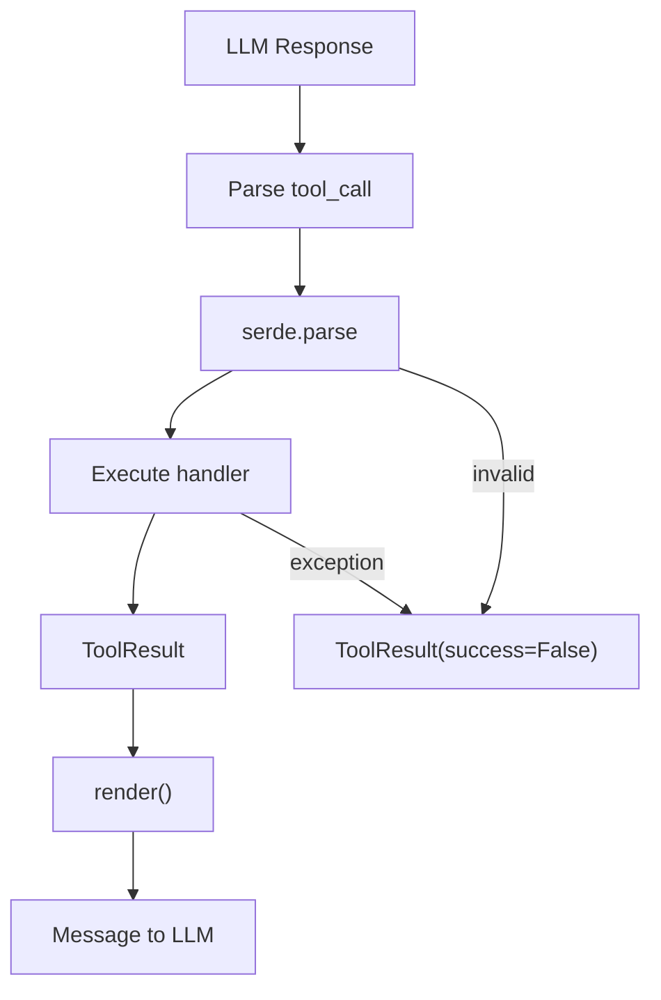

# Tool Runtime Specification

Structured tool invocation for LLM runtimes: registration, context injection,
failure semantics, and planning tools.

**Source:** `src/weakincentives/prompt/tool.py`, `contrib/tools/`

## Principles

- **Section-first**: Tools live within section hierarchy
- **Single source**: Definitions alongside documenting sections
- **Type-safe**: Dataclass params and results
- **Predictable failures**: Never abort evaluation; return structured errors



## Core Types

### Tool

**Definition:** `prompt/tool.py:Tool`

```python
Tool[ParamsT, ResultT](
    name: str,  # ^[a-z0-9_-]{1,64}$
    description: str,  # 1-200 chars
    handler: ToolHandler[ParamsT, ResultT] | None,
    examples: tuple[ToolExample, ...] = (),
)
```

Handler signature:

```python
def handler(params: ParamsT, *, context: ToolContext) -> ToolResult[ResultT]: ...
```

### ToolResult

**Definition:** `prompt/tool_result.py`

```python
ToolResult.ok(MyResult(...), message="Done")  # Success
ToolResult.error("Something went wrong")       # Failure
```

Full form: `ToolResult(message, value, success, exclude_value_from_context)`.
Default rendering via `serde.dump`.

### ToolContext

**Definition:** `prompt/tool.py:ToolContext`

| Field | Purpose |
|-------|---------|
| `prompt` | Active prompt |
| `session` | Session state |
| `deadline` | Time budget |
| `budget_tracker` | Token tracking |
| `resources` | → `prompt.resources` |
| `filesystem` | Shortcut for `Filesystem` |

## Registration

Tools declared on sections:

```python
section = MarkdownSection[Params](
    title="Guidance",
    template="...",
    key="guidance",
    tools=[lookup_tool, search_tool],
)
```

`Prompt` validates: duplicate names → `PromptValidationError`.
`RenderedPrompt.tools` contains ordered tuple from enabled sections.

## Dispatch

1. Registry lookup against rendered prompt
2. Argument parsing via `serde.parse(..., extra="forbid")`
3. Deadline check
4. Snapshot session and resources
5. Execute handler
6. Restore on failure
7. Emit `ToolInvoked` event

## Planning Tools

**Definition:** `contrib/tools/planning.py`

Session-scoped todo list for background agents.

| Tool | Purpose |
|------|---------|
| `planning_setup_plan` | Create/replace plan |
| `planning_add_step` | Append steps |
| `planning_update_step` | Modify status/title |
| `planning_read_plan` | Get current state |

```python
session = Session(dispatcher=dispatcher)
section = PlanningToolsSection(session=session)
# After tools: session[Plan].latest()
```

### Planning Strategies

**Definition:** `contrib/tools/planning.py:PlanningStrategy`

| Strategy | Style |
|----------|-------|
| `REACT` | Reason → tool → observe (default) |
| `PLAN_ACT_REFLECT` | Full plan → execute → reflect |
| `GOAL_DECOMPOSE_ROUTE_SYNTHESISE` | Decompose → route → synthesize |

```python
section = PlanningToolsSection(session=session, strategy=PlanningStrategy.PLAN_ACT_REFLECT)
```

## Failure Semantics

| Exception | Handling |
|-----------|----------|
| `ToolValidationError` | `ToolResult(success=False)` |
| `VisibilityExpansionRequired` | Re-raise |
| `PromptEvaluationError` | Re-raise |
| `DeadlineExceededError` | Convert to `PromptEvaluationError` |
| `TypeError` | `ToolResult(success=False)` with message |
| Other | `ToolResult(success=False)` |

All failure paths restore session and resource state.

## Limitations

- Synchronous handlers only
- Dataclass-only schemas
- `exclude_value_from_context` not a security boundary
- Deadline checked before entry, not per-invocation
