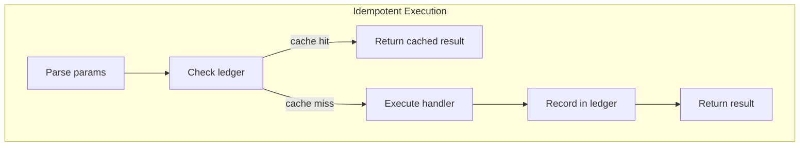

# Tool Runtime Specification

## Purpose

Large language model runtimes expect prompts to advertise structured "tools"
that can be invoked mid-interaction. This specification covers the tool
registration lifecycle, context injection, failure semantics, and the planning
tool suite.

## Guiding Principles

- **Section-first integration**: Tooling lives within the section hierarchy so
  enablement and ordering align with rendered instructions.
- **Single source of truth**: Tool definitions live alongside the sections that
  document them.
- **Type-safe tooling**: Dataclass-based params and result payloads keep schemas
  explicit and validated.
- **Predictable failure semantics**: Tool failures never abort evaluation; they
  return structured error results.


## Core Schemas

### Tool

`Tool[ParamsT, ResultT]` describes a callable affordance:

```python
@dataclass
class Tool(Generic[ParamsT, ResultT]):
    name: str                                    # ^[a-z0-9_-]{1,64}$
    description: str                             # 1-200 chars
    handler: ToolHandler[ParamsT, ResultT] | None
    accepts_overrides: bool = True
    examples: tuple[ToolExample[ParamsT, ResultT], ...] = ()
```

Handler signature:

```python
def handle_tool(
    params: ParamsT,
    *,
    context: ToolContext,
) -> ToolResult[ResultT]: ...
```

### ToolResult

`ToolResult[PayloadT]` models the data returned to orchestrators and the LLM:

```python
@dataclass
class ToolResult(Generic[PayloadT]):
    message: str                           # Text forwarded to model
    value: PayloadT | None                 # Typed payload (may be None)
    success: bool = True                   # Normal vs. failure
    exclude_value_from_context: bool = False  # Hide from provider
```

**Result Rendering Protocol:**

```python
class ToolRenderableResult(Protocol):
    def render(self) -> str: ...
```

Default implementation serializes via `weakincentives.serde.dump`.

### ToolContext

Immutable snapshot passed to every handler:

```python
@dataclass(slots=True, frozen=True)
class ToolContext:
    prompt: PromptProtocol[Any]
    rendered_prompt: RenderedPromptProtocol[Any] | None
    adapter: ProviderAdapterProtocol[Any]
    session: SessionProtocol
    deadline: Deadline | None = None
    budget_tracker: BudgetTracker | None = None
    resources: ResourceRegistry = field(default_factory=ResourceRegistry)

    @property
    def filesystem(self) -> Filesystem | None: ...
```

Tool handlers that need an event bus should publish via `context.session.event_bus`.

### ResourceRegistry

Typed container for runtime resources:

```python
@dataclass(slots=True, frozen=True)
class ResourceRegistry:
    _entries: Mapping[type[object], object]

    def get(self, resource_type: type[T]) -> T | None: ...
    def get(self, resource_type: type[T], default: T) -> T: ...
    def __contains__(self, resource_type: type[object]) -> bool: ...

    @staticmethod
    def build(mapping: Mapping[type[object], object]) -> ResourceRegistry: ...
```

Resources are stored by type and retrieved via the `get` method:

```python
def my_handler(params: Params, *, context: ToolContext) -> ToolResult[Result]:
    # Access via typed registry
    fs = context.resources.get(Filesystem)
    if fs is None:
        return ToolResult(message="No filesystem", value=None, success=False)

    # Common resources have sugar properties
    # These are equivalent:
    fs = context.filesystem
    fs = context.resources.get(Filesystem)
```

**Design rationale**: The registry pattern allows future resources (HTTPClient,
KVStore, ArtifactStore, Clock, Tracer) without bloating ToolContext with
dedicated fields. Resources come from:

- Workspace sections (protocol-based)
- Adapter-provided runtime handles
- Loop-provided services

### ToolExample

Representative invocation for documentation:

```python
@dataclass(slots=True, frozen=True)
class ToolExample(Generic[ParamsT, ResultT]):
    description: str   # <= 200 chars
    input: ParamsT     # Params dataclass instance
    output: ResultT    # Result dataclass instance
```

## Registration Lifecycle

### Section Integration

`Section.__init__` accepts an optional `tools` sequence:

```python
section = MarkdownSection[Params](
    title="Guidance",
    template="Use tools when needed.",
    key="guidance",
    tools=[lookup_tool, search_tool],
)
```

### Prompt Rendering

`Prompt` walks the section tree depth-first to validate tools:

1. Duplicate names trigger `PromptValidationError`
1. Examples validated against params/result dataclasses
1. Declaration order cached for stable retrieval

`RenderedPrompt.tools` contains ordered tuple from enabled sections.

## Runtime Dispatch

Adapters drive tool invocation using a shared dispatcher:

1. **Registry lookup** - Resolve tool name against rendered prompt
1. **Argument parsing** - Decode via `serde.parse(..., extra="forbid")`
1. **Deadline check** - Refuse invocation if deadline elapsed
1. **Context construction** - Build `ToolContext` from active state
1. **Handler execution** - Run with params/context pair
1. **Telemetry** - Publish `ToolInvoked` event to `session.event_bus`
1. **Response assembly** - Return result to calling loop

### Exception Handling

- Unexpected exceptions convert to `ToolResult(success=False, value=None)`
- Event publication failures trigger session rollback
- `ToolResult.message` contains error guidance for the LLM

## Planning Tool Suite

The planning tools let background agents maintain a session-scoped todo list.

### Data Model

```python
StepStatus = Literal["pending", "in_progress", "done"]
PlanStatus = Literal["active", "completed"]

@dataclass(slots=True, frozen=True)
class PlanStep:
    step_id: int
    title: str
    status: StepStatus

@dataclass(slots=True, frozen=True)
class Plan:
    objective: str
    status: PlanStatus
    steps: tuple[PlanStep, ...] = ()
```

### Tools

| Tool | Purpose |
|------|---------|
| `planning_setup_plan` | Create or replace the plan |
| `planning_add_step` | Append steps to active plan |
| `planning_update_step` | Modify step title or status |
| `planning_read_plan` | Retrieve current plan state |

### Tool Parameters

```python
@dataclass(slots=True, frozen=True)
class SetupPlan:
    objective: str
    initial_steps: tuple[str, ...] = ()

@dataclass(slots=True, frozen=True)
class AddStep:
    steps: tuple[str, ...]

@dataclass(slots=True, frozen=True)
class UpdateStep:
    step_id: int
    title: str | None = None
    status: StepStatus | None = None

@dataclass(slots=True, frozen=True)
class ReadPlan:
    pass
```

### Behavior

- **Plan lifecycle**: `setup_plan` creates or replaces; others require existing
- **Step IDs**: Incrementing integers (1, 2, 3...); never reused
- **Auto-completion**: All steps `done` sets plan to `completed`
- **Validation**: Titles non-empty and \<= 500 chars

### Session Integration

```python
session = Session(bus=bus)
section = PlanningToolsSection(session=session, accepts_overrides=False)
# ... after tool calls ...
plan = session[Plan].latest()
```

Note: `PlanningToolsSection` automatically registers reducers for `Plan`,
`SetupPlan`, `AddStep`, and `UpdateStep` on the provided session. The
`planning_read_plan` tool returns the `Plan` object (not `ReadPlan`).

## Planning Strategies

Strategies tune the instructional copy for different reasoning styles.

### Strategy Enum

```python
class PlanningStrategy(Enum):
    REACT = "react"
    PLAN_ACT_REFLECT = "plan_act_reflect"
    GOAL_DECOMPOSE_ROUTE_SYNTHESISE = "goal_decompose_route_synthesise"
```

### Usage

```python
section = PlanningToolsSection(
    session=session,
    strategy=PlanningStrategy.PLAN_ACT_REFLECT,
)
```

### Strategy Descriptions

**ReAct** (default):

- Alternate between reasoning bursts, tool calls, and observations
- Capture observations as plan step notes

**Plan -> Act -> Reflect (PAR)**:

- Outline entire plan first
- Execute steps with reflections after each
- Append reflections as plan notes

**Goal -> Decompose -> Route -> Synthesize**:

- Restate goal in own words
- Break into sub-problems before tool routing
- Synthesize results into cohesive answer

### Rendering Rules

- Same markdown structure across strategies
- Only mindset paragraphs vary
- Tool usage references unchanged

## Example Registration

```python
@dataclass
class LookupParams:
    entity_id: str = field(metadata={"description": "ID to fetch"})

@dataclass
class LookupResult:
    entity_id: str
    url: str

def lookup_handler(
    params: LookupParams,
    *,
    context: ToolContext,
) -> ToolResult[LookupResult]:
    result = LookupResult(entity_id=params.entity_id, url="https://...")
    return ToolResult(message=f"Fetched {result.entity_id}", value=result)

lookup_tool = Tool[LookupParams, LookupResult](
    name="lookup_entity",
    description="Fetch information for an entity ID.",
    handler=lookup_handler,
    examples=(
        ToolExample(
            description="Basic lookup",
            input=LookupParams(entity_id="abc-123"),
            output=LookupResult(entity_id="abc-123", url="https://..."),
        ),
    ),
)

template = PromptTemplate(
    ns="examples/tooling",
    key="demo",
    sections=[
        MarkdownSection(
            title="Guidance",
            key="guidance",
            template="Use tools for context.",
            tools=[lookup_tool],
        ),
    ],
)
prompt = Prompt(template)
```

## Failure Semantics

### ToolResult Contract

- `success=True`: Normal payload in `value`
- `success=False`: Error condition; `value=None` unless error payload

### Adapter Behavior

Exception handling is nuanced by exception type:

- `ToolValidationError` → Wrap as `ToolResult(success=False)`
- `VisibilityExpansionRequired` → Re-raise (not wrapped)
- `PromptEvaluationError` → Re-raise (not wrapped)
- `DeadlineExceededError` → Convert to `PromptEvaluationError`
- Other exceptions → Wrap as `ToolResult(success=False)`

Tool failures forward error messages to the LLM via `role: "tool"` response.
Original exceptions are logged for observability.

### Session and Telemetry

- Reducers tolerate `ToolResult.value is None`
- `ToolInvoked` events fire for all outcomes
- `success` flag determines slice routing

## Idempotency Ledger

The idempotency ledger enables exactly-once semantics for tool execution. When
a tool declares an idempotency configuration and an effect ledger is available,
tool results are cached and reused on retry.

### Idempotency Configuration

Tools declare idempotency via the optional `idempotency` field:

```python
from weakincentives.runtime import IdempotencyConfig

tool = Tool[Params, Result](
    name="create_order",
    description="Create a new order",
    handler=handler,
    idempotency=IdempotencyConfig(
        strategy="auto",        # Key strategy
        ttl=timedelta(hours=1), # Cache duration
        scope="session",        # Key namespace
    ),
)
```

### Idempotency Strategies

| Strategy | Description |
|----------|-------------|
| `auto` | Key derived from tool name + hash of all serialized params (default) |
| `params` | Key derived from tool name + hash of specific param fields |
| `custom` | Key computed by a user-provided function |
| `none` | No idempotency (always execute) |

**Strategy examples:**

```python
# AUTO: Hash all params
IdempotencyConfig(strategy="auto")
# Key: "session:create_order:abc123def456"

# PARAMS: Hash specific fields only
IdempotencyConfig(
    strategy="params",
    param_keys=("order_id",),
)
# Key: "session:create_order:789xyz"
# (Only order_id contributes to key, not other params)

# CUSTOM: Full control over key computation
IdempotencyConfig(
    strategy="custom",
    key_fn=lambda p: f"order:{p.order_id}:{p.idempotency_token}",
)
# Key: "session:order:123:token-abc"

# NONE: Disable idempotency
IdempotencyConfig(strategy="none")
# Always executes handler, never caches
```

### Effect Ledger

The `EffectLedger` stores tool execution results keyed by idempotency key:

```python
from weakincentives.runtime import EffectLedger

ledger = EffectLedger()

# Check for cached result
effect = ledger.lookup("session:create_order:abc123")
if effect is not None:
    # Reuse cached result
    return effect.result_message

# After tool execution, record result
ledger.record(
    idempotency_key="session:create_order:abc123",
    tool_name="create_order",
    params=params,
    result=tool_result,
    ttl=timedelta(hours=1),
)
```

**Ledger operations:**

| Method | Description |
|--------|-------------|
| `lookup(key)` | Retrieve cached effect (returns None if expired) |
| `record(...)` | Store tool execution result |
| `invalidate(key)` | Remove specific entry |
| `invalidate_by_tool(name)` | Remove all entries for a tool |
| `clear()` | Remove all entries |
| `prune_expired()` | Remove expired entries |

### Integration with Tool Execution

When the `ToolExecutionContext` or `ToolExecutor` is created with an
`effect_ledger`, the execution flow becomes:



**Usage:**

```python
from weakincentives.runtime import EffectLedger
from weakincentives.adapters.tool_executor import ToolExecutor

ledger = EffectLedger()

executor = ToolExecutor(
    # ... other params ...
    effect_ledger=ledger,
)

# Tools with idempotency config will now check/update the ledger
```

### ToolEffect Record

Each cached execution is stored as a `ToolEffect`:

```python
@dataclass
class ToolEffect:
    idempotency_key: str           # Computed key
    tool_name: str                 # Tool that was executed
    params_hash: str               # Hash of serialized params
    result_message: str            # ToolResult.message
    result_value: dict | list | None  # Serialized ToolResult.value
    result_success: bool           # ToolResult.success
    created_at: datetime           # When recorded
    expires_at: datetime | None    # When entry expires
    effect_id: UUID                # Unique identifier
```

### TTL and Expiration

- Entries with `ttl=None` never expire
- Expired entries are removed on lookup (lazy cleanup)
- Use `prune_expired()` for batch cleanup
- Default TTL is 24 hours

### Design Considerations

- **Only successful executions are cached**: Failed tool calls are not recorded
- **Ledger is in-memory**: Not persistent across process restarts
- **Not thread-safe**: Wrap with locking for concurrent access
- **Scope prefix**: Use different scopes to partition keys (e.g., per-session)

### When to Use Idempotency

Enable idempotency for tools that:

- Make external API calls (payments, notifications)
- Create resources with unique identifiers
- Perform expensive computations
- Have observable side effects

Skip idempotency for tools that:

- Read-only queries
- Intentionally vary per-call (random, timestamps)
- Must always execute fresh

## Limitations

- **Synchronous handlers**: Execute on provider loop thread
- **Dataclass-only schemas**: No TypedDict or arbitrary mappings
- **Payload visibility**: `exclude_value_from_context` not a security boundary
- **Deadline enforcement**: Checked before entry, not per-invocation
- **In-memory ledger**: Effect ledger is not persistent across restarts
