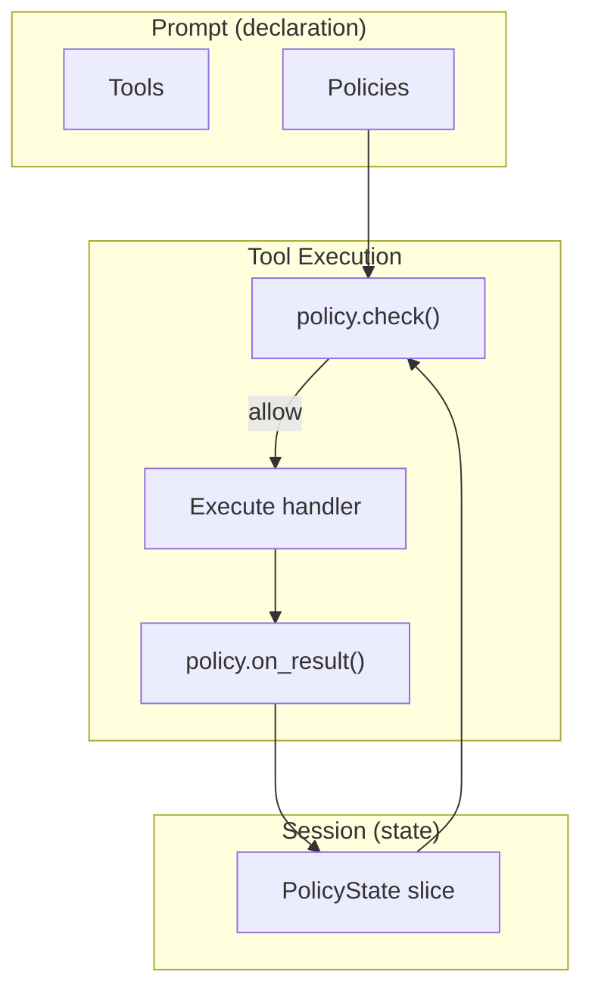

# Tool Policy Specification

## Purpose

Tool policies enforce sequential dependencies between tool invocations. A
policy declares that tool B requires tool A to have been called first—either
unconditionally or keyed by a parameter value. Policies are declared on the
prompt; their state is tracked in the session.

## Guiding Principles

- **Prompt-scoped declaration**: Policies are bound to prompts alongside tools.
- **Session-scoped state**: Invocation history lives in session slices,
  enabling snapshot/restore.
- **Composable**: Multiple policies can govern the same tool; all must allow.
- **Fail-closed**: Denied tool calls return error results without executing.



## Core Types

### ToolPolicy Protocol

```python
class ToolPolicy(Protocol):
    """Sequential dependency constraint on tool invocations."""

    @property
    def name(self) -> str:
        """Unique identifier for this policy."""
        ...

    def check(
        self,
        tool: Tool[Any, Any],
        params: SupportsDataclass | None,
        *,
        context: ToolContext,
    ) -> PolicyDecision:
        """Evaluate whether the tool call should proceed."""
        ...

    def on_result(
        self,
        tool: Tool[Any, Any],
        params: SupportsDataclass | None,
        result: ToolResult[Any],
        *,
        context: ToolContext,
    ) -> None:
        """Update session state after successful execution."""
        ...
```

### PolicyDecision

```python
@dataclass(slots=True, frozen=True)
class PolicyDecision:
    """Result of a policy check."""

    allowed: bool
    reason: str | None = None

    @classmethod
    def allow(cls) -> PolicyDecision:
        return cls(allowed=True)

    @classmethod
    def deny(cls, reason: str) -> PolicyDecision:
        return cls(allowed=False, reason=reason)
```

### PolicyState (Session Slice)

Policy state is stored in a session slice, keyed by policy name:

```python
@FrozenDataclass()
class PolicyState:
    """Tracks which tools/keys have been invoked for a policy."""

    policy_name: str
    invoked_tools: frozenset[str] = frozenset()
    invoked_keys: frozenset[tuple[str, str]] = frozenset()  # (tool, key) pairs
```

Policies read and write this slice via the session in `ToolContext`.

## Built-in Policies

### SequentialDependencyPolicy

Unconditional tool ordering: tool B requires tool A to have succeeded.

```python
@dataclass(frozen=True)
class SequentialDependencyPolicy:
    """Enforce tool invocation order.

    State: tracks which tools have been successfully invoked.
    """

    dependencies: Mapping[str, frozenset[str]]  # tool -> required predecessors

    @property
    def name(self) -> str:
        return "sequential_dependency"

    def check(
        self,
        tool: Tool[Any, Any],
        params: SupportsDataclass | None,
        *,
        context: ToolContext,
    ) -> PolicyDecision:
        required = self.dependencies.get(tool.name, frozenset())
        if not required:
            return PolicyDecision.allow()

        state = context.session[PolicyState].latest()
        invoked = state.invoked_tools if state else frozenset()
        missing = required - invoked

        if missing:
            return PolicyDecision.deny(
                f"Tool '{tool.name}' requires: {', '.join(sorted(missing))}"
            )
        return PolicyDecision.allow()

    def on_result(
        self,
        tool: Tool[Any, Any],
        params: SupportsDataclass | None,
        result: ToolResult[Any],
        *,
        context: ToolContext,
    ) -> None:
        if not result.success:
            return

        state = context.session[PolicyState].latest()
        if state is None:
            state = PolicyState(policy_name=self.name)

        new_state = PolicyState(
            policy_name=self.name,
            invoked_tools=state.invoked_tools | {tool.name},
            invoked_keys=state.invoked_keys,
        )
        context.session[PolicyState].seed(new_state)
```

**Usage:**

```python
policy = SequentialDependencyPolicy(
    dependencies={
        "deploy": frozenset({"test", "build"}),
        "build": frozenset({"lint"}),
    }
)
# Required order: lint → build, then test, then deploy
```

### ReadBeforeWritePolicy

Parameter-keyed dependency for filesystem tools. A file must be read before
it can be overwritten. New files (that don't exist) can be created freely.

```python
@dataclass(frozen=True)
class ReadBeforeWritePolicy:
    """Enforce read-before-write on filesystem tools.

    State: tracks which paths have been read.
    """

    read_tools: frozenset[str] = frozenset({"read_file"})
    write_tools: frozenset[str] = frozenset({"write_file", "edit_file"})

    @property
    def name(self) -> str:
        return "read_before_write"

    def check(
        self,
        tool: Tool[Any, Any],
        params: SupportsDataclass | None,
        *,
        context: ToolContext,
    ) -> PolicyDecision:
        if tool.name not in self.write_tools:
            return PolicyDecision.allow()

        path = _extract_path(params)
        if path is None:
            return PolicyDecision.allow()

        # No filesystem: allow (other checks apply)
        fs = context.filesystem
        if fs is None:
            return PolicyDecision.allow()

        # New file: allow creation
        if not fs.exists(path):
            return PolicyDecision.allow()

        # Existing file: check if read
        state = context.session[PolicyState].latest()
        read_paths = {k for t, k in (state.invoked_keys if state else set())
                      if t in self.read_tools}

        if path not in read_paths:
            return PolicyDecision.deny(
                f"File '{path}' must be read before overwriting."
            )
        return PolicyDecision.allow()

    def on_result(
        self,
        tool: Tool[Any, Any],
        params: SupportsDataclass | None,
        result: ToolResult[Any],
        *,
        context: ToolContext,
    ) -> None:
        if not result.success:
            return
        if tool.name not in self.read_tools:
            return

        path = _extract_path(params)
        if path is None:
            return

        state = context.session[PolicyState].latest()
        if state is None:
            state = PolicyState(policy_name=self.name)

        new_state = PolicyState(
            policy_name=self.name,
            invoked_tools=state.invoked_tools,
            invoked_keys=state.invoked_keys | {(tool.name, path)},
        )
        context.session[PolicyState].seed(new_state)


def _extract_path(params: SupportsDataclass | None) -> str | None:
    """Extract path from filesystem tool parameters."""
    if params is None:
        return None
    for field in ("path", "file_path"):
        if hasattr(params, field):
            return getattr(params, field)
    return None
```

**Usage:**

```python
policy = ReadBeforeWritePolicy()

# write_file(path="new.txt")      → OK (file doesn't exist)
# write_file(path="config.yaml")  → DENIED (exists, not read)
# read_file(path="config.yaml")   → OK (records path)
# write_file(path="config.yaml")  → OK (was read)
```

## Prompt Integration

Policies can be declared at both section and prompt levels:

```python
template = PromptTemplate(
    ns="my-agent",
    key="main",
    sections=[
        MarkdownSection(
            title="Filesystem",
            key="filesystem",
            template="Read and write files.",
            tools=[read_file, write_file, edit_file],
            policies=[ReadBeforeWritePolicy()],  # Section-level
        ),
        MarkdownSection(
            title="Deployment",
            key="deployment",
            template="Build and deploy.",
            tools=[lint, test, build, deploy],
            policies=[
                SequentialDependencyPolicy(
                    dependencies={
                        "build": frozenset({"lint"}),
                        "deploy": frozenset({"test", "build"}),
                    }
                ),
            ],
        ),
    ],
    policies=[  # Prompt-level (applies to all tools)
        SequentialDependencyPolicy(
            dependencies={"deploy": frozenset({"review"})}
        ),
    ],
)
```

**Policy collection**: At execution time, policies are collected from:
1. The section containing the invoked tool
2. The prompt itself

All collected policies must allow for execution to proceed.

## Execution Flow

The tool executor checks section and prompt policies before handler invocation:

```python
def execute_tool(call: ToolCall, *, context: ToolContext) -> ToolResult:
    tool = resolve_tool(call)
    params = parse_params(call, tool)
    section = find_section_for_tool(tool, context.prompt)

    # Collect policies from section and prompt
    policies = [*section.policies, *context.prompt.policies]

    # Check all policies
    for policy in policies:
        decision = policy.check(tool, params, context=context)
        if not decision.allowed:
            return ToolResult.error(decision.reason or "Policy denied")

    # Execute handler
    result = tool.handler(params, context=context)

    # Record successful invocations
    if result.success:
        for policy in policies:
            policy.on_result(tool, params, result, context=context)

    return result
```

## Built-in Section Policies

Some contrib sections include default policies:

| Section | Default Policy | Behavior |
|---------|----------------|----------|
| `VFSToolsSection` | `ReadBeforeWritePolicy` | Must read before overwriting existing files |
| `PodmanToolsSection` | `ReadBeforeWritePolicy` | Must read before overwriting existing files (in container) |
| `PlanningToolsSection` | None | No constraints |
| `AstevalToolsSection` | None | No constraints |

**Disabling default policies:**

```python
# VFSToolsSection with policy disabled
vfs_section = VFSToolsSection(
    filesystem=fs,
    policies=(),  # Override with empty tuple
)

# Or with custom policies
vfs_section = VFSToolsSection(
    filesystem=fs,
    policies=[CustomPolicy()],  # Replace defaults
)
```

## State Management

Policy state lives in the session's `PolicyState` slice:

- **Snapshot/restore**: State is captured and restored with session snapshots
- **Reset**: `session.reset()` clears policy state along with other slices
- **Isolation**: Each session has independent policy state

```python
# State is automatically managed via session
session = Session(bus=bus)

# After tool calls, state is recorded
# read_file(path="foo.txt") → PolicyState.invoked_keys includes ("read_file", "foo.txt")

# Snapshot captures policy state
snapshot = session.snapshot()

# Restore resets policy state to snapshot
session.restore(snapshot)
```

## Limitations

- **Synchronous**: Policy checks run on the tool execution thread
- **Session-scoped**: No cross-session state persistence
- **No rollback notification**: Policies aren't notified on session restore
