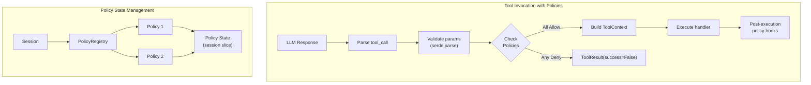

# Tool Policy Specification

## Purpose

Tool policies provide a mechanism to enforce stateful constraints on tool
invocations. Examples include requiring a file to be read before it can be
written, rate limiting tool calls, or enforcing sequential dependencies between
tools. Policies are bound to a session and can track invocation history to make
allow/deny decisions.

## Guiding Principles

- **Stateful by design**: Policies maintain state across tool invocations to
  enforce temporal constraints (e.g., "must read before write").
- **Composable**: Multiple policies can govern the same tool; all must allow
  for execution to proceed.
- **Fail-closed**: When a policy denies a tool call, the tool returns an error
  result without executing the handler.
- **Session-scoped**: Policy state is tied to the session lifecycle and can be
  snapshotted/restored alongside session state.
- **Declarative bindings**: Policies declare which tools they govern via name
  patterns or explicit tool references.



## Core Types

### ToolPolicy Protocol

```python
class ToolPolicy(Protocol):
    """Stateful constraint on tool invocations."""

    @property
    def name(self) -> str:
        """Unique identifier for this policy."""
        ...

    @property
    def tools(self) -> frozenset[str]:
        """Tool names this policy governs (empty = all tools)."""
        ...

    def check(
        self,
        tool: Tool[Any, Any],
        params: SupportsDataclass | None,
        *,
        context: ToolContext,
    ) -> PolicyDecision:
        """Evaluate whether the tool call should proceed.

        Called before handler execution. Return PolicyDecision.allow() to
        permit execution, or PolicyDecision.deny(reason) to block it.
        """
        ...

    def on_result(
        self,
        tool: Tool[Any, Any],
        params: SupportsDataclass | None,
        result: ToolResult[Any],
        *,
        context: ToolContext,
    ) -> None:
        """Hook called after successful tool execution.

        Use this to update policy state based on the result. Not called
        when the policy denies execution or the handler raises.
        """
        ...
```

### PolicyDecision

```python
@dataclass(slots=True, frozen=True)
class PolicyDecision:
    """Result of a policy check."""

    allowed: bool
    reason: str | None = None
    metadata: Mapping[str, Any] = field(default_factory=dict)

    @classmethod
    def allow(cls) -> PolicyDecision:
        """Permit the tool call."""
        return cls(allowed=True)

    @classmethod
    def deny(cls, reason: str, **metadata: Any) -> PolicyDecision:
        """Block the tool call with an explanation."""
        return cls(allowed=False, reason=reason, metadata=metadata)
```

### PolicyRegistry

```python
@dataclass
class PolicyRegistry:
    """Container for policies bound to a session."""

    session: SessionProtocol
    _policies: list[ToolPolicy] = field(default_factory=list)

    def register(self, policy: ToolPolicy) -> None:
        """Add a policy to the registry."""
        ...

    def unregister(self, policy_name: str) -> bool:
        """Remove a policy by name. Returns True if found."""
        ...

    def policies_for(self, tool_name: str) -> tuple[ToolPolicy, ...]:
        """Return all policies that govern the given tool."""
        ...

    def check_all(
        self,
        tool: Tool[Any, Any],
        params: SupportsDataclass | None,
        *,
        context: ToolContext,
    ) -> PolicyDecision:
        """Check all applicable policies. Returns first denial or allow."""
        ...

    def notify_result(
        self,
        tool: Tool[Any, Any],
        params: SupportsDataclass | None,
        result: ToolResult[Any],
        *,
        context: ToolContext,
    ) -> None:
        """Notify all applicable policies of execution result."""
        ...
```

## Built-in Policies

### ReadBeforeWritePolicy

Requires files to be read before they can be written or edited:

```python
@dataclass
class ReadBeforeWritePolicy:
    """Enforce read-before-write semantics on filesystem tools."""

    read_tools: frozenset[str] = frozenset({"read_file", "vfs_read_file"})
    write_tools: frozenset[str] = frozenset({
        "write_file", "edit_file", "vfs_write_file", "vfs_edit_file"
    })
    _read_paths: set[str] = field(default_factory=set)

    @property
    def name(self) -> str:
        return "read_before_write"

    @property
    def tools(self) -> frozenset[str]:
        return self.read_tools | self.write_tools

    def check(
        self,
        tool: Tool[Any, Any],
        params: SupportsDataclass | None,
        *,
        context: ToolContext,
    ) -> PolicyDecision:
        if tool.name in self.write_tools:
            path = _extract_path(params)
            if path and path not in self._read_paths:
                return PolicyDecision.deny(
                    f"File '{path}' must be read before writing. "
                    f"Use read_file first.",
                    path=path,
                )
        return PolicyDecision.allow()

    def on_result(
        self,
        tool: Tool[Any, Any],
        params: SupportsDataclass | None,
        result: ToolResult[Any],
        *,
        context: ToolContext,
    ) -> None:
        if tool.name in self.read_tools and result.success:
            path = _extract_path(params)
            if path:
                self._read_paths.add(path)
```

### RateLimitPolicy

Limits the number of times a tool can be invoked per session:

```python
@dataclass
class RateLimitPolicy:
    """Limit invocations per tool per session."""

    limits: Mapping[str, int]  # tool_name -> max_calls
    _counts: dict[str, int] = field(default_factory=dict)

    @property
    def name(self) -> str:
        return "rate_limit"

    @property
    def tools(self) -> frozenset[str]:
        return frozenset(self.limits.keys())

    def check(
        self,
        tool: Tool[Any, Any],
        params: SupportsDataclass | None,
        *,
        context: ToolContext,
    ) -> PolicyDecision:
        limit = self.limits.get(tool.name)
        if limit is None:
            return PolicyDecision.allow()

        count = self._counts.get(tool.name, 0)
        if count >= limit:
            return PolicyDecision.deny(
                f"Tool '{tool.name}' has reached its limit of {limit} calls.",
                tool=tool.name,
                limit=limit,
                count=count,
            )
        return PolicyDecision.allow()

    def on_result(
        self,
        tool: Tool[Any, Any],
        params: SupportsDataclass | None,
        result: ToolResult[Any],
        *,
        context: ToolContext,
    ) -> None:
        if result.success:
            self._counts[tool.name] = self._counts.get(tool.name, 0) + 1
```

### SequentialDependencyPolicy

Enforces that certain tools must be called before others:

```python
@dataclass
class SequentialDependencyPolicy:
    """Enforce tool invocation order."""

    dependencies: Mapping[str, frozenset[str]]  # tool -> required predecessors
    _invoked: set[str] = field(default_factory=set)

    @property
    def name(self) -> str:
        return "sequential_dependency"

    @property
    def tools(self) -> frozenset[str]:
        all_tools: set[str] = set(self.dependencies.keys())
        for prereqs in self.dependencies.values():
            all_tools.update(prereqs)
        return frozenset(all_tools)

    def check(
        self,
        tool: Tool[Any, Any],
        params: SupportsDataclass | None,
        *,
        context: ToolContext,
    ) -> PolicyDecision:
        required = self.dependencies.get(tool.name, frozenset())
        missing = required - self._invoked
        if missing:
            return PolicyDecision.deny(
                f"Tool '{tool.name}' requires prior invocation of: "
                f"{', '.join(sorted(missing))}",
                tool=tool.name,
                missing=tuple(sorted(missing)),
            )
        return PolicyDecision.allow()

    def on_result(
        self,
        tool: Tool[Any, Any],
        params: SupportsDataclass | None,
        result: ToolResult[Any],
        *,
        context: ToolContext,
    ) -> None:
        if result.success:
            self._invoked.add(tool.name)
```

### ConfirmationPolicy

Requires explicit confirmation before destructive operations:

```python
@dataclass
class ConfirmationPolicy:
    """Require confirmation tokens for destructive tools."""

    destructive_tools: frozenset[str]
    confirmation_param: str = "confirm"
    confirmation_value: str = "yes_i_am_sure"

    @property
    def name(self) -> str:
        return "confirmation"

    @property
    def tools(self) -> frozenset[str]:
        return self.destructive_tools

    def check(
        self,
        tool: Tool[Any, Any],
        params: SupportsDataclass | None,
        *,
        context: ToolContext,
    ) -> PolicyDecision:
        if params is None:
            return PolicyDecision.deny(
                f"Tool '{tool.name}' requires confirmation parameter."
            )

        confirm = getattr(params, self.confirmation_param, None)
        if confirm != self.confirmation_value:
            return PolicyDecision.deny(
                f"Tool '{tool.name}' is destructive. "
                f"Set {self.confirmation_param}='{self.confirmation_value}' "
                f"to confirm execution.",
                tool=tool.name,
            )
        return PolicyDecision.allow()

    def on_result(
        self,
        tool: Tool[Any, Any],
        params: SupportsDataclass | None,
        result: ToolResult[Any],
        *,
        context: ToolContext,
    ) -> None:
        pass  # No state to track
```

## Session Integration

### Binding Policies to Sessions

Policies are registered via the session's policy registry:

```python
from weakincentives.runtime import Session
from weakincentives.policies import (
    PolicyRegistry,
    ReadBeforeWritePolicy,
    RateLimitPolicy,
)

session = Session(bus=bus)

# Create and register policies
policies = PolicyRegistry(session=session)
policies.register(ReadBeforeWritePolicy())
policies.register(RateLimitPolicy(limits={"web_search": 10}))

# Bind to tool execution context
response = adapter.evaluate(
    prompt,
    params,
    session=session,
    policy_registry=policies,
)
```

### State Persistence

Policy state can be persisted via a dedicated session slice:

```python
@FrozenDataclass()
class PolicyState:
    """Snapshot of policy state for persistence."""

    policy_name: str
    state: Mapping[str, Any]
    created_at: datetime

# Policies can store state in session
session[PolicyState].seed(PolicyState(
    policy_name="read_before_write",
    state={"read_paths": list(policy._read_paths)},
    created_at=datetime.now(UTC),
))
```

### Snapshot and Restore

The `PolicyRegistry` integrates with session snapshots:

```python
# Capture
snapshot = session.snapshot()
policy_snapshot = policies.snapshot()

# Restore
session.restore(snapshot)
policies.restore(policy_snapshot)
```

## Execution Flow Integration

### Tool Executor Changes

The tool executor checks policies before handler invocation:

```python
@contextmanager
def tool_execution(
    call: ToolCall,
    *,
    execution_context: ToolExecutionContext,
    policy_registry: PolicyRegistry | None = None,
) -> Iterator[ToolExecutionOutcome]:
    tool = resolve_tool(call, execution_context)
    params = parse_params(call, tool)

    # Policy check (new step)
    if policy_registry is not None:
        decision = policy_registry.check_all(
            tool,
            params,
            context=build_context(execution_context),
        )
        if not decision.allowed:
            yield ToolExecutionOutcome(
                tool=tool,
                params=params,
                result=ToolResult.error(decision.reason or "Policy denied"),
                call_id=call.id,
                log=log,
                snapshot=snapshot,
            )
            return

    # Execute handler
    result = execute_handler(tool, params, context)

    # Notify policies of result (new step)
    if policy_registry is not None:
        policy_registry.notify_result(tool, params, result, context=context)

    yield ToolExecutionOutcome(...)
```

### ToolContext Extension

Policies can access the policy registry via an extended context:

```python
@dataclass(slots=True, frozen=True)
class ToolContext:
    # ... existing fields ...
    policy_registry: PolicyRegistry | None = None
```

This allows handlers to query policy state if needed (e.g., checking remaining
rate limit quota).

## Custom Policies

### Implementing a Custom Policy

```python
from dataclasses import dataclass, field
from weakincentives.policies import ToolPolicy, PolicyDecision

@dataclass
class CooldownPolicy:
    """Enforce minimum time between tool invocations."""

    cooldown_seconds: float
    affected_tools: frozenset[str]
    _last_invocation: dict[str, datetime] = field(default_factory=dict)

    @property
    def name(self) -> str:
        return "cooldown"

    @property
    def tools(self) -> frozenset[str]:
        return self.affected_tools

    def check(
        self,
        tool: Tool[Any, Any],
        params: SupportsDataclass | None,
        *,
        context: ToolContext,
    ) -> PolicyDecision:
        last = self._last_invocation.get(tool.name)
        if last is not None:
            elapsed = (datetime.now(UTC) - last).total_seconds()
            if elapsed < self.cooldown_seconds:
                remaining = self.cooldown_seconds - elapsed
                return PolicyDecision.deny(
                    f"Tool '{tool.name}' is on cooldown. "
                    f"Wait {remaining:.1f}s before next call.",
                    remaining_seconds=remaining,
                )
        return PolicyDecision.allow()

    def on_result(
        self,
        tool: Tool[Any, Any],
        params: SupportsDataclass | None,
        result: ToolResult[Any],
        *,
        context: ToolContext,
    ) -> None:
        if result.success:
            self._last_invocation[tool.name] = datetime.now(UTC)
```

### Pattern-Based Tool Matching

Policies can use glob patterns for tool matching:

```python
@dataclass
class PatternPolicy:
    """Base class for policies with pattern-based tool matching."""

    patterns: tuple[str, ...]  # e.g., ("vfs_*", "podman_*")

    @property
    def tools(self) -> frozenset[str]:
        # Empty set signals dynamic matching
        return frozenset()

    def matches(self, tool_name: str) -> bool:
        return any(fnmatch(tool_name, p) for p in self.patterns)
```

The registry calls `matches()` when `tools` is empty:

```python
def policies_for(self, tool_name: str) -> tuple[ToolPolicy, ...]:
    result = []
    for policy in self._policies:
        if not policy.tools:
            # Dynamic matching via pattern
            if hasattr(policy, "matches") and policy.matches(tool_name):
                result.append(policy)
        elif tool_name in policy.tools:
            result.append(policy)
    return tuple(result)
```

## Composition

### Policy Evaluation Order

Policies are evaluated in registration order. The first denial stops evaluation:

```python
def check_all(
    self,
    tool: Tool[Any, Any],
    params: SupportsDataclass | None,
    *,
    context: ToolContext,
) -> PolicyDecision:
    for policy in self.policies_for(tool.name):
        decision = policy.check(tool, params, context=context)
        if not decision.allowed:
            return decision
    return PolicyDecision.allow()
```

### Combining Policies

```python
# Multiple policies on overlapping tool sets
policies.register(ReadBeforeWritePolicy())
policies.register(RateLimitPolicy(limits={"write_file": 50}))
policies.register(SequentialDependencyPolicy(
    dependencies={"deploy": frozenset({"test", "build"})}
))

# All applicable policies must allow for execution to proceed
# Order: read_before_write → rate_limit → sequential_dependency
```

### Conditional Policies

Policies can be conditionally active based on session state:

```python
@dataclass
class ConditionalPolicy:
    """Wrapper that activates a policy based on session state."""

    inner: ToolPolicy
    predicate: Callable[[SessionProtocol], bool]

    @property
    def name(self) -> str:
        return f"conditional:{self.inner.name}"

    @property
    def tools(self) -> frozenset[str]:
        return self.inner.tools

    def check(
        self,
        tool: Tool[Any, Any],
        params: SupportsDataclass | None,
        *,
        context: ToolContext,
    ) -> PolicyDecision:
        if not self.predicate(context.session):
            return PolicyDecision.allow()  # Policy inactive
        return self.inner.check(tool, params, context=context)

    def on_result(
        self,
        tool: Tool[Any, Any],
        params: SupportsDataclass | None,
        result: ToolResult[Any],
        *,
        context: ToolContext,
    ) -> None:
        if self.predicate(context.session):
            self.inner.on_result(tool, params, result, context=context)


# Example: Only enforce read-before-write in "strict" mode
strict_policy = ConditionalPolicy(
    inner=ReadBeforeWritePolicy(),
    predicate=lambda s: s[Config].latest().strict_mode,
)
```

## Telemetry

### PolicyDenied Event

When a policy denies execution, emit a telemetry event:

```python
@FrozenDataclass()
class PolicyDenied:
    """Event emitted when a policy blocks tool execution."""

    policy_name: str
    tool_name: str
    reason: str
    metadata: Mapping[str, Any]
    session_id: UUID | None
    created_at: datetime
    event_id: UUID = field(default_factory=uuid4)
```

### Logging

Policy checks are logged at DEBUG level; denials at WARNING:

```python
logger.debug("Policy check", policy=policy.name, tool=tool.name)
logger.warning(
    "Policy denied tool execution",
    policy=policy.name,
    tool=tool.name,
    reason=decision.reason,
)
```

## Design Considerations

### Why Session-Scoped State?

Policies track state across tool invocations within a single agent run. This
aligns with:

- **Session semantics**: One session = one coherent task execution
- **Snapshot/restore**: Policy state can be persisted alongside session state
- **Isolation**: Different sessions have independent policy state

### Why Not Decorators?

While decorators could wrap individual handlers, the policy approach provides:

- **Cross-tool coordination**: Policies can track relationships between tools
- **Centralized management**: All policies visible in one registry
- **Dynamic activation**: Policies can be enabled/disabled at runtime
- **Composability**: Multiple policies can govern the same tool

### Thread Safety

Policy state is mutated only from the tool execution thread. For concurrent
tool execution (not currently supported), policies would need internal locking
or immutable state patterns.

## Limitations

- **Synchronous only**: Policies run on the tool execution thread
- **No async support**: `check()` and `on_result()` are synchronous
- **Session-scoped**: No cross-session policy state (use external storage)
- **No rollback hooks**: Policies are not notified when session state rolls back
- **Manual registration**: Policies must be explicitly registered per session

## Future Extensions

### Policy DSL

A declarative DSL for common policy patterns:

```python
policy = Policy.define(
    name="file_safety",
    rules=[
        Rule.require_before("write_file", reads="read_file", key="path"),
        Rule.limit("web_search", max_calls=10),
        Rule.cooldown("deploy", seconds=60),
    ],
)
```

### Session-Aware Policies

Policies that query session slices for stateful decisions:

```python
@dataclass
class ApprovalRequiredPolicy:
    """Require approval event in session before destructive tools."""

    def check(self, tool, params, *, context):
        approval = context.session[Approval].latest()
        if approval is None or not approval.granted:
            return PolicyDecision.deny("Approval required")
        return PolicyDecision.allow()
```

### Policy Middleware

Stack-based policy composition with middleware semantics:

```python
@dataclass
class LoggingMiddleware:
    """Wrap policies with logging."""

    def wrap(self, policy: ToolPolicy) -> ToolPolicy:
        # Return wrapped policy with before/after logging
        ...
```
