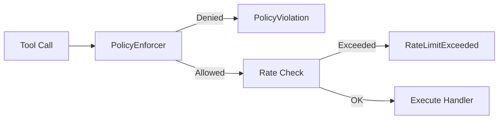

# Tool Use Policy Specification

## Purpose

Machine-enforced policies for tool invocation. Policies are programmatic
constraints evaluated before tool execution—not human approval. The framework
provides allowlists/denylists, rate limits, resource quotas, and safe mode
profiles.

## Guiding Principles

- **Fail-closed**: Unknown tools denied in restrictive profiles.
- **Defense in depth**: Policies layer with filesystem sandboxing.
- **Observable**: All denials logged for auditing.
- **Zero external calls**: Policy checks are local O(1) lookups or O(n) pattern
  matches.



## Core Schemas

### PolicyProfile

Flat collection of policy rules:

```python
@dataclass(slots=True, frozen=True)
class PolicyProfile:
    """Machine-enforced constraints for tool invocation."""

    name: str

    # Path restrictions (filesystem tools)
    allowed_paths: tuple[str, ...] = ()        # Glob patterns; empty = all
    denied_paths: tuple[str, ...] = ()         # Always checked

    # Command restrictions (shell tools)
    allowed_commands: frozenset[str] = frozenset()  # Empty = all
    denied_commands: frozenset[str] = frozenset()

    # Network restrictions
    network_enabled: bool = True
    allowed_hosts: frozenset[str] = frozenset()     # Empty = all
    denied_hosts: frozenset[str] = frozenset()

    # Write limits
    max_file_size: int = 48_000          # Bytes per file
    max_file_count: int | None = None    # Per evaluation
    max_total_writes: int | None = None  # Total bytes

    # Rate limits
    rate_limits: Mapping[str, RateLimit] = field(default_factory=dict)

    # Global limits
    max_tool_calls: int | None = None
```

### RateLimit

```python
@dataclass(slots=True, frozen=True)
class RateLimit:
    """Token bucket rate limit."""

    requests: int      # Max requests per window
    window_seconds: int
```

## Built-in Profiles

```python
PERMISSIVE = PolicyProfile(
    name="permissive",
    max_file_size=1_000_000,
)

STANDARD = PolicyProfile(
    name="standard",
    denied_paths=("**/.git/**", "**/.env", "**/secrets/**"),
    denied_commands=frozenset({
        "rm", "sudo", "chmod", "chown", "kill",
        "shutdown", "reboot", "mkfs", "dd",
    }),
    denied_hosts=frozenset({"localhost", "127.0.0.1"}),
    max_file_size=48_000,
    max_file_count=100,
    max_tool_calls=500,
)

RESTRICTIVE = PolicyProfile(
    name="restrictive",
    allowed_paths=("src/**", "tests/**", "docs/**"),
    allowed_commands=frozenset({
        "ls", "cat", "grep", "find", "python", "pytest", "git",
    }),
    network_enabled=False,
    max_file_size=24_000,
    max_file_count=20,
    max_tool_calls=100,
)

READ_ONLY = PolicyProfile(
    name="read-only",
    allowed_commands=frozenset({"ls", "cat", "grep", "find"}),
    network_enabled=False,
    max_file_size=0,
    max_file_count=0,
)
```

## PolicyEnforcer

```python
@dataclass(slots=True)
class PolicyEnforcer:
    """Stateful policy enforcement."""

    profile: PolicyProfile
    _tool_calls: int = 0
    _file_count: int = 0
    _total_writes: int = 0
    _rate_buckets: dict[str, _TokenBucket] = field(default_factory=dict)

    def check_path(self, path: str) -> PolicyDecision:
        """Check if path access is allowed."""
        # Denylist always checked
        if self._matches_any(path, self.profile.denied_paths):
            return PolicyDecision.denied(f"Path denied: {path}")

        # Allowlist checked if set
        if self.profile.allowed_paths:
            if not self._matches_any(path, self.profile.allowed_paths):
                return PolicyDecision.denied(f"Path not allowed: {path}")

        return PolicyDecision.allowed()

    def check_command(self, command: str) -> PolicyDecision:
        """Check if command execution is allowed."""
        if command in self.profile.denied_commands:
            return PolicyDecision.denied(f"Command denied: {command}")

        if self.profile.allowed_commands:
            if command not in self.profile.allowed_commands:
                return PolicyDecision.denied(f"Command not allowed: {command}")

        return PolicyDecision.allowed()

    def check_network(self, host: str) -> PolicyDecision:
        """Check if network access is allowed."""
        if not self.profile.network_enabled:
            return PolicyDecision.denied("Network disabled")

        if host in self.profile.denied_hosts:
            return PolicyDecision.denied(f"Host denied: {host}")

        if self.profile.allowed_hosts and host not in self.profile.allowed_hosts:
            return PolicyDecision.denied(f"Host not allowed: {host}")

        return PolicyDecision.allowed()

    def check_write(self, path: str, size: int) -> PolicyDecision:
        """Check if write operation is allowed."""
        if size > self.profile.max_file_size:
            return PolicyDecision.denied(
                f"File size {size} exceeds limit {self.profile.max_file_size}"
            )

        if self.profile.max_file_count and self._file_count >= self.profile.max_file_count:
            return PolicyDecision.denied("File count limit exceeded")

        if self.profile.max_total_writes:
            if self._total_writes + size > self.profile.max_total_writes:
                return PolicyDecision.denied("Total write limit exceeded")

        return PolicyDecision.allowed()

    def check_rate_limit(self, tool_name: str) -> PolicyDecision:
        """Check if tool is rate-limited."""
        limit = self.profile.rate_limits.get(tool_name)
        if limit is None:
            return PolicyDecision.allowed()

        bucket = self._get_bucket(tool_name, limit)
        if not bucket.try_acquire():
            return PolicyDecision.rate_limited(bucket.retry_after())

        return PolicyDecision.allowed()

    def check_tool_limit(self) -> PolicyDecision:
        """Check global tool call limit."""
        if self.profile.max_tool_calls:
            if self._tool_calls >= self.profile.max_tool_calls:
                return PolicyDecision.denied("Tool call limit exceeded")
        return PolicyDecision.allowed()

    def record_invocation(self) -> None:
        """Record a tool invocation."""
        self._tool_calls += 1

    def record_write(self, size: int, is_new: bool) -> None:
        """Record a write operation."""
        self._total_writes += size
        if is_new:
            self._file_count += 1
```

### PolicyDecision

```python
@dataclass(slots=True, frozen=True)
class PolicyDecision:
    """Result of a policy check."""

    allowed: bool
    reason: str | None = None
    retry_after: timedelta | None = None

    @classmethod
    def allowed(cls) -> PolicyDecision:
        return cls(allowed=True)

    @classmethod
    def denied(cls, reason: str) -> PolicyDecision:
        return cls(allowed=False, reason=reason)

    @classmethod
    def rate_limited(cls, retry_after: timedelta) -> PolicyDecision:
        return cls(allowed=False, reason="Rate limited", retry_after=retry_after)
```

## ToolRunner Integration

```python
@dataclass(slots=True)
class ToolRunner:
    """Tool execution with policy enforcement."""

    execution_state: ExecutionState
    tool_registry: Mapping[str, Tool[Any, Any]]
    enforcer: PolicyEnforcer | None = None

    def execute(self, tool_call: ProviderToolCall, *, context: ToolContext) -> ToolResult[Any]:
        # Policy checks before snapshot
        if self.enforcer:
            decision = self.enforcer.check_tool_limit()
            if not decision.allowed:
                return self._policy_error(tool_call, decision)

            decision = self.enforcer.check_rate_limit(tool_call.name)
            if not decision.allowed:
                return self._policy_error(tool_call, decision)

        # Standard transaction semantics
        pre_snapshot = self.execution_state.snapshot()

        try:
            result = self._invoke_handler(tool_call, context=context)
        except Exception as e:
            self.execution_state.restore(pre_snapshot)
            return _wrap_exception(e)

        if not result.success:
            self.execution_state.restore(pre_snapshot)
        elif self.enforcer:
            self.enforcer.record_invocation()

        return result

    def _policy_error(self, tool_call: ProviderToolCall, decision: PolicyDecision) -> ToolResult[None]:
        self._publish_violation(tool_call, decision)
        return ToolResult(message=f"Policy: {decision.reason}", value=None, success=False)
```

## Telemetry

```python
@dataclass(slots=True, frozen=True)
class PolicyViolation:
    """Event when policy denies a tool call."""

    tool_name: str
    tool_call_id: str
    reason: str
    timestamp: datetime
```

## Usage

```python
from weakincentives.policy import PolicyEnforcer, STANDARD

enforcer = PolicyEnforcer(profile=STANDARD)

# Check before operations
decision = enforcer.check_path("/etc/passwd")
assert not decision.allowed

decision = enforcer.check_command("rm")
assert not decision.allowed

decision = enforcer.check_write("output.txt", 50_000)
assert not decision.allowed  # Exceeds max_file_size
```

## Limitations

- **No inheritance**: Profiles are flat; copy fields to customize.
- **No content inspection**: Write policies check size, not content.
- **Pattern cost**: Glob matching is O(n) per pattern.
- **Trust boundary**: Policies assume honest tool handlers.
