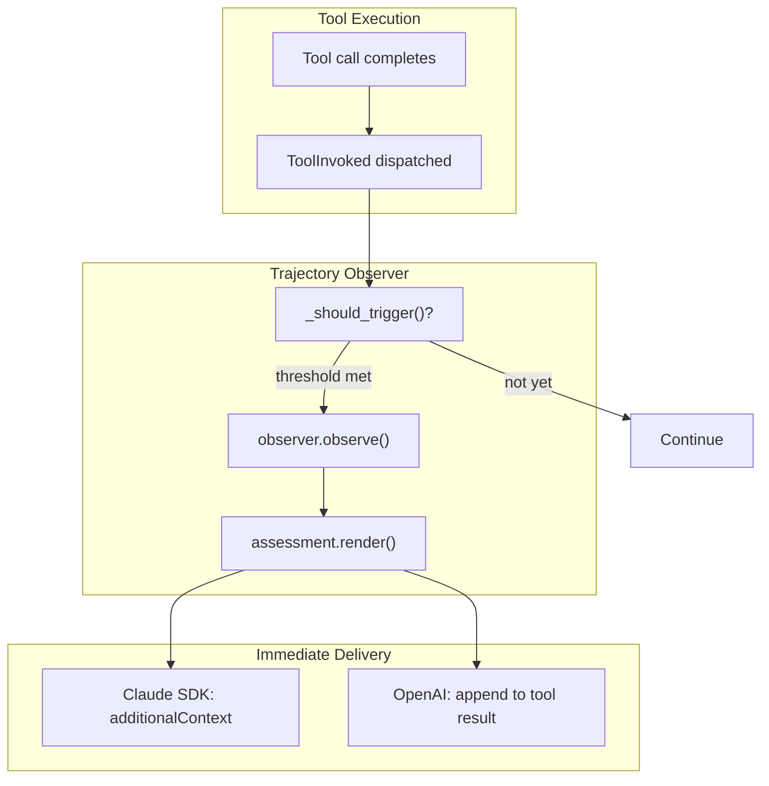

# Trajectory Observer Specification

## Purpose

Trajectory observers provide ongoing assessment of agent progress during
unattended execution. Unlike tool policies that gate individual calls,
observers analyze patterns over time and inject feedback into the agent's
context. This enables soft course-correction without hard intervention.

## Guiding Principles

- **Immediate delivery**: Assessments are injected as additional context
  immediately after tool execution via hook response.
- **Non-blocking feedback**: Observers produce guidance, not gates. The agent
  decides how to respond.
- **Resource access**: Observers have access to session state and prompt
  resources via `ObserverContext`, mirroring `ToolContext`.

## Architecture



## Core Types

### TrajectoryObserver Protocol

```python
class TrajectoryObserver(Protocol):
    """Programmatic assessment of agent trajectory."""

    @property
    def name(self) -> str:
        """Unique identifier for this observer."""
        ...

    def should_run(
        self,
        session: Session,
        *,
        context: ObserverContext,
    ) -> bool:
        """Determine if observer should produce an assessment."""
        ...

    def observe(
        self,
        session: Session,
        *,
        context: ObserverContext,
    ) -> Assessment:
        """Analyze trajectory and produce feedback."""
        ...
```

### Assessment

```python
@dataclass(frozen=True)
class Assessment:
    """Structured output from trajectory observation."""

    observer_name: str
    summary: str
    observations: tuple[Observation, ...] = ()
    suggestions: tuple[str, ...] = ()
    severity: Literal["info", "caution", "warning"] = "info"
    timestamp: datetime = field(default_factory=datetime.utcnow)
    call_index: int = 0

    def render(self) -> str:
        """Render as concise text for context injection."""
        lines = [
            f"[Trajectory Assessment - {self.observer_name}]",
            "",
            self.summary,
        ]

        if self.observations:
            lines.append("")
            for obs in self.observations:
                lines.append(f"• {obs.category}: {obs.description}")

        if self.suggestions:
            lines.append("")
            for suggestion in self.suggestions:
                lines.append(f"→ {suggestion}")

        return "\n".join(lines)
```

### Observation

```python
@dataclass(frozen=True)
class Observation:
    """Single observation about the trajectory."""

    category: str
    description: str
    evidence: str | None = None
```

### ObserverContext

Mirrors `ToolContext` for resource access:

```python
@dataclass(frozen=True)
class ObserverContext:
    """Context provided to observers during assessment.

    Provides access to session state and prompt resources, mirroring the
    ToolContext interface for consistency.
    """

    session: Session
    prompt: PromptProtocol[Any]
    deadline: Deadline | None = None

    @property
    def resources(self) -> PromptResources:
        """Access resources from the prompt's resource context."""
        return self.prompt.resources

    @property
    def filesystem(self) -> Filesystem | None:
        """Return the filesystem resource, if available."""
        return self.resources.get_optional(Filesystem)

    @property
    def last_assessment(self) -> Assessment | None:
        """Most recent assessment, if any."""
        return self.session[Assessment].latest()

    @property
    def tool_call_count(self) -> int:
        """Total tool calls in session."""
        return len(self.session[ToolInvoked].all())

    def tool_calls_since_last_assessment(self) -> int:
        """Number of tool calls since last assessment."""
        last = self.last_assessment
        if last is None:
            return self.tool_call_count
        return self.tool_call_count - last.call_index

    def recent_tool_calls(self, n: int) -> Sequence[ToolInvoked]:
        """Retrieve the N most recent tool invocations."""
        records = self.session[ToolInvoked].all()
        return records[-n:] if len(records) >= n else records
```

## Configuration

### ObserverTrigger

```python
@dataclass(frozen=True)
class ObserverTrigger:
    """Conditions that trigger observer execution."""

    every_n_calls: int | None = None
    every_n_seconds: float | None = None
```

Triggers are OR'd together: if either condition is met, the observer runs.

### ObserverConfig

```python
@dataclass(frozen=True)
class ObserverConfig:
    """Configuration for a trajectory observer."""

    observer: TrajectoryObserver
    trigger: ObserverTrigger
```

## Prompt Integration

Observers are declared on the prompt template, following the same pattern as policies:

```python
template = PromptTemplate[OutputType](
    ns="my-agent",
    key="main",
    sections=[...],
    policies=[ReadBeforeWritePolicy()],
    observers=[
        ObserverConfig(
            observer=DeadlineObserver(),
            trigger=ObserverTrigger(every_n_seconds=30),
        ),
    ],
)
```

The `Prompt` class exposes the configured observers:

```python
@property
def observers(self) -> tuple[ObserverConfig, ...]:
    """Return trajectory observers configured on this prompt."""
    return self.template.observers
```

Adapters access observers from the prompt rather than receiving them as
constructor arguments. This keeps configuration centralized and consistent
with how policies are managed.

## Integration: Claude Agent SDK

The observer runs in the `PostToolUse` hook and returns assessment via
`additionalContext`. This mirrors how task completion feedback is delivered.

```python
async def post_tool_use_hook(
    input_data: Any,
    tool_use_id: str | None,
    sdk_context: Any,
) -> dict[str, Any]:
    # ... existing ToolInvoked dispatch ...

    # Run trajectory observers from prompt
    prompt = hook_context.prompt
    observer_context = ObserverContext(
        session=hook_context.session,
        prompt=prompt,
        deadline=hook_context.deadline,
    )
    assessment_text = run_observers(
        observers=prompt.observers,
        context=observer_context,
        session=hook_context.session,
    )

    if assessment_text:
        return {
            "hookSpecificOutput": {
                "hookEventName": "PostToolUse",
                "additionalContext": assessment_text,
            }
        }

    return {}
```

## Integration: OpenAI Adapter

For the OpenAI adapter, assessment is appended to the tool result message:

```python
def execute_tool_call(
    *,
    context: ToolExecutionContext,
    tool_call: ProviderToolCall,
) -> tuple[ToolInvoked, ToolResult[SupportsToolResult]]:
    """Execute tool call with trajectory observation."""

    with tool_execution(context=context, tool_call=tool_call) as outcome:
        invocation = dispatch_tool_invocation(context=context, outcome=outcome)

    # Run observers from prompt
    observer_context = ObserverContext(
        session=context.session,
        prompt=context.prompt,
        deadline=context.deadline,
    )
    assessment_text = run_observers(
        observers=context.prompt.observers,
        context=observer_context,
        session=context.session,
    )

    if assessment_text and outcome.result.message:
        outcome.result = replace(
            outcome.result,
            message=f"{outcome.result.message}\n\n{assessment_text}",
        )

    return invocation, outcome.result
```

## Shared Observer Runner

Both adapters use shared helpers for observer execution:

```python
def run_observers(
    *,
    observers: Sequence[ObserverConfig],
    context: ObserverContext,
    session: Session,
) -> str | None:
    """Run observers and return rendered assessment if triggered."""

    for config in observers:
        if _should_trigger(config.trigger, context):
            if config.observer.should_run(session, context=context):
                assessment = config.observer.observe(session, context=context)
                assessment = replace(assessment, call_index=context.tool_call_count)
                session.dispatch(RecordAssessment(assessment))
                return assessment.render()

    return None


def _should_trigger(trigger: ObserverTrigger, context: ObserverContext) -> bool:
    """Check if any trigger condition is met."""

    if trigger.every_n_calls:
        if context.tool_calls_since_last_assessment() >= trigger.every_n_calls:
            return True

    if trigger.every_n_seconds:
        last = context.last_assessment
        if last:
            elapsed = (datetime.utcnow() - last.timestamp).total_seconds()
            if elapsed >= trigger.every_n_seconds:
                return True
        else:
            return True  # No previous assessment

    return False
```

## Built-in Observer: DeadlineObserver

Reports remaining time until deadline. Default trigger: every 30 seconds.

```python
@dataclass(frozen=True)
class DeadlineObserver:
    """Report remaining time until deadline."""

    warning_threshold_seconds: float = 120  # 2 minutes

    @property
    def name(self) -> str:
        return "Deadline"

    def should_run(self, session: Session, *, context: ObserverContext) -> bool:
        return context.deadline is not None

    def observe(self, session: Session, *, context: ObserverContext) -> Assessment:
        remaining = context.deadline.remaining().total_seconds()

        if remaining <= 0:
            return Assessment(
                observer_name=self.name,
                summary="You have reached the time deadline.",
                suggestions=("Wrap up immediately.",),
                severity="warning",
            )

        summary = f"You have {self._format_duration(remaining)} remaining."
        suggestions: tuple[str, ...] = ()
        severity: Literal["info", "caution", "warning"] = "info"

        if remaining <= self.warning_threshold_seconds:
            severity = "warning"
            suggestions = (
                "Prioritize completing critical remaining work.",
                "Consider summarizing progress and remaining tasks.",
            )

        return Assessment(
            observer_name=self.name,
            summary=summary,
            suggestions=suggestions,
            severity=severity,
        )

    def _format_duration(self, seconds: float) -> str:
        if seconds < 60:
            return f"{int(seconds)} seconds"
        elif seconds < 3600:
            minutes = int(seconds / 60)
            return f"{minutes} minute{'s' if minutes != 1 else ''}"
        else:
            return f"{seconds / 3600:.1f} hours"
```

## Example Output

When injected via `additionalContext`:

```
[Trajectory Assessment - Deadline]

You have 8 minutes remaining.
```

Warning (< 2 minutes):

```
[Trajectory Assessment - Deadline]

You have 90 seconds remaining.

→ Prioritize completing critical remaining work.
→ Consider summarizing progress and remaining tasks.
```

## State Management

| Slice | Purpose | Mutation |
|-------|---------|----------|
| `ToolInvoked` | Tool invocation log (existing) | Append via dispatch |
| `Assessment` | Assessment history | Append after observer runs |

The `Assessment` slice provides history for trigger calculations and debugging.
Immediate delivery happens via hook response.

```python
session[Assessment].all()
# [Assessment(..., call_index=10), Assessment(..., call_index=40), ...]

session[Assessment].latest()
# Assessment(observer_name="Deadline", call_index=40, ...)
```

## Design Decisions

### Why immediate delivery via hook response?

1. **Single prompt architecture**: WINK has one prompt that runs continuously.
   No outer workflow to inject context between turns.
2. **Mirrors task completion**: Task completion checker uses `additionalContext`
   for immediate feedback.
3. **No prompt rebuilding**: Assessment injects without re-rendering.

### Why store in slice if delivered immediately?

1. **Trigger state**: Need to know when last assessment occurred
2. **Debugging**: Assessment history aids troubleshooting

### Why no escalation?

Budget exhaustion provides the backstop for unattended agents.

## Limitations

- **Single observer per check**: First matching observer wins
- **Synchronous**: Observers block tool completion briefly
- **Text feedback**: Agent interprets natural language guidance

## Future Observers

Potential extensions (out of scope):

- **StallDetector**: Repeated tool calls, read-write thrashing
- **ErrorCascadeDetector**: Consecutive failures
- **DriftDetector**: Working on unrelated files
