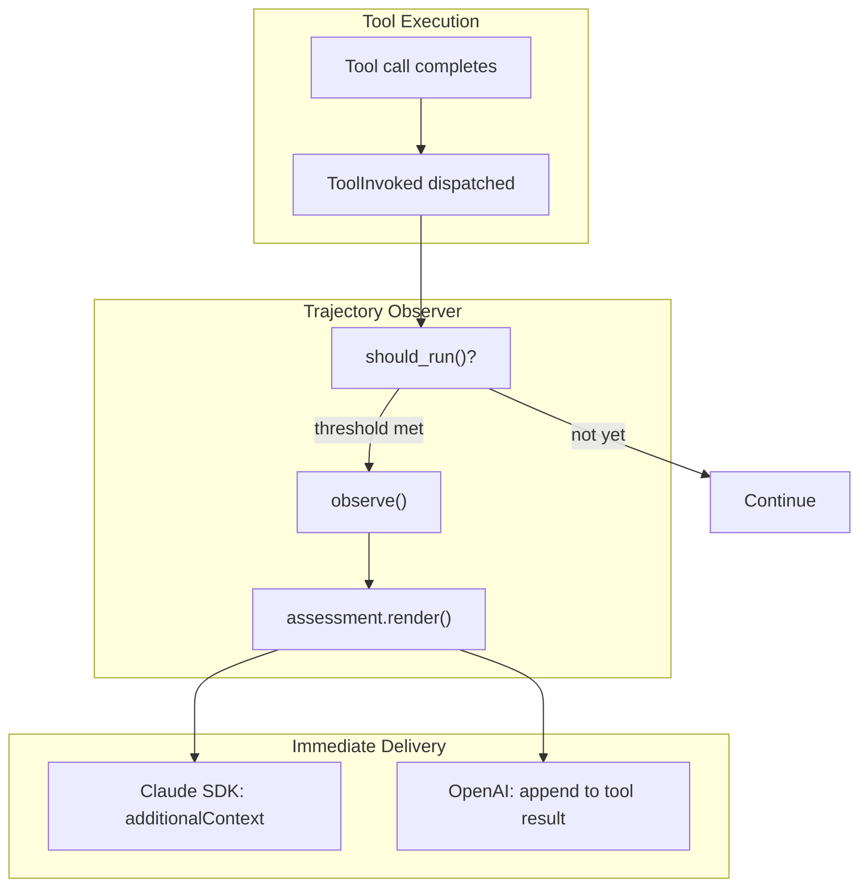

# Trajectory Observer Specification

## Purpose

Trajectory observers provide ongoing assessment of agent progress during
unattended execution. Unlike tool policies that gate individual calls,
observers analyze patterns over time and inject feedback into the agent's
context. This enables soft course-correction without hard intervention.

## Guiding Principles

- **Immediate delivery**: Assessments are injected as additional context
  immediately after tool execution, not stored for later prompt building.
- **Non-blocking feedback**: Observers produce guidance, not gates. The agent
  decides how to respond to observations.
- **Evidence-backed**: Observations cite specific tool calls and patterns.
  Vague warnings are not actionable.
- **Inline execution**: Observers run synchronously in post-tool hooks. No
  background threads or async complexity.



## Core Types

### TrajectoryObserver Protocol

```python
class TrajectoryObserver(Protocol):
    """Programmatic assessment of agent trajectory."""

    @property
    def name(self) -> str:
        """Unique identifier for this observer."""
        ...

    def should_run(
        self,
        session: Session,
        *,
        context: ObserverContext,
    ) -> bool:
        """Determine if assessment threshold has been met."""
        ...

    def observe(
        self,
        session: Session,
        *,
        context: ObserverContext,
    ) -> Assessment:
        """Analyze trajectory and produce feedback."""
        ...
```

### Observation

```python
@dataclass(frozen=True)
class Observation:
    """Single observation about the trajectory."""

    category: str  # "loop", "error_rate", "drift", "stall", etc.
    description: str
    evidence: str | None = None  # Specific tool calls, patterns
```

### Assessment (Session Slice)

Assessments are appended to a session slice for history. The latest is also
delivered immediately via hook response:

```python
@dataclass(frozen=True)
class Assessment:
    """Structured output from trajectory observation."""

    observer_name: str
    summary: str
    observations: tuple[Observation, ...] = ()
    suggestions: tuple[str, ...] = ()
    severity: Literal["info", "caution", "warning"] = "info"
    timestamp: datetime = field(default_factory=datetime.utcnow)
    call_index: int = 0  # Tool call index when generated

    def render(self) -> str:
        """Render as concise text for context injection."""
        lines = [
            f"[Trajectory Assessment - {self.observer_name}]",
            "",
            self.summary,
        ]

        if self.observations:
            lines.append("")
            for obs in self.observations:
                lines.append(f"• {obs.category}: {obs.description}")

        if self.suggestions:
            lines.append("")
            for suggestion in self.suggestions:
                lines.append(f"→ {suggestion}")

        return "\n".join(lines)
```

### ObserverContext

```python
@dataclass(frozen=True)
class ObserverContext:
    """Context provided to observers during assessment."""

    session: Session
    budget_tracker: BudgetTracker | None = None
    deadline: Deadline | None = None

    @property
    def last_assessment(self) -> Assessment | None:
        """Most recent assessment, if any."""
        return self.session[Assessment].latest()

    @property
    def tool_call_count(self) -> int:
        """Total tool calls in session."""
        return len(self.session[ToolInvoked].all())

    def tool_calls_since_last_assessment(self) -> int:
        """Number of tool calls since last assessment."""
        last = self.last_assessment
        if last is None:
            return self.tool_call_count
        return self.tool_call_count - last.call_index

    def recent_tool_calls(self, n: int) -> Sequence[ToolInvoked]:
        """Retrieve the N most recent tool invocations."""
        records = self.session[ToolInvoked].all()
        return records[-n:] if len(records) >= n else records

    def error_rate(self, window: int) -> float:
        """Calculate error rate over the last N calls."""
        recent = self.recent_tool_calls(window)
        if not recent:
            return 0.0
        return sum(1 for r in recent if not _is_success(r)) / len(recent)
```

### ToolInvoked (Existing Event)

Trajectory observers use the existing `ToolInvoked` event from
`weakincentives.runtime.events`. This event is dispatched after each tool
execution via `PostToolUse` hook (Claude SDK) or `dispatch_tool_invocation`
(OpenAI adapter).

```python
def _is_success(event: ToolInvoked) -> bool:
    """Check if tool invocation succeeded."""
    result = event.result
    if hasattr(result, "success"):
        return result.success
    return True  # Assume success if no flag
```

## Trigger Configuration

```python
@dataclass(frozen=True)
class ObserverTrigger:
    """Conditions that trigger observer execution."""

    every_n_calls: int | None = None
    after_consecutive_errors: int | None = None
    every_n_seconds: float | None = None
    on_every_call: bool = False
```

Multiple triggers are OR'd together.

## Observer Configuration

```python
@dataclass(frozen=True)
class ObserverConfig:
    """Configuration for a trajectory observer."""

    observer: TrajectoryObserver
    trigger: ObserverTrigger
```

## Integration: Claude Agent SDK

The observer runs in the `PostToolUse` hook and returns assessment via
`additionalContext`. This mirrors how task completion feedback is delivered.

### Hook Integration

```python
def create_post_tool_use_hook(
    hook_context: HookContext,
    *,
    observers: Sequence[ObserverConfig] = (),
    # ... existing parameters
) -> AsyncHookCallback:
    """Create PostToolUse hook with trajectory observation."""

    async def post_tool_use_hook(
        input_data: Any,
        tool_use_id: str | None,
        sdk_context: Any,
    ) -> dict[str, Any]:
        # ... existing ToolInvoked dispatch ...

        # Run trajectory observers
        assessment_text = _run_observers(
            observers=observers,
            hook_context=hook_context,
        )

        # Return assessment as additional context if produced
        if assessment_text:
            return {
                "hookSpecificOutput": {
                    "hookEventName": "PostToolUse",
                    "additionalContext": assessment_text,
                }
            }

        # ... existing StructuredOutput handling ...
        return {}

    return post_tool_use_hook


def _run_observers(
    *,
    observers: Sequence[ObserverConfig],
    hook_context: HookContext,
) -> str | None:
    """Run observers and return rendered assessment if any triggered."""

    context = ObserverContext(
        session=hook_context.session,
        budget_tracker=hook_context.budget_tracker,
        deadline=hook_context.deadline,
    )
    call_index = context.tool_call_count

    for config in observers:
        if _should_trigger(config.trigger, context):
            if config.observer.should_run(hook_context.session, context=context):
                assessment = config.observer.observe(
                    hook_context.session, context=context
                )
                # Store in session slice for history
                assessment = replace(assessment, call_index=call_index)
                hook_context.session.dispatch(RecordAssessment(assessment))
                # Return rendered text for immediate injection
                return assessment.render()

    return None


def _should_trigger(trigger: ObserverTrigger, context: ObserverContext) -> bool:
    """Check if any trigger condition is met."""

    if trigger.on_every_call:
        return True

    if trigger.every_n_calls:
        if context.tool_calls_since_last_assessment() >= trigger.every_n_calls:
            return True

    if trigger.after_consecutive_errors:
        recent = context.recent_tool_calls(trigger.after_consecutive_errors)
        if len(recent) >= trigger.after_consecutive_errors:
            if all(not _is_success(r) for r in recent):
                return True

    if trigger.every_n_seconds:
        last = context.last_assessment
        if last:
            elapsed = (datetime.utcnow() - last.timestamp).total_seconds()
            if elapsed >= trigger.every_n_seconds:
                return True
        else:
            return True  # No previous assessment, run now

    return False
```

### Adapter Configuration

```python
adapter = ClaudeAgentSDKAdapter(
    prompt=prompt,
    session=session,
    observers=[
        ObserverConfig(
            observer=ResourceObserver(),
            trigger=ObserverTrigger(every_n_calls=10),
        ),
    ],
)
```

## Integration: OpenAI Adapter

For the OpenAI adapter, assessment is appended to the tool result message.

### Tool Executor Integration

```python
def execute_tool_call(
    *,
    context: ToolExecutionContext,
    tool_call: ProviderToolCall,
    observers: Sequence[ObserverConfig] = (),
) -> tuple[ToolInvoked, ToolResult[SupportsToolResult]]:
    """Execute tool call with trajectory observation."""

    with tool_execution(context=context, tool_call=tool_call) as outcome:
        invocation = dispatch_tool_invocation(context=context, outcome=outcome)

    # Run trajectory observers after dispatch
    assessment_text = _run_observers_openai(
        observers=observers,
        session=context.session,
        budget_tracker=context.budget_tracker,
        deadline=context.deadline,
    )

    # Append assessment to result if produced
    if assessment_text and outcome.result.message:
        outcome.result = replace(
            outcome.result,
            message=f"{outcome.result.message}\n\n{assessment_text}",
        )

    return invocation, outcome.result
```

## Built-in Observer: ResourceObserver

Reports time and token budget constraints in natural language.

```python
@dataclass(frozen=True)
class ResourceObserver:
    """Report remaining time and token budget in natural language."""

    caution_threshold: float = 0.3  # 30% remaining
    warning_threshold: float = 0.1  # 10% remaining

    @property
    def name(self) -> str:
        return "Resources"

    def should_run(self, session: Session, *, context: ObserverContext) -> bool:
        return True  # Always run when triggered

    def observe(self, session: Session, *, context: ObserverContext) -> Assessment:
        statements: list[str] = []
        suggestions: list[str] = []
        severity: Literal["info", "caution", "warning"] = "info"

        # Check deadline
        if context.deadline is not None:
            remaining = context.deadline.remaining().total_seconds()
            if remaining <= 0:
                statements.append("You have reached the time deadline.")
                severity = "warning"
            else:
                statements.append(
                    f"You have {self._format_duration(remaining)} remaining."
                )
                # Estimate percentage based on elapsed time
                # (deadline tracks remaining, not total)

        # Check token budget
        if context.budget_tracker is not None:
            budget = context.budget_tracker.budget
            consumed = context.budget_tracker.consumed
            if budget.max_total_tokens:
                used = (consumed.input_tokens or 0) + (consumed.output_tokens or 0)
                remaining = budget.max_total_tokens - used
                pct_used = used / budget.max_total_tokens

                if remaining <= 0:
                    statements.append("You have exhausted your token budget.")
                    severity = "warning"
                else:
                    statements.append(
                        f"You have used {used:,} of {budget.max_total_tokens:,} "
                        f"tokens ({pct_used:.0%}). {remaining:,} remaining."
                    )
                    pct_remaining = remaining / budget.max_total_tokens
                    if pct_remaining <= self.warning_threshold:
                        severity = "warning"
                    elif pct_remaining <= self.caution_threshold:
                        severity = "caution"

        # Build suggestions based on severity
        if severity == "warning":
            suggestions.append("Prioritize completing critical remaining work.")
            suggestions.append("Consider summarizing progress and remaining tasks.")
        elif severity == "caution":
            suggestions.append("Be mindful of remaining resources.")

        summary = " ".join(statements) if statements else "No constraints configured."

        return Assessment(
            observer_name=self.name,
            summary=summary,
            suggestions=tuple(suggestions),
            severity=severity,
        )

    def _format_duration(self, seconds: float) -> str:
        if seconds < 60:
            return f"{int(seconds)} seconds"
        elif seconds < 3600:
            return f"{int(seconds / 60)} minutes"
        else:
            return f"{seconds / 3600:.1f} hours"
```

## Example: Rendered Assessment

When injected via `additionalContext`, the agent sees:

```
[Trajectory Assessment - Resources]

You have 8 minutes remaining. You have used 35,000 of 50,000 tokens (70%). 15,000 remaining.

→ Be mindful of remaining resources.
```

### Severity Examples

**Info** (plenty of runway):
```
[Trajectory Assessment - Resources]

You have 25 minutes remaining. You have used 12,000 of 50,000 tokens (24%). 38,000 remaining.
```

**Warning** (critical):
```
[Trajectory Assessment - Resources]

You have 2 minutes remaining. You have used 48,500 of 50,000 tokens (97%). 1,500 remaining.

→ Prioritize completing critical remaining work.
→ Consider summarizing progress and remaining tasks.
```

## State Management

| Slice | Purpose | Mutation |
|-------|---------|----------|
| `ToolInvoked` | Tool invocation log (existing) | Append via dispatch |
| `Assessment` | Assessment history | Append after observer runs |

The `Assessment` slice provides history for analysis and trigger state. The
immediate delivery happens via hook response, not slice reads.

```python
# Assessment history (retained for debugging/analysis)
session[Assessment].all()
# [Assessment(..., call_index=10), Assessment(..., call_index=20), ...]

# Latest used for trigger calculations
session[Assessment].latest()
# Assessment(observer_name="Resources", call_index=47, ...)
```

## Design Decisions

### Why immediate delivery via hook response?

1. **Single prompt architecture**: WINK has one prompt that runs continuously.
   There's no outer workflow to inject context between turns.
2. **Mirrors task completion**: The task completion checker already uses
   `additionalContext` for immediate feedback injection.
3. **No prompt rebuilding**: Assessment is delivered without re-rendering the
   system prompt or modifying message history.

### Why store in slice if delivered immediately?

1. **Trigger state**: Need to know when last assessment occurred
2. **Debugging**: Assessment history aids troubleshooting
3. **Analysis**: Can examine assessment patterns post-hoc

### Why no escalation path?

For unattended agents with budget/time limits, the agent should self-correct
based on feedback. Budget exhaustion provides the backstop.

## Limitations

- **Single observer per trigger**: First matching observer wins
- **Synchronous only**: Observers block tool completion briefly
- **Text-based feedback**: Agent must interpret natural language guidance

## Future Observers

Out of scope for initial implementation:

### StallDetector
- Track tool call frequency in sliding window
- Alert on repeated calls to same tool
- Detect read→write→read→write thrashing

### ErrorCascadeDetector
- Track consecutive errors
- Group similar error messages
- Suggest reassessment when patterns emerge

### DriftDetector
- Compare recent file paths to initial task context
- Alert when majority of activity is on unrelated files

## Future Considerations

- **Multiple assessments**: Run all matching observers, combine output
- **Severity trends**: Track escalating/de-escalating patterns
- **Structured response**: Allow agent to acknowledge observations
- **Pace estimation**: Project whether budget will last
