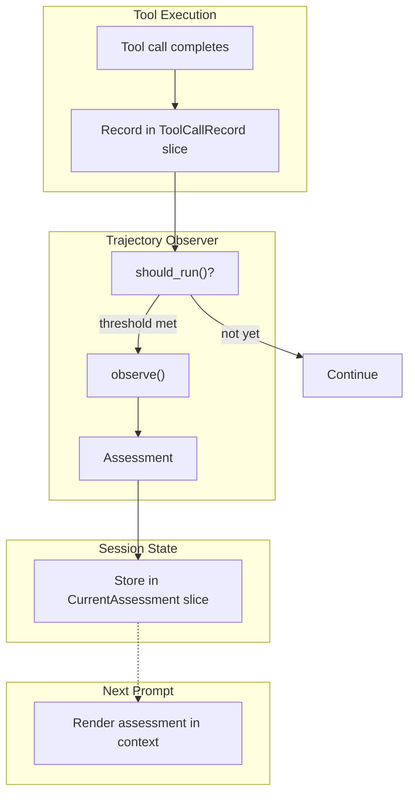

# Trajectory Observer Specification

## Purpose

Trajectory observers provide ongoing assessment of agent progress during
unattended execution. Unlike tool policies that gate individual calls,
observers analyze patterns over time and inject feedback into the agent's
context. This enables soft course-correction without hard intervention.

## Guiding Principles

- **Non-blocking feedback**: Observers produce guidance, not gates. The agent
  decides how to respond to observations.
- **Evidence-backed**: Observations cite specific tool calls and patterns.
  Vague warnings are not actionable.
- **Session-stored**: Assessments live in session slices, making them available
  for prompt injection and preserving them across snapshot/restore.
- **Inline execution**: Observers run synchronously after tool calls. No
  background threads or async complexity.
- **Composable**: Multiple observers can run independently; their assessments
  are merged into a single context block.



## Core Types

### TrajectoryObserver Protocol

```python
class TrajectoryObserver(Protocol):
    """Programmatic assessment of agent trajectory."""

    @property
    def name(self) -> str:
        """Unique identifier for this observer."""
        ...

    def should_run(
        self,
        session: Session,
        *,
        context: ObserverContext,
    ) -> bool:
        """Determine if assessment threshold has been met."""
        ...

    def observe(
        self,
        session: Session,
        *,
        context: ObserverContext,
    ) -> Assessment:
        """Analyze trajectory and produce feedback."""
        ...
```

### Assessment

```python
@dataclass(frozen=True)
class Assessment:
    """Structured output from trajectory observation."""

    observer_name: str
    summary: str
    observations: tuple[Observation, ...] = ()
    suggestions: tuple[str, ...] = ()
    severity: Literal["info", "caution", "warning"] = "info"
    timestamp: datetime = field(default_factory=datetime.utcnow)

    def render(self) -> str:
        """Render as concise markdown for context injection."""
        lines = [f"### {self.observer_name} [{self.severity}]", ""]
        lines.append(self.summary)

        if self.observations:
            lines.append("")
            for obs in self.observations:
                lines.append(f"**{obs.category}**: {obs.description}")
                if obs.evidence:
                    lines.append(f"```\n{obs.evidence}\n```")

        if self.suggestions:
            lines.append("")
            lines.append("**Suggestions**:")
            for suggestion in self.suggestions:
                lines.append(f"- {suggestion}")

        return "\n".join(lines)
```

### Observation

```python
@dataclass(frozen=True)
class Observation:
    """Single observation about the trajectory."""

    category: str  # "loop", "error_rate", "drift", "stall", etc.
    description: str
    evidence: str | None = None  # Specific tool calls, patterns
```

### CurrentAssessment (Session Slice)

The current assessment is stored in a session slice for prompt injection:

```python
@dataclass(frozen=True)
class CurrentAssessment:
    """Holds the latest trajectory assessment for context injection."""

    assessments: tuple[Assessment, ...] = ()
    generated_at: datetime = field(default_factory=datetime.utcnow)
    call_index: int = 0  # Tool call index when generated

    def render(self) -> str:
        """Render all assessments as a single context block."""
        if not self.assessments:
            return ""

        lines = [
            "## Trajectory Assessment",
            "",
            f"_Generated after tool call #{self.call_index}_",
            "",
        ]
        for assessment in self.assessments:
            lines.append(assessment.render())
            lines.append("")

        return "\n".join(lines)

    def is_stale(self, current_call_index: int, max_age_calls: int = 20) -> bool:
        """Check if assessment is too old to be relevant."""
        return (current_call_index - self.call_index) > max_age_calls
```

### ObserverContext

```python
@dataclass(frozen=True)
class ObserverContext:
    """Context provided to observers during assessment."""

    session: Session
    observer_state: ObserverState

    def recent_tool_calls(self, n: int) -> Sequence[ToolCallRecord]:
        """Retrieve the N most recent tool call records."""
        records = self.session[ToolCallRecord].all()
        return records[-n:] if len(records) >= n else records

    def tool_calls_since(self, timestamp: datetime) -> Sequence[ToolCallRecord]:
        """Retrieve tool calls since a given timestamp."""
        records = self.session[ToolCallRecord].all()
        return [r for r in records if r.timestamp >= timestamp]

    def error_rate(self, window: int) -> float:
        """Calculate error rate over the last N calls."""
        recent = self.recent_tool_calls(window)
        if not recent:
            return 0.0
        return sum(1 for r in recent if not r.success) / len(recent)
```

### ObserverState (Session Slice)

```python
@dataclass(frozen=True)
class ObserverState:
    """Tracks observer execution state in the session."""

    tool_calls_since_assessment: int = 0
    last_assessment_time: datetime | None = None
    last_assessment_call_index: int = 0
    total_assessments: int = 0
```

### ToolCallRecord (Session Slice)

```python
@dataclass(frozen=True)
class ToolCallRecord:
    """Record of a single tool invocation for trajectory analysis."""

    tool_name: str
    params_summary: str  # Abbreviated params (e.g., path for file ops)
    success: bool
    error_message: str | None = None
    timestamp: datetime = field(default_factory=datetime.utcnow)
    call_index: int = 0  # Monotonic counter within session
```

## Trigger Configuration

Observers declare when they should run via `ObserverTrigger`:

```python
@dataclass(frozen=True)
class ObserverTrigger:
    """Conditions that trigger observer execution."""

    # Run every N tool calls
    every_n_calls: int | None = None

    # Run after N consecutive errors
    after_consecutive_errors: int | None = None

    # Run every N seconds (wall clock)
    every_n_seconds: float | None = None

    # Always run (observer decides internally)
    on_every_call: bool = False
```

Multiple triggers are OR'd together: if any condition is met, the observer
runs.

**Example:**

```python
trigger = ObserverTrigger(
    every_n_calls=15,
    after_consecutive_errors=3,
)
# Runs after every 15 calls OR after 3 consecutive errors
```

## Observer Configuration

```python
@dataclass(frozen=True)
class ObserverConfig:
    """Configuration for a trajectory observer."""

    observer: TrajectoryObserver
    trigger: ObserverTrigger
```

Multiple observers can be configured; their assessments are collected into a
single `CurrentAssessment` slice entry.

## Prompt Integration

### Reading Assessment from Session

The prompt system reads the current assessment from the session slice and
injects it into context:

```python
def build_context(session: Session, *, max_age_calls: int = 20) -> str:
    """Build additional context including trajectory assessment."""
    context_parts = []

    # Get current assessment if not stale
    current = session[CurrentAssessment].latest()
    if current and not current.is_stale(
        session[ObserverState].latest().last_assessment_call_index,
        max_age_calls,
    ):
        rendered = current.render()
        if rendered:
            context_parts.append(rendered)

    return "\n\n".join(context_parts)
```

### Prompt Declaration

```python
template = PromptTemplate(
    ns="my-agent",
    key="main",
    sections=[
        MarkdownSection(
            title="Instructions",
            key="instructions",
            template="...",
        ),
        # ... other sections
    ],
    observers=[
        ObserverConfig(
            observer=StallDetector(),
            trigger=ObserverTrigger(every_n_calls=10),
        ),
        ObserverConfig(
            observer=ErrorCascadeDetector(),
            trigger=ObserverTrigger(after_consecutive_errors=3),
        ),
    ],
)
```

### Context Injection Point

Assessment context is injected when building the prompt for the next LLM call:

```python
def build_prompt_messages(
    prompt: Prompt,
    session: Session,
    *,
    include_assessment: bool = True,
) -> list[Message]:
    """Build messages for LLM call, including trajectory context."""
    messages = prompt.render_messages()

    if include_assessment:
        assessment_context = build_context(session)
        if assessment_context:
            # Inject as system context or append to user message
            messages = inject_context(messages, assessment_context)

    return messages
```

## Execution Flow

After each tool call completes:

```python
def after_tool_call(
    call: ToolCallRecord,
    *,
    session: Session,
    prompt: Prompt,
) -> None:
    """Run trajectory observers after tool execution."""

    # Record the call
    session.dispatch(RecordToolCall(call))

    # Update observer state
    state = session[ObserverState].latest() or ObserverState()
    state = replace(
        state,
        tool_calls_since_assessment=state.tool_calls_since_assessment + 1,
    )
    session[ObserverState].seed(state)

    # Check each observer
    assessments: list[Assessment] = []
    for config in prompt.observers:
        if _should_trigger(config.trigger, session, state, call):
            context = ObserverContext(
                session=session,
                observer_state=state,
            )
            if config.observer.should_run(session, context=context):
                assessment = config.observer.observe(session, context=context)
                assessments.append(assessment)

    # Store assessment in session if any produced
    if assessments:
        current = CurrentAssessment(
            assessments=tuple(assessments),
            generated_at=datetime.utcnow(),
            call_index=call.call_index,
        )
        session[CurrentAssessment].seed(current)

        # Reset counter
        new_state = replace(
            state,
            tool_calls_since_assessment=0,
            last_assessment_time=datetime.utcnow(),
            last_assessment_call_index=call.call_index,
            total_assessments=state.total_assessments + 1,
        )
        session[ObserverState].seed(new_state)


def _should_trigger(
    trigger: ObserverTrigger,
    session: Session,
    state: ObserverState,
    call: ToolCallRecord,
) -> bool:
    """Check if any trigger condition is met."""

    if trigger.on_every_call:
        return True

    if trigger.every_n_calls and state.tool_calls_since_assessment >= trigger.every_n_calls:
        return True

    if trigger.after_consecutive_errors:
        recent = session[ToolCallRecord].all()[-trigger.after_consecutive_errors:]
        if len(recent) >= trigger.after_consecutive_errors:
            if all(not r.success for r in recent):
                return True

    if trigger.every_n_seconds and state.last_assessment_time:
        elapsed = (datetime.utcnow() - state.last_assessment_time).total_seconds()
        if elapsed >= trigger.every_n_seconds:
            return True

    return False
```

## Built-in Observer

### ResourceObserver

The primary built-in observer reports time and token budget constraints in
natural language. This gives the agent clear visibility into remaining runway.

```python
@dataclass(frozen=True)
class ResourceObserver:
    """Report remaining time and token budget in natural language."""

    # Thresholds for severity escalation (percentage remaining)
    caution_threshold: float = 0.3  # 30% remaining
    warning_threshold: float = 0.1  # 10% remaining

    @property
    def name(self) -> str:
        return "Resources"

    def should_run(self, session: Session, *, context: ObserverContext) -> bool:
        # Always run when triggered - let trigger config control frequency
        return True

    def observe(self, session: Session, *, context: ObserverContext) -> Assessment:
        budget = context.budget
        statements: list[str] = []
        severity: Literal["info", "caution", "warning"] = "info"

        # Time remaining
        if budget.deadline is not None:
            remaining_seconds = (budget.deadline - datetime.utcnow()).total_seconds()
            if remaining_seconds <= 0:
                statements.append("You have reached the time deadline.")
                severity = "warning"
            else:
                time_str = self._format_duration(remaining_seconds)
                elapsed = budget.elapsed_seconds or 0
                total = elapsed + remaining_seconds
                pct_remaining = remaining_seconds / total if total > 0 else 0

                statements.append(f"You have {time_str} remaining before the deadline.")

                if pct_remaining <= self.warning_threshold:
                    severity = "warning"
                elif pct_remaining <= self.caution_threshold:
                    severity = max(severity, "caution")

        # Token budget
        if budget.max_tokens is not None:
            used = budget.tokens_used or 0
            remaining = budget.max_tokens - used
            pct_used = used / budget.max_tokens

            if remaining <= 0:
                statements.append("You have exhausted your token budget.")
                severity = "warning"
            else:
                statements.append(
                    f"You have used {used:,} of {budget.max_tokens:,} tokens "
                    f"({pct_used:.0%} of budget). {remaining:,} tokens remaining."
                )

                pct_remaining = remaining / budget.max_tokens
                if pct_remaining <= self.warning_threshold:
                    severity = "warning"
                elif pct_remaining <= self.caution_threshold:
                    severity = max(severity, "caution")

        # Tool call budget
        if budget.max_tool_calls is not None:
            used = len(context.recent_tool_calls(1000))  # All calls
            remaining = budget.max_tool_calls - used
            pct_used = used / budget.max_tool_calls

            if remaining <= 0:
                statements.append("You have exhausted your tool call budget.")
                severity = "warning"
            else:
                statements.append(
                    f"You have made {used} of {budget.max_tool_calls} allowed tool calls. "
                    f"{remaining} calls remaining."
                )

                pct_remaining = remaining / budget.max_tool_calls
                if pct_remaining <= self.warning_threshold:
                    severity = "warning"
                elif pct_remaining <= self.caution_threshold:
                    severity = max(severity, "caution")

        # Build suggestions based on severity
        suggestions: list[str] = []
        if severity == "warning":
            suggestions.append("Prioritize completing the most critical remaining work.")
            suggestions.append("Consider wrapping up with a summary of progress and remaining tasks.")
        elif severity == "caution":
            suggestions.append("Be mindful of remaining resources when planning next steps.")

        # Compose summary
        if not statements:
            summary = "No resource constraints configured."
        else:
            summary = " ".join(statements)

        return Assessment(
            observer_name=self.name,
            summary=summary,
            suggestions=tuple(suggestions),
            severity=severity,
        )

    def _format_duration(self, seconds: float) -> str:
        """Format seconds as human-readable duration."""
        if seconds < 60:
            return f"{int(seconds)} seconds"
        elif seconds < 3600:
            minutes = int(seconds / 60)
            return f"{minutes} minute{'s' if minutes != 1 else ''}"
        else:
            hours = seconds / 3600
            if hours < 24:
                return f"{hours:.1f} hours"
            else:
                days = hours / 24
                return f"{days:.1f} days"
```

### Budget Configuration

The observer reads budget constraints from the session:

```python
@dataclass(frozen=True)
class Budget:
    """Resource constraints for the session."""

    # Time constraint
    deadline: datetime | None = None
    elapsed_seconds: float | None = None

    # Token constraint
    max_tokens: int | None = None
    tokens_used: int | None = None

    # Tool call constraint
    max_tool_calls: int | None = None
```

Budget is typically set at session initialization and updated by the adapter
after each LLM call:

```python
# Initialize with constraints
session[Budget].seed(Budget(
    deadline=datetime.utcnow() + timedelta(minutes=30),
    max_tokens=50_000,
    max_tool_calls=100,
))

# Adapter updates token usage after each call
current = session[Budget].latest()
session[Budget].seed(replace(current, tokens_used=current.tokens_used + response.usage.total))
```

### ObserverContext Extension

The observer context provides access to budget:

```python
@dataclass(frozen=True)
class ObserverContext:
    """Context provided to observers during assessment."""

    session: Session
    observer_state: ObserverState

    @property
    def budget(self) -> Budget:
        """Current resource budget."""
        return self.session[Budget].latest() or Budget()

    def recent_tool_calls(self, n: int) -> Sequence[ToolCallRecord]:
        """Retrieve the N most recent tool call records."""
        records = self.session[ToolCallRecord].all()
        return records[-n:] if len(records) >= n else records

    # ... other methods unchanged
```

## Example Rendered Assessment

When injected into context, an assessment renders as natural language:

```markdown
## Trajectory Assessment

_Generated after tool call #47_

### Resources [caution]

You have 8 minutes remaining before the deadline. You have used 35,000 of
50,000 tokens (70% of budget). 15,000 tokens remaining. You have made 47 of
100 allowed tool calls. 53 calls remaining.

**Suggestions**:
- Be mindful of remaining resources when planning next steps.
```

### Severity Examples

**Info** (plenty of runway):
```markdown
### Resources [info]

You have 25 minutes remaining before the deadline. You have used 12,000 of
50,000 tokens (24% of budget). 38,000 tokens remaining.
```

**Caution** (approaching limits):
```markdown
### Resources [caution]

You have 6 minutes remaining before the deadline. You have used 42,000 of
50,000 tokens (84% of budget). 8,000 tokens remaining.

**Suggestions**:
- Be mindful of remaining resources when planning next steps.
```

**Warning** (critical):
```markdown
### Resources [warning]

You have 2 minutes remaining before the deadline. You have used 48,500 of
50,000 tokens (97% of budget). 1,500 tokens remaining.

**Suggestions**:
- Prioritize completing the most critical remaining work.
- Consider wrapping up with a summary of progress and remaining tasks.
```

## State Management

All observer state lives in session slices:

| Slice | Purpose | Mutation |
|-------|---------|----------|
| `Budget` | Time/token/call constraints | Replace after LLM calls |
| `ToolCallRecord` | Append-only log of tool invocations | Append after each call |
| `ObserverState` | Assessment timing and counters | Replace after assessment |
| `CurrentAssessment` | Latest assessment for injection | Replace after assessment |

```python
# Budget tracking
session[Budget].latest()
# Budget(
#     deadline=datetime(2024, 1, 15, 15, 0),
#     max_tokens=50000,
#     tokens_used=35000,
#     max_tool_calls=100,
# )

# Observer state after assessment
session[ObserverState].latest()
# ObserverState(
#     tool_calls_since_assessment=0,
#     last_assessment_time=datetime(2024, 1, 15, 14, 32),
#     last_assessment_call_index=51,
#     total_assessments=5,
# )

session[CurrentAssessment].latest()
# CurrentAssessment(
#     assessments=(Assessment(...),),
#     generated_at=datetime(2024, 1, 15, 14, 32),
#     call_index=51,
# )
```

**Snapshot/restore**: All slices are captured in session snapshots. Restoring
a snapshot resets observer state and current assessment to that point.

## Design Decisions

### Why session-based instead of file-based?

1. **Simpler**: No filesystem operations, directory creation, or path handling
2. **Atomic**: Assessment storage is transactional with session state
3. **Bounded**: Assessments are short; no need for external storage
4. **Integrated**: Naturally participates in snapshot/restore

### Why overwrite instead of append?

1. **Recency**: Only the latest assessment matters for guidance
2. **Context budget**: Keeps injected content bounded
3. **Relevance**: Old assessments become misleading as state changes

### Why no escalation path?

For unattended agents with budget/time limits, the agent should self-correct
based on feedback. Hard intervention would require:

- Human availability (not guaranteed for unattended)
- Clear escalation criteria (domain-specific)
- Recovery procedures (complex state management)

The observer provides feedback; budget exhaustion provides the backstop.

### Why inline execution?

1. **Simplicity**: No threading, no race conditions
2. **Consistency**: Assessment reflects state at a known point
3. **Predictability**: Observer cost is visible in timing

### Why staleness check?

Assessments become misleading if too old. The `is_stale()` check prevents
injecting outdated feedback that no longer reflects current trajectory.
Default threshold of 20 calls balances relevance with persistence.

## Limitations

- **No cross-session state**: Observers reset with each session
- **Synchronous only**: Observers block tool execution briefly
- **Single assessment**: Only latest assessment is retained
- **Text-based feedback**: Agent must interpret markdown guidance

## Future Observers

The following observers are out of scope for the initial implementation but
represent natural extensions:

### StallDetector

Detect repetitive tool call patterns suggesting the agent is stuck:

- Track tool call frequency in sliding window
- Alert on repeated calls to same tool (e.g., `edit_file` 5x in 10 calls)
- Detect read→write→read→write thrashing patterns

### ErrorCascadeDetector

Detect consecutive failure sequences:

- Track consecutive errors (e.g., 3+ failures in a row)
- Group similar error messages to identify systemic issues
- Suggest reassessment when error patterns emerge

### DriftDetector

Detect when agent wanders from original task scope:

- Compare recent file paths to initial task context
- Alert when majority of activity is on unrelated files
- Useful for preventing scope creep in long-running tasks

## Future Considerations

Out of scope for initial implementation:

- **Assessment history**: Keep last N assessments for trend analysis
- **Observer composition**: Combine observers into pipelines
- **Severity trends**: Track escalating/de-escalating patterns
- **Structured response**: Allow agent to acknowledge/dismiss observations
- **Pace estimation**: Project whether budget will last based on consumption rate
