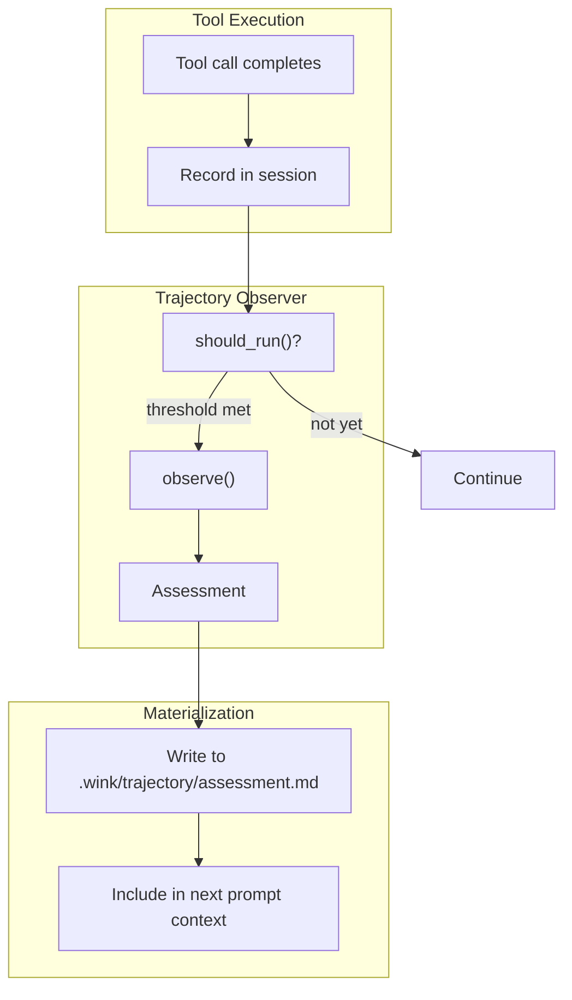

# Trajectory Observer Specification

## Purpose

Trajectory observers provide ongoing assessment of agent progress during
unattended execution. Unlike tool policies that gate individual calls,
observers analyze patterns over time and inject feedback into the agent's
context. This enables soft course-correction without hard intervention.

## Guiding Principles

- **Non-blocking feedback**: Observers produce guidance, not gates. The agent
  decides how to respond to observations.
- **Evidence-backed**: Observations cite specific tool calls and patterns.
  Vague warnings are not actionable.
- **File-materialized**: Assessments are written to the filesystem, making them
  inspectable, versionable, and cleanly separable from prompt machinery.
- **Inline execution**: Observers run synchronously after tool calls. No
  background threads or async complexity.
- **Composable**: Multiple observers can run independently; their assessments
  are merged into a single file.



## Core Types

### TrajectoryObserver Protocol

```python
class TrajectoryObserver(Protocol):
    """Programmatic assessment of agent trajectory."""

    @property
    def name(self) -> str:
        """Unique identifier for this observer."""
        ...

    def should_run(
        self,
        session: Session,
        *,
        context: ObserverContext,
    ) -> bool:
        """Determine if assessment threshold has been met."""
        ...

    def observe(
        self,
        session: Session,
        *,
        context: ObserverContext,
    ) -> Assessment:
        """Analyze trajectory and produce feedback."""
        ...
```

### Assessment

```python
@dataclass(frozen=True)
class Assessment:
    """Structured output from trajectory observation."""

    observer_name: str
    summary: str
    observations: tuple[Observation, ...] = ()
    suggestions: tuple[str, ...] = ()
    severity: Literal["info", "caution", "warning"] = "info"
    timestamp: datetime = field(default_factory=datetime.utcnow)

    def render(self) -> str:
        """Render as markdown for context injection."""
        lines = [
            f"## {self.observer_name}",
            "",
            f"**Severity**: {self.severity}  ",
            f"**Time**: {self.timestamp.isoformat()}Z",
            "",
            "### Summary",
            "",
            self.summary,
        ]

        if self.observations:
            lines.extend(["", "### Observations", ""])
            for obs in self.observations:
                lines.append(f"#### {obs.category}")
                lines.append("")
                lines.append(obs.description)
                if obs.evidence:
                    lines.extend(["", "```", obs.evidence, "```"])
                lines.append("")

        if self.suggestions:
            lines.extend(["", "### Suggestions", ""])
            for i, suggestion in enumerate(self.suggestions, 1):
                lines.append(f"{i}. {suggestion}")

        return "\n".join(lines)
```

### Observation

```python
@dataclass(frozen=True)
class Observation:
    """Single observation about the trajectory."""

    category: str  # "loop", "error_rate", "drift", "stall", etc.
    description: str
    evidence: str | None = None  # Specific tool calls, patterns
```

### ObserverContext

```python
@dataclass(frozen=True)
class ObserverContext:
    """Context provided to observers during assessment."""

    session: Session
    filesystem: Filesystem
    observer_state: ObserverState

    def recent_tool_calls(self, n: int) -> Sequence[ToolCallRecord]:
        """Retrieve the N most recent tool call records."""
        ...

    def tool_calls_since(self, timestamp: datetime) -> Sequence[ToolCallRecord]:
        """Retrieve tool calls since a given timestamp."""
        ...

    def error_rate(self, window: int) -> float:
        """Calculate error rate over the last N calls."""
        ...
```

### ObserverState (Session Slice)

```python
@dataclass(frozen=True)
class ObserverState:
    """Tracks observer execution state in the session."""

    tool_calls_since_assessment: int = 0
    last_assessment_time: datetime | None = None
    last_assessment_call_index: int = 0
    total_assessments: int = 0
```

### ToolCallRecord (Session Slice)

```python
@dataclass(frozen=True)
class ToolCallRecord:
    """Record of a single tool invocation for trajectory analysis."""

    tool_name: str
    params_summary: str  # Abbreviated params (e.g., path for file ops)
    success: bool
    error_message: str | None = None
    timestamp: datetime = field(default_factory=datetime.utcnow)
    call_index: int = 0  # Monotonic counter within session
```

## Trigger Configuration

Observers declare when they should run via `ObserverTrigger`:

```python
@dataclass(frozen=True)
class ObserverTrigger:
    """Conditions that trigger observer execution."""

    # Run every N tool calls
    every_n_calls: int | None = None

    # Run after N consecutive errors
    after_consecutive_errors: int | None = None

    # Run every N seconds (wall clock)
    every_n_seconds: float | None = None

    # Always run (observer decides internally)
    on_every_call: bool = False
```

Multiple triggers are OR'd together: if any condition is met, the observer
runs.

**Example:**

```python
trigger = ObserverTrigger(
    every_n_calls=15,
    after_consecutive_errors=3,
)
# Runs after every 15 calls OR after 3 consecutive errors
```

## Observer Configuration

```python
@dataclass(frozen=True)
class ObserverConfig:
    """Configuration for a trajectory observer."""

    observer: TrajectoryObserver
    trigger: ObserverTrigger
    output_path: str = ".wink/trajectory/assessment.md"
```

Multiple observers can be configured; their assessments are concatenated into
the output file.

## Prompt Integration

### TrajectorySection

A section type that injects the current assessment into prompt context:

```python
@dataclass(frozen=True)
class TrajectorySection(Section):
    """Inject trajectory assessment as additional context."""

    assessment_path: str = ".wink/trajectory/assessment.md"
    title: str = "Trajectory Assessment"
    key: str = "trajectory"

    def render(self, resources: ResourceResolver) -> str:
        fs = resources.get(Filesystem)
        if not fs.exists(self.assessment_path):
            return ""

        content = fs.read_text(self.assessment_path)
        return f"""# {self.title}

The following is an automated assessment of your recent activity. Use this
feedback to evaluate whether you are making progress toward the goal.

{content}
"""
```

### Prompt Declaration

```python
template = PromptTemplate(
    ns="my-agent",
    key="main",
    sections=[
        MarkdownSection(
            title="Instructions",
            key="instructions",
            template="...",
        ),
        TrajectorySection(
            assessment_path=".wink/trajectory/assessment.md",
        ),
        # ... other sections
    ],
    observers=[
        ObserverConfig(
            observer=StallDetector(),
            trigger=ObserverTrigger(every_n_calls=10),
        ),
        ObserverConfig(
            observer=ErrorRateMonitor(),
            trigger=ObserverTrigger(after_consecutive_errors=3),
        ),
    ],
)
```

## Execution Flow

After each tool call completes:

```python
def after_tool_call(
    call: ToolCallRecord,
    *,
    session: Session,
    prompt: Prompt,
    filesystem: Filesystem,
) -> None:
    """Run trajectory observers after tool execution."""

    # Record the call
    session.dispatch(RecordToolCall(call))

    # Update observer state
    state = session[ObserverState].latest() or ObserverState()
    state = replace(state, tool_calls_since_assessment=state.tool_calls_since_assessment + 1)
    session[ObserverState].seed(state)

    # Check each observer
    assessments: list[Assessment] = []
    for config in prompt.observers:
        if _should_trigger(config.trigger, session, state, call):
            context = ObserverContext(
                session=session,
                filesystem=filesystem,
                observer_state=state,
            )
            assessment = config.observer.observe(session, context=context)
            assessments.append(assessment)

    # Materialize if any assessments produced
    if assessments:
        _write_assessments(assessments, filesystem, prompt.observers[0].output_path)

        # Reset counter
        new_state = replace(
            state,
            tool_calls_since_assessment=0,
            last_assessment_time=datetime.utcnow(),
            last_assessment_call_index=call.call_index,
            total_assessments=state.total_assessments + 1,
        )
        session[ObserverState].seed(new_state)


def _should_trigger(
    trigger: ObserverTrigger,
    session: Session,
    state: ObserverState,
    call: ToolCallRecord,
) -> bool:
    """Check if any trigger condition is met."""

    if trigger.on_every_call:
        return True

    if trigger.every_n_calls and state.tool_calls_since_assessment >= trigger.every_n_calls:
        return True

    if trigger.after_consecutive_errors:
        recent = session[ToolCallRecord].all()[-trigger.after_consecutive_errors:]
        if len(recent) >= trigger.after_consecutive_errors:
            if all(not r.success for r in recent):
                return True

    if trigger.every_n_seconds and state.last_assessment_time:
        elapsed = (datetime.utcnow() - state.last_assessment_time).total_seconds()
        if elapsed >= trigger.every_n_seconds:
            return True

    return False


def _write_assessments(
    assessments: Sequence[Assessment],
    filesystem: Filesystem,
    output_path: str,
) -> None:
    """Write assessments to file, overwriting previous."""

    # Ensure directory exists
    parent = str(Path(output_path).parent)
    if not filesystem.exists(parent):
        filesystem.mkdir(parent, parents=True)

    # Render all assessments
    lines = [
        "# Trajectory Assessment",
        "",
        f"**Generated**: {datetime.utcnow().isoformat()}Z",
        "",
    ]
    for assessment in assessments:
        lines.append(assessment.render())
        lines.append("")
        lines.append("---")
        lines.append("")

    filesystem.write_text(output_path, "\n".join(lines))
```

## Built-in Observers

### StallDetector

Detects repetitive tool call patterns and elevated error rates:

```python
@dataclass(frozen=True)
class StallDetector:
    """Detect when agent is stuck in loops or error cascades."""

    window_size: int = 10
    repetition_threshold: int = 3  # Same tool N times in window
    error_rate_threshold: float = 0.5

    @property
    def name(self) -> str:
        return "Stall Detector"

    def should_run(self, session: Session, *, context: ObserverContext) -> bool:
        return context.observer_state.tool_calls_since_assessment >= self.window_size

    def observe(self, session: Session, *, context: ObserverContext) -> Assessment:
        recent = context.recent_tool_calls(self.window_size)
        observations: list[Observation] = []
        suggestions: list[str] = []

        # Detect loops
        call_counts = Counter(c.tool_name for c in recent)
        for tool, count in call_counts.items():
            if count >= self.repetition_threshold:
                observations.append(Observation(
                    category="Repetitive Pattern",
                    description=f"Tool `{tool}` called {count} times in last {self.window_size} calls.",
                    evidence=self._format_calls(recent, tool),
                ))
                suggestions.append(
                    f"Consider a different approach - repeated `{tool}` calls suggest the current strategy isn't working."
                )

        # Detect error rate
        error_rate = context.error_rate(self.window_size)
        if error_rate >= self.error_rate_threshold:
            error_count = sum(1 for c in recent if not c.success)
            observations.append(Observation(
                category="Elevated Error Rate",
                description=f"{error_count}/{len(recent)} recent calls failed ({error_rate:.0%}).",
                evidence=self._format_errors(recent),
            ))
            suggestions.append(
                "Review the error messages carefully - there may be a common root cause."
            )

        # Determine severity
        severity: Literal["info", "caution", "warning"] = "info"
        if observations:
            severity = "caution"
        if error_rate >= 0.7 or any(
            call_counts.get(t, 0) >= self.repetition_threshold * 2
            for t in call_counts
        ):
            severity = "warning"

        return Assessment(
            observer_name=self.name,
            summary=self._summarize(observations, recent),
            observations=tuple(observations),
            suggestions=tuple(suggestions),
            severity=severity,
        )

    def _format_calls(self, records: Sequence[ToolCallRecord], tool: str) -> str:
        relevant = [r for r in records if r.tool_name == tool]
        lines = [f"#{r.call_index}: {r.tool_name}({r.params_summary})" for r in relevant[-5:]]
        return "\n".join(lines)

    def _format_errors(self, records: Sequence[ToolCallRecord]) -> str:
        errors = [r for r in records if not r.success]
        lines = [f"#{r.call_index}: {r.tool_name} - {r.error_message}" for r in errors[-5:]]
        return "\n".join(lines)

    def _summarize(
        self,
        observations: Sequence[Observation],
        recent: Sequence[ToolCallRecord],
    ) -> str:
        if not observations:
            return "No concerning patterns detected. Progress appears normal."

        parts = []
        for obs in observations:
            if obs.category == "Repetitive Pattern":
                parts.append("repetitive tool usage")
            elif obs.category == "Elevated Error Rate":
                parts.append("elevated error rate")

        return f"Detected {', '.join(parts)} in recent activity. Review observations below."
```

### ErrorCascadeDetector

Focuses specifically on consecutive failures:

```python
@dataclass(frozen=True)
class ErrorCascadeDetector:
    """Detect consecutive error sequences."""

    consecutive_threshold: int = 3

    @property
    def name(self) -> str:
        return "Error Cascade Detector"

    def should_run(self, session: Session, *, context: ObserverContext) -> bool:
        recent = context.recent_tool_calls(self.consecutive_threshold)
        return len(recent) >= self.consecutive_threshold and all(
            not r.success for r in recent
        )

    def observe(self, session: Session, *, context: ObserverContext) -> Assessment:
        recent = context.recent_tool_calls(self.consecutive_threshold + 2)
        consecutive_errors = list(takewhile(lambda r: not r.success, reversed(recent)))

        # Group by error message similarity
        error_groups = self._group_errors(consecutive_errors)

        observations = [
            Observation(
                category="Error Cascade",
                description=f"{len(consecutive_errors)} consecutive tool calls have failed.",
                evidence=self._format_errors(consecutive_errors),
            )
        ]

        suggestions = [
            "Stop and reassess the current approach before continuing.",
            "Check if there's a common cause across these failures.",
        ]

        if len(error_groups) == 1:
            suggestions.append(
                "All errors appear similar - this suggests a systemic issue rather than individual problems."
            )

        return Assessment(
            observer_name=self.name,
            summary=f"Detected {len(consecutive_errors)} consecutive failures. Immediate reassessment recommended.",
            observations=tuple(observations),
            suggestions=tuple(suggestions),
            severity="warning",
        )
```

### DriftDetector

Monitors whether the agent is working on files/areas related to the original
task:

```python
@dataclass(frozen=True)
class DriftDetector:
    """Detect when agent drifts from the original task scope."""

    initial_paths: frozenset[str]  # Paths mentioned in original task
    drift_threshold: float = 0.7  # Alert if >70% of recent work is unrelated

    @property
    def name(self) -> str:
        return "Drift Detector"

    def should_run(self, session: Session, *, context: ObserverContext) -> bool:
        return context.observer_state.tool_calls_since_assessment >= 10

    def observe(self, session: Session, *, context: ObserverContext) -> Assessment:
        recent = context.recent_tool_calls(10)

        # Extract paths from recent calls
        recent_paths = {self._extract_path(r) for r in recent if self._extract_path(r)}

        # Calculate drift
        if not recent_paths:
            return Assessment(
                observer_name=self.name,
                summary="No file operations in recent activity.",
                severity="info",
            )

        related = sum(1 for p in recent_paths if self._is_related(p))
        drift_ratio = 1 - (related / len(recent_paths))

        if drift_ratio < self.drift_threshold:
            return Assessment(
                observer_name=self.name,
                summary=f"Activity appears focused ({1-drift_ratio:.0%} of files are task-related).",
                severity="info",
            )

        unrelated = [p for p in recent_paths if not self._is_related(p)]
        return Assessment(
            observer_name=self.name,
            summary=f"{drift_ratio:.0%} of recent file operations are outside the original task scope.",
            observations=(
                Observation(
                    category="Scope Drift",
                    description="Recent work includes files unrelated to the original task.",
                    evidence="\n".join(sorted(unrelated)[:10]),
                ),
            ),
            suggestions=(
                "Verify these files are necessary for the task.",
                "If scope has legitimately expanded, this may be fine.",
                "If not, refocus on the original objective.",
            ),
            severity="caution",
        )

    def _is_related(self, path: str) -> bool:
        """Check if path is related to initial paths."""
        # Same directory or shares prefix
        for initial in self.initial_paths:
            if path.startswith(str(Path(initial).parent)):
                return True
        return False
```

## Assessment File Format

The assessment file is overwritten on each observer run:

```markdown
# Trajectory Assessment

**Generated**: 2024-01-15T14:32:00Z

## Stall Detector

**Severity**: caution
**Time**: 2024-01-15T14:32:00Z

### Summary

Detected repetitive tool usage in recent activity. Review observations below.

### Observations

#### Repetitive Pattern

Tool `edit_file` called 4 times in last 10 calls.

```
#45: edit_file(path=src/config.py)
#47: edit_file(path=src/config.py)
#49: edit_file(path=src/config.py)
#51: edit_file(path=src/config.py)
```

### Suggestions

1. Consider a different approach - repeated `edit_file` calls suggest the current strategy isn't working.

---

## Error Cascade Detector

**Severity**: warning
**Time**: 2024-01-15T14:32:00Z

### Summary

Detected 3 consecutive failures. Immediate reassessment recommended.

### Observations

#### Error Cascade

3 consecutive tool calls have failed.

```
#49: edit_file - Syntax error on line 42
#50: edit_file - Syntax error on line 42
#51: edit_file - Syntax error on line 42
```

### Suggestions

1. Stop and reassess the current approach before continuing.
2. Check if there's a common cause across these failures.
3. All errors appear similar - this suggests a systemic issue rather than individual problems.

---
```

## State Management

Observer state lives in session slices:

- **ToolCallRecord**: Append-only log of all tool invocations
- **ObserverState**: Tracks assessment timing and counters

```python
# Recording tool calls (handled by executor)
session.dispatch(RecordToolCall(ToolCallRecord(
    tool_name="edit_file",
    params_summary="path=src/config.py",
    success=False,
    error_message="Syntax error on line 42",
    call_index=51,
)))

# Observer state is updated after each assessment
state = session[ObserverState].latest()
# ObserverState(
#     tool_calls_since_assessment=0,
#     last_assessment_time=datetime(2024, 1, 15, 14, 32),
#     last_assessment_call_index=51,
#     total_assessments=5,
# )
```

**Snapshot/restore**: Both slices are captured in session snapshots. Restoring
a snapshot resets observer state to that point.

## Design Decisions

### Why file-based output?

1. **Inspectable**: Operators can read the assessment file directly
2. **Debuggable**: Assessment history can be preserved by copying files
3. **Decoupled**: Prompt system doesn't need special assessment handling
4. **Flexible**: Other tools can read/process the assessment file

### Why overwrite instead of append?

1. **Recency**: Only the latest assessment matters for agent guidance
2. **Simplicity**: No log rotation or size management needed
3. **Context window**: Keeps injected context bounded

### Why no escalation path?

For unattended agents with budget/time limits, the agent should self-correct
based on feedback. Hard intervention would require:

- Human availability (not guaranteed for unattended)
- Clear escalation criteria (domain-specific)
- Recovery procedures (complex state management)

The observer provides the feedback; budget exhaustion provides the backstop.

### Why inline execution?

1. **Simplicity**: No threading, no race conditions
2. **Consistency**: Assessment reflects state at a known point
3. **Predictability**: Observer cost is visible in timing

For long-running observers, consider batching (run every N calls, not every
call).

## Limitations

- **No cross-session state**: Observers reset with each session
- **Synchronous only**: Observers block tool execution briefly
- **Single output file**: Multiple observer configs share one file
- **No programmatic response**: Agent must interpret markdown feedback

## Future Considerations

These are out of scope for the initial implementation but may be valuable:

- **Structured assessment slice**: Store assessments in session for
  programmatic access
- **Observer composition**: Combine multiple observers into pipelines
- **Severity escalation**: Track severity trends over time
- **Custom renderers**: Support formats beyond markdown
