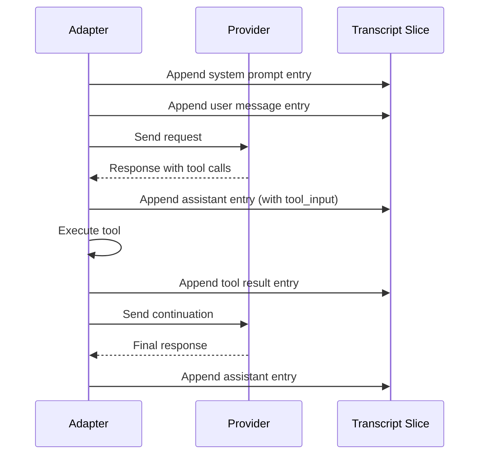
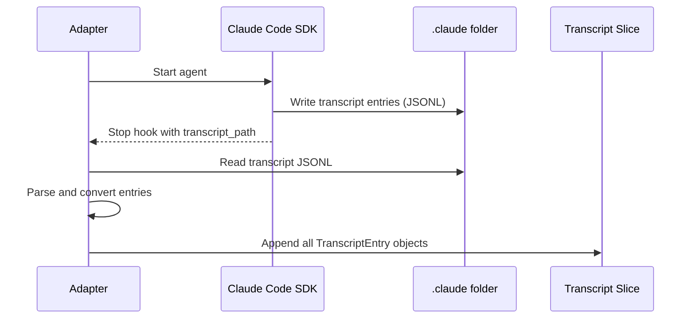

# Transcript Capture Specification

## Purpose

This specification defines how full conversation transcripts are captured in a
LOG slice within the Session. Transcripts provide human-readable visibility into
exactly what the agent is doing at the most granular level—every message sent,
every tool call made, every response received.

The transcript system serves debugging, auditing, and understanding agent
behavior without requiring access to provider dashboards or log aggregation
systems.

## Guiding Principles

- **Human-first**: Transcripts are designed for human consumption. Field names,
  structure, and content should be immediately understandable without
  documentation.
- **Complete capture**: Every message in the conversation is recorded, including
  system prompts, user messages, assistant responses, and tool interactions.
- **Adapter-agnostic storage**: All adapters store transcripts in the same
  `TranscriptEntry` format regardless of provider differences.
- **Append-only semantics**: Transcript slices use LOG policy; entries are never
  modified or deleted during a session.
- **Source fidelity**: For Claude Agent SDK, transcripts capture the full
  conversation from the `.claude` folder, preserving the exact sequence of
  events as they occurred in the subprocess.

## Data Model

### TranscriptEntry

A single entry in the conversation transcript:

```python
from dataclasses import dataclass, field
from datetime import datetime
from typing import Any, Literal
from uuid import UUID, uuid4

TranscriptRole = Literal["system", "user", "assistant", "tool"]

@dataclass(frozen=True, slots=True)
class TranscriptEntry:
    """A single message in the conversation transcript.

    Represents one turn in the conversation, whether from the system,
    user, assistant, or a tool response. Designed for human readability.
    """

    role: TranscriptRole
    """Who produced this message: system, user, assistant, or tool."""

    content: str
    """The text content of the message.

    For tool calls, this contains the tool arguments as formatted JSON.
    For tool responses, this contains the tool output.
    """

    created_at: datetime
    """When this entry was recorded."""

    # Optional fields for richer context

    tool_name: str | None = None
    """For tool role: the name of the tool that was called."""

    tool_call_id: str | None = None
    """For tool role: the unique identifier for this tool invocation."""

    tool_input: dict[str, Any] | None = None
    """For assistant role with tool calls: the structured tool arguments."""

    metadata: dict[str, Any] | None = None
    """Provider-specific metadata (model name, token counts, etc.)."""

    entry_id: UUID = field(default_factory=uuid4)
    """Unique identifier for this transcript entry."""

    # Source tracking for multi-agent scenarios

    source: str = "primary"
    """Source identifier. 'primary' for main agent, 'subagent:<id>' for
    nested agents (Claude Agent SDK Task tool spawns)."""

    sequence: int = 0
    """Monotonically increasing sequence number within the source.
    Enables correct ordering when entries arrive out of order."""
```

### TranscriptRole Values

| Role | Description |
| ----------- | ---------------------------------------------------------- |
| `system` | System prompt or instructions injected into the context |
| `user` | User-provided input (the initial prompt or follow-ups) |
| `assistant` | Model-generated response text or tool call declarations |
| `tool` | Tool execution result returned to the model |

### Slice Registration

Transcripts use LOG policy for append-only persistence:

```python
from weakincentives.runtime.session import Session, SlicePolicy

session = Session(bus=bus)
session.set_policy(TranscriptEntry, SlicePolicy.LOG)
```

When using `JsonlSliceFactory` for LOG slices, transcripts persist to disk
automatically:

```python
from weakincentives.runtime.session.slices import (
    JsonlSliceFactory,
    MemorySliceFactory,
    SliceFactoryConfig,
)

config = SliceFactoryConfig(
    state_factory=MemorySliceFactory(),
    log_factory=JsonlSliceFactory(base_dir=Path("./transcripts")),
)

session = Session(bus=bus, slice_config=config)
```

## Adapter Integration

### OpenAI and LiteLLM Adapters

For request/response adapters, transcript entries are captured at each turn of
the conversation:



#### Capture Points

1. **Before first provider call**: Capture system prompt and user message
2. **After each provider response**: Capture assistant message (text and/or
   tool calls)
3. **After each tool execution**: Capture tool result
4. **On conversation end**: Final assistant message captured

#### Implementation Pattern

```python
def _capture_transcript_entry(
    self,
    role: TranscriptRole,
    content: str,
    *,
    session: Session,
    tool_name: str | None = None,
    tool_call_id: str | None = None,
    tool_input: dict[str, Any] | None = None,
    metadata: dict[str, Any] | None = None,
) -> None:
    """Append a transcript entry to the session."""
    entry = TranscriptEntry(
        role=role,
        content=content,
        created_at=datetime.now(UTC),
        tool_name=tool_name,
        tool_call_id=tool_call_id,
        tool_input=tool_input,
        metadata=metadata,
    )
    session.dispatch(entry)
```

### Claude Agent SDK Adapter

The Claude Agent SDK runs as a subprocess with its own conversation history
stored in the `.claude` folder within the isolated home directory. Transcripts
are captured by reading the JSONL transcript file after execution completes.

#### Transcript File Location

When isolation is enabled, the SDK writes transcripts to:

```
$ISOLATED_HOME/.claude/projects/<project_hash>/transcripts/<session_id>.jsonl
```

The adapter reads this file using the `transcript_path` provided in hook
callbacks (e.g., `SubagentStop`, `PostToolUse`).

#### Capture Flow



#### Entry Conversion

Claude Code transcript entries are converted to `TranscriptEntry` format:

```python
def _convert_claude_transcript_entry(
    raw: dict[str, Any],
    *,
    source: str = "primary",
    sequence: int = 0,
) -> TranscriptEntry:
    """Convert a Claude Code transcript entry to TranscriptEntry.

    Claude Code JSONL format includes fields like:
    - type: "user" | "assistant" | "tool_use" | "tool_result"
    - content: message content (text or structured)
    - timestamp: ISO 8601 timestamp
    - tool_name: for tool entries
    - tool_use_id: correlation ID
    """
    entry_type = raw.get("type", "")
    timestamp_str = raw.get("timestamp", "")

    # Map Claude Code types to TranscriptRole
    role_map: dict[str, TranscriptRole] = {
        "user": "user",
        "assistant": "assistant",
        "tool_use": "assistant",  # Tool calls come from assistant
        "tool_result": "tool",
        "system": "system",
    }
    role = role_map.get(entry_type, "assistant")

    # Extract content
    content_raw = raw.get("content", "")
    if isinstance(content_raw, dict):
        content = json.dumps(content_raw, indent=2)
    elif isinstance(content_raw, list):
        # Claude sometimes uses content blocks
        parts = []
        for block in content_raw:
            if isinstance(block, dict) and "text" in block:
                parts.append(block["text"])
            elif isinstance(block, str):
                parts.append(block)
        content = "\n".join(parts)
    else:
        content = str(content_raw)

    # Parse timestamp
    try:
        created_at = datetime.fromisoformat(timestamp_str.replace("Z", "+00:00"))
    except (ValueError, AttributeError):
        created_at = datetime.now(UTC)

    return TranscriptEntry(
        role=role,
        content=content,
        created_at=created_at,
        tool_name=raw.get("tool_name"),
        tool_call_id=raw.get("tool_use_id"),
        tool_input=raw.get("input") if entry_type == "tool_use" else None,
        metadata={"raw_type": entry_type, "claude_session_id": raw.get("session_id")},
        source=source,
        sequence=sequence,
    )
```

#### Subagent Transcripts

When Claude Code spawns subagents via the Task tool, each subagent maintains its
own transcript. These are captured via the `SubagentStop` hook with the
`agent_transcript_path` field:

```python
def _capture_subagent_transcript(
    self,
    transcript_entries: list[dict[str, Any]],
    *,
    session: Session,
    subagent_id: str,
) -> None:
    """Capture transcript from a completed subagent."""
    source = f"subagent:{subagent_id}"
    for i, raw in enumerate(transcript_entries):
        entry = _convert_claude_transcript_entry(raw, source=source, sequence=i)
        session.dispatch(entry)
```

## Querying Transcripts

### Basic Access

```python
# Get all transcript entries
all_entries = session[TranscriptEntry].all()

# Get most recent entry
latest = session[TranscriptEntry].latest()

# Filter by role
assistant_messages = session[TranscriptEntry].where(
    lambda e: e.role == "assistant"
)

# Filter by source (primary agent only)
primary_only = session[TranscriptEntry].where(
    lambda e: e.source == "primary"
)
```

### Human-Readable Formatting

```python
def format_transcript(entries: Iterable[TranscriptEntry]) -> str:
    """Format transcript entries for human reading."""
    lines = []
    for entry in entries:
        timestamp = entry.created_at.strftime("%H:%M:%S")
        source_prefix = f"[{entry.source}] " if entry.source != "primary" else ""

        if entry.role == "tool":
            header = f"{source_prefix}[{timestamp}] 🔧 {entry.tool_name}"
        else:
            role_emoji = {"system": "⚙️", "user": "👤", "assistant": "🤖"}
            header = f"{source_prefix}[{timestamp}] {role_emoji.get(entry.role, '•')} {entry.role.upper()}"

        lines.append(header)
        lines.append(entry.content)
        lines.append("")  # Blank line between entries

    return "\n".join(lines)
```

Example output:

```
[09:15:32] ⚙️ SYSTEM
You are a helpful coding assistant...

[09:15:32] 👤 USER
Please review the code in src/main.py

[09:15:35] 🤖 ASSISTANT
I'll review the code in src/main.py. Let me read the file first.

[09:15:36] 🔧 Read
{"path": "src/main.py"}

[subagent:abc123] [09:15:38] 🤖 ASSISTANT
Looking at the implementation...
```

## Configuration

### Enabling Transcript Capture

Transcript capture is opt-in per adapter. Enable via adapter configuration:

```python
# OpenAI adapter
adapter = OpenAIAdapter(
    model="gpt-4o",
    model_config=OpenAIModelConfig(capture_transcript=True),
)

# Claude Agent SDK adapter
adapter = ClaudeAgentSDKAdapter(
    client_config=ClaudeAgentSDKClientConfig(
        capture_transcript=True,
        capture_subagent_transcripts=True,  # Include nested agents
    ),
)
```

### Transcript Slice Policy

By default, `TranscriptEntry` uses LOG policy when capture is enabled. This can
be configured explicitly:

```python
from weakincentives.runtime.session import SlicePolicy

# Explicitly set (this is the default when capture_transcript=True)
session.set_policy(TranscriptEntry, SlicePolicy.LOG)
```

### File-Backed Persistence

For long-running agents or post-mortem analysis:

```python
from pathlib import Path
from weakincentives.runtime.session.slices import (
    JsonlSliceFactory,
    MemorySliceFactory,
    SliceFactoryConfig,
)

config = SliceFactoryConfig(
    state_factory=MemorySliceFactory(),
    log_factory=JsonlSliceFactory(base_dir=Path("./agent_transcripts")),
)

session = Session(bus=bus, slice_config=config)
```

Transcripts persist to:
`./agent_transcripts/weakincentives.transcript:TranscriptEntry.jsonl`

## Reducer

Transcript entries use the built-in `append_all` reducer (default for LOG
slices):

```python
from weakincentives.runtime.session import append_all

# This is registered automatically for LOG policy slices
session[TranscriptEntry].register(TranscriptEntry, append_all)
```

## Event Integration

Transcript capture integrates with the existing event system. When transcript
capture is enabled, adapters dispatch `TranscriptEntry` events alongside
existing telemetry events:

| Existing Event | Related Transcript Entries |
| ---------------- | --------------------------------------- |
| `PromptRendered` | `system` and `user` entries |
| `ToolInvoked` | `assistant` (tool call) + `tool` (result) entries |
| `PromptExecuted` | Final `assistant` entry |

Transcripts provide more granular detail than existing events; they capture the
full message content rather than summarized metadata.

## Limitations

- **Memory growth**: Long conversations accumulate many entries. Use file-backed
  slices for extended sessions.
- **No streaming**: Entries are captured after completion, not during streaming
  responses.
- **Provider differences**: Some providers include more metadata than others;
  the `metadata` field captures provider-specific details.
- **Subagent depth**: Claude Agent SDK subagent transcripts are captured one
  level deep by default. Deeply nested agents may require explicit configuration.
- **Sensitive data**: Transcripts capture full message content including any
  sensitive data in prompts or responses. Apply appropriate access controls.

## Related Specifications

- `specs/SLICES.md` - Slice storage backends and LOG policy
- `specs/SESSIONS.md` - Session lifecycle and event dispatch
- `specs/ADAPTERS.md` - Provider adapter architecture
- `specs/CLAUDE_AGENT_SDK.md` - Claude Code integration and isolation
- `specs/LOGGING.md` - Structured logging conventions
