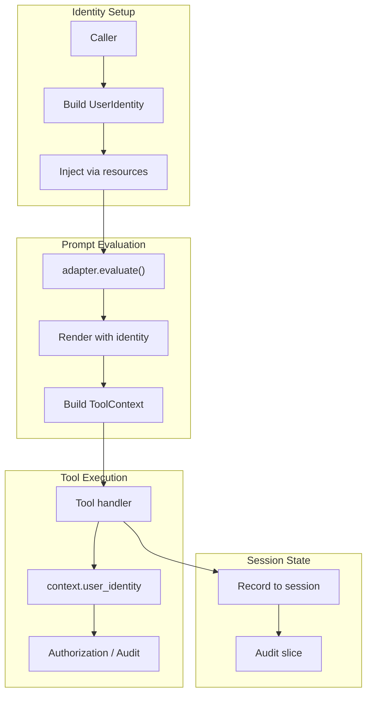

# User Identity Primitives Specification

## Purpose

User identity primitives provide a typed, immutable mechanism for associating a
user with a prompt evaluation and ensuring that identity is accessible
throughout tool execution. This enables:

- **Audit trails**: Tool invocations can be attributed to specific users
- **Authorization enforcement**: Tools can make access decisions based on user
  context
- **Personalization**: Prompts and tool behaviors can adapt to user attributes
- **Multi-tenant isolation**: Session state can be scoped to specific users

## Guiding Principles

- **Immutable identity**: User identity is frozen at evaluation start; it cannot
  be modified mid-execution.
- **Type-safe access**: Identity is accessed via typed protocols, not string
  lookups or dynamic attributes.
- **Opt-in design**: User identity is optional; prompts and tools must handle
  its absence gracefully.
- **Separation of concerns**: Identity primitives carry user metadata; they do
  not enforce authorization (that responsibility belongs to tool handlers).
- **Protocol-first extensibility**: Custom identity types are supported via the
  `UserIdentityProtocol`.
- **Resource registry integration**: Identity flows through `ResourceRegistry`
  for consistent access patterns.



## Core Components

### UserIdentity

`UserIdentity` is the standard identity dataclass:

```python
@dataclass(slots=True, frozen=True)
class UserIdentity:
    user_id: str                              # Unique identifier (required)
    display_name: str | None = None           # Human-readable name
    email: str | None = None                  # Email address
    roles: tuple[str, ...] = ()               # Role identifiers
    permissions: tuple[str, ...] = ()         # Permission identifiers
    attributes: Mapping[str, str] = field(    # Custom key-value attributes
        default_factory=dict
    )
    tenant_id: str | None = None              # Multi-tenancy scope
    authenticated_at: datetime | None = None  # When identity was verified
```

**Field constraints:**

| Field | Constraint |
|-------|------------|
| `user_id` | Non-empty string, max 255 chars |
| `display_name` | Max 500 chars if provided |
| `email` | Valid email format if provided |
| `roles` | Each role max 100 chars |
| `permissions` | Each permission max 100 chars |
| `attributes` | Keys max 100 chars, values max 1000 chars |
| `tenant_id` | Max 255 chars if provided |
| `authenticated_at` | Must be timezone-aware if provided |

### UserIdentityProtocol

For custom identity implementations:

```python
@runtime_checkable
class UserIdentityProtocol(Protocol):
    @property
    def user_id(self) -> str:
        """Unique identifier for the user."""
        ...

    @property
    def tenant_id(self) -> str | None:
        """Optional tenant scope for multi-tenancy."""
        ...
```

Custom identity types must satisfy this protocol to integrate with the resource
registry lookup.

### AnonymousIdentity

Sentinel for unauthenticated access:

```python
@dataclass(slots=True, frozen=True)
class AnonymousIdentity:
    """Represents an unauthenticated or anonymous user."""

    session_id: str | None = None   # Optional session tracking
    ip_address: str | None = None   # Optional client IP
    user_agent: str | None = None   # Optional user agent string

    @property
    def user_id(self) -> str:
        return "anonymous"

    @property
    def tenant_id(self) -> str | None:
        return None
```

Use `AnonymousIdentity` when tool handlers need to distinguish between "no
identity provided" and "explicitly anonymous user."

## Resource Registry Integration

User identity flows through the `ResourceRegistry`:

```python
# Inject identity at evaluation time
identity = UserIdentity(
    user_id="user-123",
    display_name="Alice",
    roles=("admin", "developer"),
)

resources = ResourceRegistry.build({
    UserIdentity: identity,
})

response = adapter.evaluate(
    prompt,
    params,
    bus=bus,
    session=session,
    resources=resources,
)
```

### ToolContext Sugar Property

`ToolContext` provides a convenience property:

```python
@dataclass(slots=True, frozen=True)
class ToolContext:
    # ... existing fields ...
    resources: ResourceRegistry = field(default_factory=ResourceRegistry)

    @property
    def user_identity(self) -> UserIdentityProtocol | None:
        """Retrieve user identity from resources."""
        return self.resources.get(UserIdentity)
```

**Note**: The property returns `UserIdentityProtocol | None` to support custom
identity implementations. Type narrowing via `isinstance()` is required for
access to non-protocol fields.

## Tool Handler Patterns

### Accessing Identity

```python
def my_handler(
    params: MyParams,
    *,
    context: ToolContext,
) -> ToolResult[MyResult]:
    identity = context.user_identity

    if identity is None:
        return ToolResult(
            message="Authentication required",
            value=None,
            success=False,
        )

    # Access protocol fields directly
    user_id = identity.user_id
    tenant_id = identity.tenant_id

    # Narrow for full UserIdentity access
    if isinstance(identity, UserIdentity):
        roles = identity.roles
        email = identity.email
```

### Authorization Patterns

Tools should implement authorization checks against identity:

```python
def admin_only_handler(
    params: AdminParams,
    *,
    context: ToolContext,
) -> ToolResult[AdminResult]:
    identity = context.user_identity

    if identity is None:
        return ToolResult(
            message="Authentication required",
            value=None,
            success=False,
        )

    if not isinstance(identity, UserIdentity):
        return ToolResult(
            message="Standard identity required",
            value=None,
            success=False,
        )

    if "admin" not in identity.roles:
        return ToolResult(
            message=f"User {identity.user_id} lacks admin role",
            value=None,
            success=False,
        )

    # Proceed with admin operation
    return ToolResult(message="Admin action completed", value=result)
```

### Permission-Based Access

```python
def check_permission(
    identity: UserIdentityProtocol | None,
    required: str,
) -> bool:
    """Check if identity has a specific permission."""
    if identity is None:
        return False
    if not isinstance(identity, UserIdentity):
        return False
    return required in identity.permissions


def write_file_handler(
    params: WriteFileParams,
    *,
    context: ToolContext,
) -> ToolResult[WriteFileResult]:
    if not check_permission(context.user_identity, "files:write"):
        return ToolResult(
            message="Permission denied: files:write required",
            value=None,
            success=False,
        )

    # Proceed with file write
    ...
```

### Tenant Scoping

```python
def list_resources_handler(
    params: ListResourcesParams,
    *,
    context: ToolContext,
) -> ToolResult[ListResourcesResult]:
    identity = context.user_identity
    tenant_id = identity.tenant_id if identity else None

    # Query scoped to tenant
    resources = db.query_resources(tenant_id=tenant_id)

    return ToolResult(
        message=f"Found {len(resources)} resources",
        value=ListResourcesResult(resources=tuple(resources)),
    )
```

## Session State Integration

### Audit Events

Record user actions to session state:

```python
@dataclass(slots=True, frozen=True)
class UserAction:
    user_id: str
    action: str
    resource: str
    timestamp: datetime
    success: bool
    details: Mapping[str, str] = field(default_factory=dict)


def audited_handler(
    params: AuditedParams,
    *,
    context: ToolContext,
) -> ToolResult[AuditedResult]:
    identity = context.user_identity
    user_id = identity.user_id if identity else "anonymous"

    try:
        result = perform_action(params)
        success = True
    except Exception as e:
        result = None
        success = False

    # Record to session for audit trail
    action = UserAction(
        user_id=user_id,
        action="audited_operation",
        resource=params.resource_id,
        timestamp=datetime.now(UTC),
        success=success,
    )
    context.session[UserAction].append(action)

    if not success:
        return ToolResult(message="Operation failed", value=None, success=False)

    return ToolResult(message="Operation completed", value=result)
```

### Identity in Session Slice

Store identity in session for cross-tool access:

```python
# At evaluation start
session[UserIdentity].seed(identity)

# In any tool handler
def some_handler(params: Params, *, context: ToolContext) -> ToolResult[Result]:
    # Access via resources (preferred)
    identity = context.user_identity

    # Or access via session (for handlers that mutate identity-related state)
    stored = context.session[UserIdentity].latest()
```

**Design note**: Prefer resource registry access (`context.user_identity`) for
read-only identity checks. Use session state when identity-related data needs
to persist across multiple prompts or when audit trails require session-scoped
recording.

## Prompt Composition

### Identity-Aware Sections

Sections can adapt content based on user identity:

```python
def identity_enabled(params: Params, *, session: Session | None) -> bool:
    """Enable section only for authenticated users."""
    if session is None:
        return False
    identity = session[UserIdentity].latest()
    return identity is not None


def admin_enabled(params: Params, *, session: Session | None) -> bool:
    """Enable section only for admin users."""
    if session is None:
        return False
    identity = session[UserIdentity].latest()
    if not isinstance(identity, UserIdentity):
        return False
    return "admin" in identity.roles


admin_section = MarkdownSection(
    title="Admin Tools",
    template="You have access to administrative functions.",
    key="admin-tools",
    tools=(admin_tool_1, admin_tool_2),
    enabled=admin_enabled,
)
```

### User Context in Templates

Include user information in rendered prompts:

```python
@dataclass(slots=True, frozen=True)
class UserContextParams:
    user_name: str
    user_role: str


user_context_section = MarkdownSection[UserContextParams](
    title="User Context",
    template="""
You are assisting $user_name who has the role: $user_role.
Tailor your responses appropriately.
""",
    key="user-context",
)

# At render time
identity = get_user_identity()
params = UserContextParams(
    user_name=identity.display_name or identity.user_id,
    user_role=identity.roles[0] if identity.roles else "user",
)
prompt.bind(params)
```

## Identity Providers

### Factory Pattern

```python
class IdentityProvider(Protocol):
    """Protocol for identity resolution."""

    def resolve(self, token: str) -> UserIdentity | None:
        """Resolve an authentication token to user identity."""
        ...


class JWTIdentityProvider:
    """Resolve identity from JWT tokens."""

    def __init__(self, secret: str, algorithms: tuple[str, ...] = ("HS256",)):
        self._secret = secret
        self._algorithms = algorithms

    def resolve(self, token: str) -> UserIdentity | None:
        try:
            payload = jwt.decode(token, self._secret, algorithms=self._algorithms)
            return UserIdentity(
                user_id=payload["sub"],
                email=payload.get("email"),
                roles=tuple(payload.get("roles", [])),
                authenticated_at=datetime.fromtimestamp(payload["iat"], UTC),
            )
        except jwt.InvalidTokenError:
            return None
```

### Integration with Adapters

```python
async def evaluate_with_identity(
    prompt: Prompt[OutputType],
    params: ParamsType,
    *,
    auth_token: str | None,
    identity_provider: IdentityProvider,
    adapter: ProviderAdapter[OutputType],
    bus: EventBus,
    session: Session,
) -> PromptResponse[OutputType]:
    """Evaluate prompt with resolved user identity."""

    # Resolve identity from token
    identity: UserIdentityProtocol | None = None
    if auth_token:
        identity = identity_provider.resolve(auth_token)

    # Build resources with identity
    resources = ResourceRegistry.build({
        UserIdentity: identity,
    }) if identity else ResourceRegistry()

    # Store in session for cross-prompt access
    if identity:
        session[UserIdentity].seed(identity)

    return adapter.evaluate(
        prompt,
        params,
        bus=bus,
        session=session,
        resources=resources,
    )
```

## Telemetry Integration

### ToolInvoked Events

Tool invocation events can include user context:

```python
@FrozenDataclass()
class ToolInvoked:
    # ... existing fields ...
    user_id: str | None = None  # User who triggered the invocation
```

Adapters automatically populate `user_id` from the resource registry when
building `ToolInvoked` events.

### Custom Audit Events

```python
@dataclass(slots=True, frozen=True)
class UserToolInvocation:
    """Audit event for user-attributed tool calls."""

    user_id: str
    tenant_id: str | None
    tool_name: str
    params_hash: str  # Hash of params for privacy
    success: bool
    timestamp: datetime
    session_id: UUID


def audit_tool_call(
    context: ToolContext,
    tool_name: str,
    params: object,
    success: bool,
) -> None:
    """Record tool invocation for audit purposes."""
    identity = context.user_identity

    event = UserToolInvocation(
        user_id=identity.user_id if identity else "anonymous",
        tenant_id=identity.tenant_id if identity else None,
        tool_name=tool_name,
        params_hash=hashlib.sha256(str(params).encode()).hexdigest()[:16],
        success=success,
        timestamp=datetime.now(UTC),
        session_id=context.session.session_id,
    )

    context.session.event_bus.publish(event)
```

## Usage Example

Complete example integrating user identity:

```python
from dataclasses import dataclass
from datetime import UTC, datetime

from weakincentives.adapters.openai import OpenAIAdapter
from weakincentives.identity import UserIdentity
from weakincentives.prompt import MarkdownSection, Prompt, PromptTemplate, Tool
from weakincentives.prompt.tool import ToolContext, ToolResult, ResourceRegistry
from weakincentives.runtime.events import InProcessEventBus
from weakincentives.runtime.session import Session


# Define a tool that requires authentication
@dataclass(slots=True, frozen=True)
class GetUserDataParams:
    include_private: bool = False


@dataclass(slots=True, frozen=True)
class UserData:
    user_id: str
    profile: dict[str, str]


def get_user_data_handler(
    params: GetUserDataParams,
    *,
    context: ToolContext,
) -> ToolResult[UserData]:
    identity = context.user_identity

    if identity is None:
        return ToolResult(
            message="Authentication required to access user data",
            value=None,
            success=False,
        )

    # Only return private data if user is requesting their own data
    profile = {"name": "Public Name"}
    if params.include_private and identity.user_id == "user-123":
        profile["email"] = "private@example.com"

    return ToolResult(
        message=f"Retrieved data for {identity.user_id}",
        value=UserData(user_id=identity.user_id, profile=profile),
    )


get_user_data = Tool[GetUserDataParams, UserData](
    name="get_user_data",
    description="Retrieve user profile data",
    handler=get_user_data_handler,
)


# Build prompt with identity-aware section
template = PromptTemplate[str](
    ns="example",
    key="user-data",
    sections=[
        MarkdownSection(
            title="Data Access",
            template="You can retrieve user data using the available tools.",
            key="data-access",
            tools=(get_user_data,),
        ),
    ],
)


# Evaluate with user identity
def main() -> None:
    bus = InProcessEventBus()
    session = Session(bus=bus)

    # Create identity (typically from auth token)
    identity = UserIdentity(
        user_id="user-123",
        display_name="Alice Developer",
        email="alice@example.com",
        roles=("developer",),
        permissions=("data:read", "data:write"),
        tenant_id="acme-corp",
        authenticated_at=datetime.now(UTC),
    )

    # Inject identity via resources
    resources = ResourceRegistry.build({
        UserIdentity: identity,
    })

    # Also store in session for audit trail
    session[UserIdentity].seed(identity)

    adapter = OpenAIAdapter(model="gpt-4o")
    prompt = Prompt(template)

    response = adapter.evaluate(
        prompt,
        bus=bus,
        session=session,
        resources=resources,
    )

    print(f"Response: {response.output}")

    # Query audit trail
    actions = session[UserAction].all()
    print(f"Recorded {len(actions)} user actions")
```

## Limitations

- **No identity mutation**: Identity is frozen at injection time; changes
  require a new evaluation
- **No built-in authorization framework**: Tools must implement their own
  access control logic
- **Protocol fields only for generic access**: Custom identity attributes
  require type narrowing
- **Session storage is optional**: Identity in resources is authoritative;
  session storage is for persistence/audit
- **No identity inheritance**: Child sessions do not automatically inherit
  parent identity
- **Synchronous resolution**: Identity providers are expected to resolve
  synchronously; async resolution requires pre-evaluation handling
- **No revocation checks**: Identity validity is not re-checked during
  evaluation; use short-lived tokens
