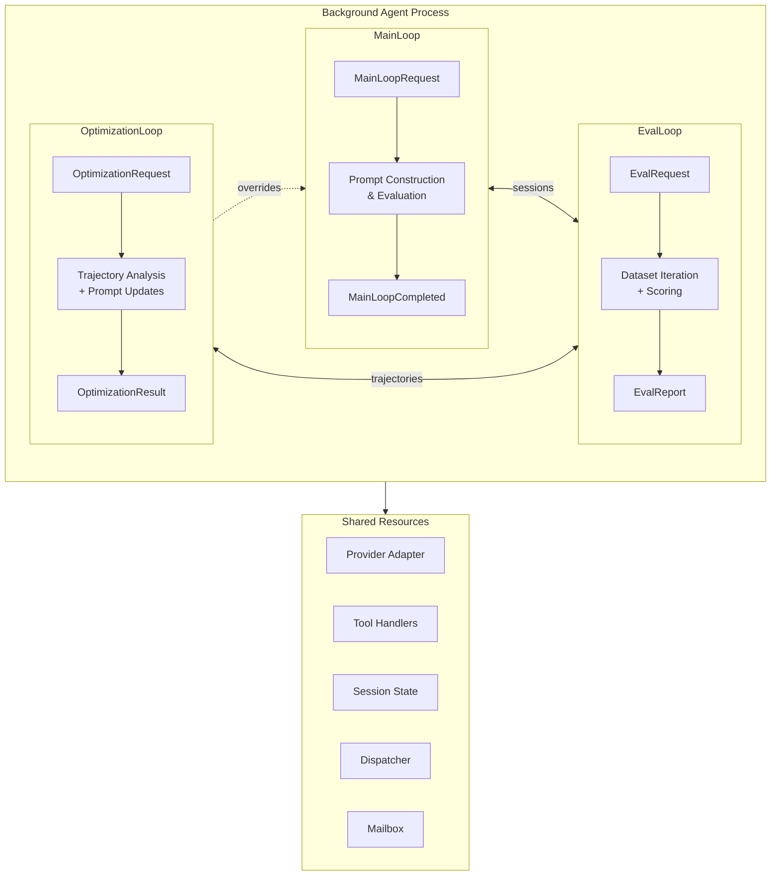

# The Whole Story: Three Loops Architecture

## Purpose

A well-defined background agent is composed of three interconnected loops that
together provide a complete lifecycle from prompt construction through
evaluation to optimization. This specification describes how `MainLoop`,
`EvalLoop`, and `OptimizationLoop` work together, their individual
request/response protocols, and the benefits of co-locating them in a single
process.

## Guiding Principles

- **Single-process deployment**: All three loops run in the same process,
  sharing resources, tools, and session infrastructure.
- **Protocol-driven composition**: Each loop defines a typed request/response
  contract enabling clean boundaries and testability.
- **Zero-fixture evaluation**: Co-location means evals use the exact same
  tools, adapters, and resources as production—no mocking required.
- **Continuous improvement**: Optimization produces prompt updates grounded in
  actual execution trajectories, not synthetic examples.

## Architecture Overview



## The Three Loops

### MainLoop: Prompt Evaluation

MainLoop handles the core task: constructing prompts and evaluating them to
produce typed outputs. Each execution follows a deterministic flow through
prompt construction, provider calls, tool dispatch, and output parsing.

**Responsibility:** Transform a domain-specific request into a typed output
via LLM evaluation.

**Protocol:**

```python
@FrozenDataclass()
class MainLoopRequest(Generic[UserRequestT]):
    request: UserRequestT
    budget: Budget | None = None
    deadline: Deadline | None = None
    request_id: UUID = field(default_factory=uuid4)


@FrozenDataclass()
class MainLoopCompleted(Generic[OutputT]):
    request_id: UUID
    response: PromptResponse[OutputT]
    session_id: UUID
```

**Execution:** Request → Session → Prompt → Evaluate → Handle Tools → Parse →
Result

See `specs/MAIN_LOOP.md` for full specification.

### EvalLoop: Dataset Evaluation

EvalLoop wraps MainLoop to run evaluation datasets. For each sample, it
executes the request through MainLoop, scores the output against expected
values, and aggregates results into a report.

**Responsibility:** Measure MainLoop performance across a dataset using
application-specific scoring logic.

**Protocol:**

```python
@FrozenDataclass()
class EvalRequest(Generic[InputT, ExpectedT]):
    dataset: tuple[Sample[InputT, ExpectedT], ...]
    evaluator: Evaluator[OutputT, ExpectedT]
    budget_per_sample: Budget | None = None
    request_id: UUID = field(default_factory=uuid4)


@FrozenDataclass()
class EvalCompleted:
    request_id: UUID
    report: EvalReport
    trajectories: tuple[ExecutionTrajectory, ...]
```

**Execution:**

```
for sample in dataset:
    response, session = main_loop.execute(sample.input)
    score = evaluator(response.output, sample.expected)
    trajectory = capture_trajectory(session)
    results.append(EvalResult(sample_id, score, trajectory))

return EvalReport(results)
```

**Key addition over raw evals:** EvalLoop captures execution trajectories
(session snapshots, tool invocations, visibility expansions) that feed into
OptimizationLoop.

See `specs/EVALS.md` for evaluator and scoring details.

### OptimizationLoop: Prompt Improvement

OptimizationLoop analyzes execution trajectories from EvalLoop and produces
prompt template updates. These updates are presented to developers for review
before being applied as overrides.

**Responsibility:** Given eval results and trajectories, suggest prompt
improvements that developers can review and apply.

**Protocol:**

```python
@FrozenDataclass()
class OptimizationRequest:
    trajectories: tuple[ExecutionTrajectory, ...]
    report: EvalReport
    target_prompt: PromptDescriptor
    strategy: OptimizationStrategy = OptimizationStrategy.INSTRUCTION_REFINEMENT
    request_id: UUID = field(default_factory=uuid4)


@FrozenDataclass()
class OptimizationResult:
    request_id: UUID
    suggestions: tuple[PromptSuggestion, ...]
    analysis: TrajectoryAnalysis


@FrozenDataclass()
class PromptSuggestion:
    section_path: tuple[str, ...]
    original_hash: HexDigest
    suggested_body: str
    rationale: str
    expected_impact: str
```

**Execution:**

```
analysis = analyze_trajectories(trajectories, report)
suggestions = generate_suggestions(analysis, target_prompt, strategy)
return OptimizationResult(suggestions=suggestions, analysis=analysis)
```

**Developer workflow:**

1. Run EvalLoop to collect trajectories and scores
1. Run OptimizationLoop to generate suggestions
1. Review suggestions and their rationales
1. Apply accepted suggestions as prompt overrides
1. Re-run EvalLoop to measure improvement

See `specs/PROMPT_OPTIMIZATION.md` for override system details.

## Co-Location Benefits

All three loops deploy together in the same process. This architecture
provides significant advantages:

### Shared Resources

```python
# All loops share the same adapter, tools, and session infrastructure
adapter = OpenAIAdapter(model="gpt-4o")
dispatcher = InProcessDispatcher()

main_loop = MyMainLoop(adapter=adapter, dispatcher=dispatcher)
eval_loop = EvalLoop(main_loop=main_loop, dispatcher=dispatcher)
optimization_loop = OptimizationLoop(adapter=adapter, dispatcher=dispatcher)
```

**Why this matters:**

- **No fixture drift**: Evals use the exact same tool handlers as production.
  When a tool changes, evals automatically test the new behavior.
- **Same resource access**: Database connections, API clients, and filesystem
  access work identically across all loops.
- **Consistent sessions**: Session state, reducers, and event subscriptions
  behave the same during eval as in production.

### Trajectory Fidelity

Because EvalLoop uses the real MainLoop (not a mock), captured trajectories
reflect actual execution:

- Real tool invocations with real parameters
- Actual visibility expansions and retries
- True session state evolution
- Genuine provider responses and token usage

OptimizationLoop can analyze these trajectories with confidence that
improvements will transfer to production.

### Simplified Testing

```python
# Integration test with real components
def test_full_pipeline():
    adapter = OpenAIAdapter(model="gpt-4o")
    dispatcher = InProcessDispatcher()

    # Same setup as production
    main_loop = CodeReviewLoop(adapter=adapter, dispatcher=dispatcher)
    eval_loop = EvalLoop(main_loop=main_loop, dispatcher=dispatcher)

    # Real evaluation
    report = eval_loop.run(dataset, evaluator)

    # Optimization uses real trajectories
    opt_loop = OptimizationLoop(adapter=adapter, dispatcher=dispatcher)
    result = opt_loop.run(report.trajectories, report)

    # Suggestions grounded in actual execution
    assert len(result.suggestions) > 0
```

No mocks, no fixtures to maintain, no behavior divergence.

## Request/Response Protocols

Each loop defines a clean protocol boundary:

| Loop | Request Type | Response Type | Key Data |
|------|--------------|---------------|----------|
| MainLoop | `MainLoopRequest[T]` | `MainLoopCompleted[O]` | User request → Typed output |
| EvalLoop | `EvalRequest[I, E]` | `EvalCompleted` | Dataset → Report + Trajectories |
| OptimizationLoop | `OptimizationRequest` | `OptimizationResult` | Trajectories → Suggestions |

### Dispatcher vs Mailbox

Two communication patterns serve different needs:

**Dispatcher** (pub/sub): Broadcast telemetry and lifecycle events to multiple
observers. All subscribers receive every event. Used for logging, metrics, and
cross-cutting concerns.

```python
dispatcher = InProcessDispatcher()

# Subscribe to loop lifecycle events
dispatcher.subscribe(MainLoopCompleted, on_main_loop_done)
dispatcher.subscribe(EvalCompleted, on_eval_done)

# Broadcast event to all subscribers
dispatcher.dispatch(OptimizationStarted(prompt_key="..."))
```

**Mailbox** (point-to-point): Request/response with acknowledgment. One
consumer processes each message. Used for MainLoop orchestration across
processes.

```python
mailbox = InMemoryMailbox[MainLoopRequest, MainLoopResult]()

# Client sends request expecting reply
reply = mailbox.send_expecting_reply(MainLoopRequest(request=my_request))
result = reply.wait(timeout=60)

# Or fire-and-forget
mailbox.send(MainLoopRequest(request=background_task))
```

See `specs/MAILBOX.md` for the full message queue abstraction.

### Direct Invocation

For simpler cases, call loops directly:

```python
# Direct evaluation
response, session = main_loop.execute(request)

# Direct eval run
report = eval_loop.run(dataset, evaluator)

# Direct optimization
result = optimization_loop.run(report.trajectories, report)
```

## Execution Trajectories

Trajectories bridge EvalLoop and OptimizationLoop:

```python
@FrozenDataclass()
class ExecutionTrajectory:
    sample_id: str
    session_snapshot: Snapshot
    tool_invocations: tuple[ToolInvoked, ...]
    visibility_expansions: tuple[VisibilityExpansion, ...]
    token_usage: TokenUsage
    latency_ms: int
    score: Score
```

Trajectories capture:

- **Session state**: Full snapshot including all slices and accumulated data
- **Tool calls**: Every tool invocation with parameters and results
- **Visibility changes**: Any progressive disclosure expansions
- **Resource usage**: Token counts and wall-clock time
- **Outcome**: The evaluator's score for this sample

OptimizationLoop uses trajectories to identify patterns:

- Which sections correlate with failures?
- What tool sequences precede poor scores?
- Where do visibility expansions help or hurt?
- Which prompts consistently exceed budgets?

## Optimization Strategies

OptimizationLoop supports multiple strategies:

```python
class OptimizationStrategy(Enum):
    INSTRUCTION_REFINEMENT = "instruction_refinement"
    EXAMPLE_SELECTION = "example_selection"
    TOOL_DESCRIPTION_TUNING = "tool_description_tuning"
    SECTION_REORDERING = "section_reordering"
```

### Instruction Refinement

Analyzes failing trajectories to suggest clearer instructions:

- Identifies ambiguous phrasing that leads to wrong outputs
- Proposes more specific guidance based on error patterns
- Adds constraints that prevent common failure modes

### Example Selection

Selects few-shot examples from successful trajectories:

- Picks diverse examples covering different input types
- Prioritizes examples that demonstrate tool usage
- Balances example count against context limits

### Tool Description Tuning

Improves tool descriptions based on misuse patterns:

- Clarifies when tools should be used
- Adds parameter constraints from observed valid inputs
- Documents failure modes and recovery strategies

### Section Reordering

Optimizes section order for attention patterns:

- Moves critical instructions earlier
- Groups related information
- Separates reference material from active instructions

## Usage Pattern

```python
from weakincentives import MainLoop, Prompt, Session
from weakincentives.adapters.openai import OpenAIAdapter
from weakincentives.runtime import InProcessDispatcher
from weakincentives.evals import Sample, EvalLoop, exact_match
from weakincentives.optimizers import OptimizationLoop, OptimizationStrategy

# 1. Define MainLoop
class TaskLoop(MainLoop[TaskRequest, TaskOutput]):
    def create_prompt(self, request: TaskRequest) -> Prompt[TaskOutput]:
        return Prompt(self._template).bind(task=request.task)

    def create_session(self) -> Session:
        return Session(dispatcher=self._dispatcher)


# 2. Create shared infrastructure
adapter = OpenAIAdapter(model="gpt-4o")
dispatcher = InProcessDispatcher()

# 3. Instantiate all loops with shared resources
main_loop = TaskLoop(adapter=adapter, dispatcher=dispatcher)
eval_loop = EvalLoop(main_loop=main_loop, dispatcher=dispatcher)
opt_loop = OptimizationLoop(adapter=adapter, dispatcher=dispatcher)


# 4. Run evaluation
dataset = load_jsonl(Path("evals/tasks.jsonl"), TaskRequest, TaskOutput)
report = eval_loop.run(dataset, exact_match)

print(f"Pass rate: {report.pass_rate:.1%}")
print(f"Mean score: {report.mean_score:.2f}")


# 5. Generate optimization suggestions
if report.pass_rate < 0.9:
    result = opt_loop.run(
        trajectories=report.trajectories,
        report=report,
        target_prompt=main_loop.prompt_descriptor,
        strategy=OptimizationStrategy.INSTRUCTION_REFINEMENT,
    )

    # 6. Review and apply suggestions
    for suggestion in result.suggestions:
        print(f"\n--- Suggestion for {suggestion.section_path} ---")
        print(f"Rationale: {suggestion.rationale}")
        print(f"Expected impact: {suggestion.expected_impact}")
        print(f"New content:\n{suggestion.suggested_body}")

        if approve(suggestion):
            store.set_section_override(
                main_loop.prompt,
                path=suggestion.section_path,
                body=suggestion.suggested_body,
            )


# 7. Re-evaluate with optimized prompt
report_v2 = eval_loop.run(dataset, exact_match)
print(f"New pass rate: {report_v2.pass_rate:.1%}")
```

## Integration with Override System

OptimizationLoop produces suggestions compatible with the override system:

```
OptimizationResult
    └── PromptSuggestion
            ├── section_path: ("instructions",)
            ├── original_hash: "abc123..."
            ├── suggested_body: "Updated instructions..."
            └── rationale: "Trajectory analysis shows..."
                    │
                    ▼
            PromptOverride
                    │
                    ▼
        .weakincentives/prompts/overrides/{ns}/{key}/latest.json
```

Suggestions include the original content hash, ensuring they're only applied
when the source prompt hasn't changed.

## Limitations

- **Sequential execution**: All loops are synchronous; samples process one at
  a time
- **Single-process scope**: Co-location benefits require same-process
  deployment
- **Memory growth**: Trajectories accumulate; large datasets need streaming
- **Human review required**: Optimization produces suggestions, not automatic
  updates
- **Strategy coverage**: Not all prompt issues have automated fixes
- **Alpha stability**: Protocols may evolve without backward compatibility
