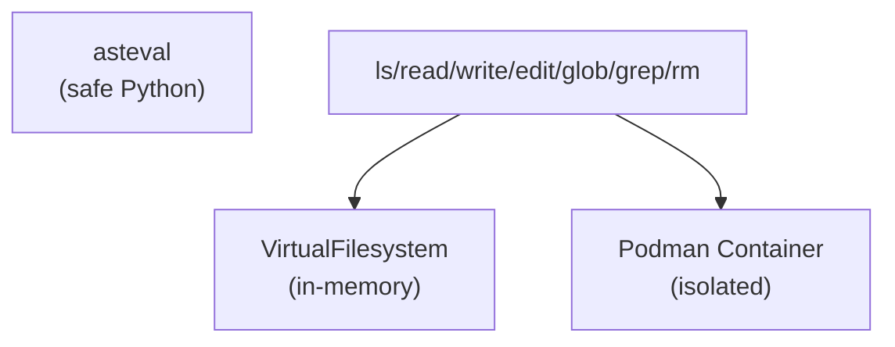

# Workspace Tools Specification

Session-scoped surfaces for file operations, code execution, and repository context.

**Source:** `src/weakincentives/contrib/tools/`

## Principles

- **Sandbox first**: VFS in-memory, Podman no-network, explicit host mounts
- **Predictable paths**: POSIX-style, ASCII-only, relative to root
- **Single source**: Reducers own mutations; handlers remain pure



## Virtual Filesystem

**Definition:** `contrib/tools/vfs.py`

| Tool | Description |
|------|-------------|
| `ls` | List directory |
| `read_file` | Read with pagination |
| `write_file` | Create file |
| `edit_file` | String replacement |
| `glob` | Pattern matching |
| `grep` | Regex search |
| `rm` | Remove file/directory |

### Limits

- Content: 48,000 chars/write
- Path depth: 16 segments
- Encoding: UTF-8 only

### Host Mounts

```python
HostMount(
    host_path="src/",
    include_glob=("*.py",),
    exclude_glob=("__pycache__/*",),
)
```

## Podman Sandbox

**Definition:** `contrib/tools/podman.py`

Container lifecycle: create → start → reuse → stop → remove

Additional tools:

| Tool | Description |
|------|-------------|
| `shell_execute` | Run command (≤120s) |
| `evaluate_python` | Execute via `python3 -c` (≤5s) |

### Configuration

```python
PodmanShellParams(
    command=("ls", "-la"),
    timeout_seconds=30.0,
    cwd="/workspace",
)
```

Limits: ASCII commands ≤4,096 chars, output truncated to 32 KiB.

## ASTEval

**Definition:** `contrib/tools/asteval.py`

Sandboxed Python evaluation:

```python
EvalParams(
    code="sum(range(10))",
    globals={},
    timeout_seconds=5.0,
)
```

- Minimal interpreter, no imports
- Whitelisted: math, statistics, `read_text`, `write_text`
- Timeout: 5 seconds

## Workspace Digest

**Definition:** `contrib/tools/workspace_digest.py`

Task-agnostic repository summary capturing layout, tooling, caveats.

```python
from weakincentives.contrib.optimizers import WorkspaceDigestOptimizer

optimizer = WorkspaceDigestOptimizer(context, store_scope=PersistenceScope.SESSION)
result = optimizer.optimize(prompt, session=session)
```

## Usage

```python
from weakincentives.contrib.tools import VfsToolsSection, HostMount

section = VfsToolsSection(
    session=session,
    mounts=(HostMount(host_path="src/"),),
    allowed_host_roots=("/project",),
)
```

## Limitations

- Ephemeral state (dies with session)
- VFS text-only
- Podman no network
- ASTEval cooperative timeout
