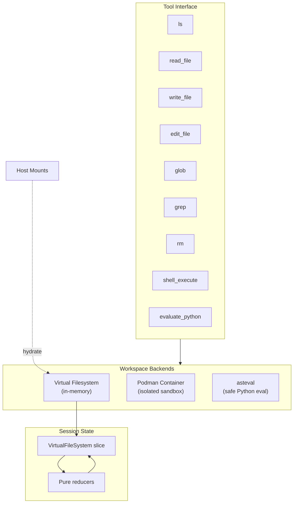
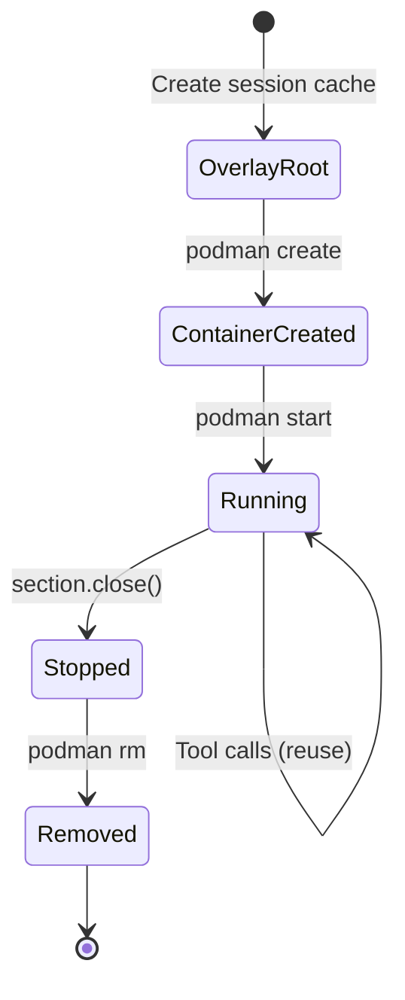

# Workspace Tools Specification

## Purpose

Workspace tools provide agents with deterministic, session-scoped surfaces for
file operations, code execution, and repository context. This specification
covers the virtual filesystem (VFS), Podman sandbox, Python evaluation (asteval),
and workspace digest generation.

## Guiding Principles

- **Sandbox first**: Tool surfaces avoid host side effects by default. VFS is
  in-memory; Podman runs with networking disabled; host filesystem access is
  limited to explicit mounts.
- **Predictable paths**: Normalized POSIX-style paths, ASCII-only, relative to
  session root.
- **Single source of state**: Reducers own all mutations; handlers remain pure.
- **VFS-compatible surface**: Backends that provide file operations expose the
  same VFS-style tools (`ls`, `read_file`, `write_file`, `edit_file`, `glob`,
  `grep`, `rm`).



## Virtual Filesystem

The VFS provides session-scoped file operations without writing to the host
disk. Content can be hydrated from explicit host mounts at section
construction time.

### Data Model

```python
@dataclass(slots=True, frozen=True)
class VfsPath:
    segments: tuple[str, ...]  # ("src", "main.py")

@dataclass(slots=True, frozen=True)
class VfsFile:
    path: VfsPath
    content: str
    encoding: Literal["utf-8"]
    size_bytes: int
    version: int
    created_at: datetime
    updated_at: datetime

@dataclass(slots=True, frozen=True)
class VirtualFileSystem:
    files: tuple[VfsFile, ...] = ()
```

### Tools

| Tool | Parameters | Description |
| ------------ | ------------------------------------------------------ | ------------------------- |
| `ls` | `path: str` | List directory entries |
| `read_file` | `file_path`, `offset`, `limit` | Read file with pagination |
| `write_file` | `file_path`, `content` | Create new file |
| `edit_file` | `file_path`, `old_string`, `new_string`, `replace_all` | String replacement |
| `glob` | `pattern`, `path` | Match files by pattern |
| `grep` | `pattern`, `path`, `glob` | Regex search |
| `rm` | `path` | Remove file or directory |

### Limits

- Content per write: 48,000 characters
- Path depth: 16 segments
- Segment length: 80 characters
- Encoding: UTF-8 text only

### Host Mounts

```python
@dataclass(slots=True, frozen=True)
class HostMount:
    host_path: str
    mount_path: VfsPath | None = None
    include_glob: tuple[str, ...] = ()
    exclude_glob: tuple[str, ...] = ()
    max_bytes: int | None = None
    follow_symlinks: bool = False
```

Mounts hydrate at section construction and appear in prompt guidance.

### Session Integration

```python
session = Session(dispatcher=dispatcher)
section = VfsToolsSection(
    session=session,
    mounts=(HostMount(host_path="docs/", include_glob=("*.md",)),),
    allowed_host_roots=("/path/to/project",),  # Required for mount resolution
)

# Query state
vfs = session[VirtualFileSystem].latest()
```

## Podman Sandbox

`PodmanSandboxSection` provides an isolated Linux container for shell commands
and file operations.

### Workspace Lifecycle

1. **Overlay Root** - Session-specific directory under cache
1. **Container Creation** - Python 3.12 image, 1 CPU, 1 GiB RAM, no network
1. **Startup** - `sleep infinity` with health check
1. **Reuse** - Subsequent calls share container
1. **Teardown** - Stopped and removed on section close



### Tools

All VFS tools plus:

| Tool | Description |
| ----------------- | --------------------------------------- |
| `shell_execute` | Run command in container (\<=120s) |
| `evaluate_python` | Execute Python via `python3 -c` (\<=5s) |

### Shell Execution

```python
@dataclass(slots=True, frozen=True)
class PodmanShellParams:
    command: tuple[str, ...]  # Note: singular "command"
    cwd: str | None = None
    env: Mapping[str, str] = field(default_factory=dict)
    stdin: str | None = None
    timeout_seconds: float = 30.0  # Note: float, not int
    capture_output: bool = True
```

Limits:

- Commands: ASCII, \<=4,096 chars combined
- Timeout: 1-120 seconds
- Output: Truncated to 32 KiB

### Configuration

Environment variables:

- `PODMAN_BASE_URL`, `PODMAN_IDENTITY`, `PODMAN_CONNECTION`
- `WEAKINCENTIVES_CACHE` for overlay root

## Python Evaluation (ASTEval)

`AstevalSection` provides sandboxed Python expression evaluation.

### Tool Contract

```python
@dataclass(slots=True, frozen=True)
class EvalParams:
    code: str                              # <= 2,000 chars
    globals: dict[str, str] = {}           # JSON-encoded values
    reads: tuple[EvalFileRead, ...] = ()   # VFS files to load
    writes: tuple[EvalFileWrite, ...] = () # VFS files to write

@dataclass(slots=True, frozen=True)
class EvalResult:
    value_repr: str | None
    stdout: str                            # <= 4,096 chars
    stderr: str                            # <= 4,096 chars
    globals: dict[str, str]
    reads: tuple[EvalFileRead, ...]
    writes: tuple[EvalFileWrite, ...]
```

### Sandbox Environment

- `asteval.Interpreter(use_numpy=False, minimal=True)`
- Whitelisted symtable: math, statistics, `read_text`, `write_text`, `print`
- Disabled: import, exec, eval, and `ALL_DISALLOWED` nodes
- Timeout: 5 seconds

### VFS Integration

- Reads resolve from session VFS snapshot
- Writes queue through reducer pipeline
- Same limits as VFS tools apply

### Installation

```bash
pip install weakincentives[asteval]
```

## Workspace Digest

`WorkspaceDigestSection` captures task-agnostic repository summaries.

### Resolution Order

1. **Session snapshot** - `latest_workspace_digest(session, key)`
1. **Override fallback** - From `PromptOverridesStore`
1. **Placeholder** - Default text with warning log

### Data Captured

- Repository layout and notable directories
- Tooling commands (tests, linting, formatting)
- Known caveats and recurring pitfalls

### Optimization Workflow

```python
from weakincentives.contrib.optimizers import WorkspaceDigestOptimizer
from weakincentives.optimizers import OptimizationContext, PersistenceScope

context = OptimizationContext(
    adapter=adapter,
    dispatcher=session.dispatcher,
    overrides_store=store,
    overrides_tag="v1",
)
optimizer = WorkspaceDigestOptimizer(context, store_scope=PersistenceScope.SESSION)
result = optimizer.optimize(prompt, session=session)
```

`PersistenceScope.SESSION` stores in session slice only.
`PersistenceScope.GLOBAL` persists to the overrides store.

### OptimizationResult

Generic container used by optimizers:

```python
@dataclass(slots=True, frozen=True)
class OptimizationResult[ArtifactT]:
    response: PromptResponse[object] | None
    artifact: ArtifactT
    metadata: dict[str, object]
```

### WorkspaceDigestResult

Specific to the workspace digest optimizer:

```python
@dataclass(slots=True, frozen=True)
class WorkspaceDigestResult:
    response: PromptResponse[object]
    digest: str
    scope: PersistenceScope
    section_key: str
```

## Usage Example

```python
from weakincentives.runtime.events import InProcessDispatcher
from weakincentives.runtime.session import Session
from weakincentives.prompt import Prompt, PromptTemplate, MarkdownSection
from weakincentives.contrib.tools import vfs, podman

dispatcher = InProcessDispatcher()
session = Session(dispatcher=dispatcher)

# VFS-based prompt
vfs_template = PromptTemplate(
    ns="agents/workspace",
    key="vfs-tools",
    sections=[
        MarkdownSection(
            title="Instructions",
            key="instructions",
            template="Stage edits in the virtual filesystem.",
        ),
        vfs.VfsToolsSection(
            session=session,
            mounts=(vfs.HostMount(host_path="src/"),),
        ),
    ],
)
vfs_prompt = Prompt(vfs_template)

# Podman-based prompt
podman_template = PromptTemplate(
    ns="agents/workspace",
    key="podman-tools",
    sections=[
        MarkdownSection(
            title="Instructions",
            key="instructions",
            template="Run commands in the sandbox.",
        ),
        podman.PodmanSandboxSection(session=session),
    ],
)
podman_prompt = Prompt(podman_template)

# After tool invocations
filesystem = session[vfs.VirtualFileSystem].latest()
workspace = session[podman.PodmanWorkspace].latest()
```

## Cloning

All workspace sections support `clone(session=..., dispatcher=...)`:

- Re-registers reducers on new session
- Binds telemetry to new event dispatcher
- Reapplies host mount hydration
- Fully decoupled from original section

## Limitations

- **Ephemeral state**: All workspace data dies with the session
- **Text-only VFS**: Binary content rejected
- **No network**: Podman containers have no network access
- **Cooperative timeout**: ASTEval interrupts cooperatively only
- **Synchronized clocks**: Timestamps require UTC synchronization
